Overall metagenome statistics
================
Sam Barnett
31 March, 2026

- [Introduction](#introduction)
  - [Librarys and global variables](#librarys-and-global-variables)
  - [Metadata](#metadata)
- [Metagenome coverage and
  diversity](#metagenome-coverage-and-diversity)
  - [Get nonpareil data](#get-nonpareil-data)
  - [Coverage](#coverage)
  - [Diversity](#diversity)
- [Estimated genome size](#estimated-genome-size)
  - [Coverage, diversity and genome size plots for
    publication](#coverage-diversity-and-genome-size-plots-for-publication)
- [Taxonomy](#taxonomy)
  - [Read based taxonomy](#read-based-taxonomy)
  - [Contig taxonomy](#contig-taxonomy)
- [Sequencing stats for resource
  announcement](#sequencing-stats-for-resource-announcement)
- [Centralia Map for revision](#centralia-map-for-revision)
- [New Figure S1](#new-figure-s1)
- [Session info](#session-info)

# Introduction

Included here is the inital analysis of the metagenome data. We are
specifically examining broad trends from reads such as estimated genome
size, diversity, and taxonomic makeup.

## Librarys and global variables

Here are some libraries used in this analysis and the global varaibles
that will be used throughout. Mostly variables for consistent plotting.

``` r
# Libraries for data
library(dplyr)
library(phyloseq)
library(ape)
library(readxl)

# Libraries for analysis
library(vegan)
library(picante)
library(Nonpareil)
library(lme4)
library(lmerTest)
              
# Libraries for plotting
library(ggplot2)
source("/Users/sambarnett/Documents/Misc_code/paul_tol_colors.R")

# Functon for extracting legends
g_legend<-function(a.gplot){
  tmp <- ggplot_gtable(ggplot_build(a.gplot))
  leg <- which(sapply(tmp$grobs, function(x) x$name) == "guide-box")
  legend <- tmp$grobs[[leg]]
  return(legend)} 


# Site lists
used_sites = c("Cen08", "Cen11", "Cen14", "Cen15", "Cen16", "Cen17", "Cen19", 
               "Cen21", "Cen22", "Cen23")

# Setting repeated plot aesthetics
## Sites
site.col = paultol_colors(length(used_sites))
names(site.col) = used_sites

site.shape = c(22, 24, 24, 24, 24, 22, 24, 24, 24, 22)
names(site.shape) = used_sites

## Fire Classifications
FC.col = c("FireAffected" = "red", "Reference" = "grey")
FC.shape = c("FireAffected" = 24, "Reference" = 22)

# Basic plotting theme so as not to continually repeat it
publication_theme = theme_bw() +
  theme(axis.text = element_text(size=6),
        axis.title = element_text(size=7),
        legend.text = element_text(size=6),
        legend.title = element_text(size=7, hjust=0.5),
        strip.text = element_text(size=7),
        plot.title = element_text(size=8, hjust=0.5))

present_theme = theme_bw() +
  theme(axis.text = element_text(size=10),
        axis.title = element_text(size=12),
        legend.text = element_text(size=10),
        legend.title = element_text(size=12, hjust=0.5),
        strip.text = element_text(size=10),
        plot.title = element_text(size=14, hjust=0.5))
```

## Metadata

Read in the metadata.

``` r
# Sample metadata
sample.meta = read_xlsx("/Users/sambarnett/Documents/Shade_lab/Centralia_project/Centralia_soil_metadata.xlsx", 
                        sheet = "Metagenomic_samples", na="NA") %>%
  filter(SampleID != "Cen08_07102019_R1") %>%
  arrange(SiteID, Year) %>%
  mutate(Seq_number = row_number()) %>%
  mutate(nonpareil_file = paste("/Users/sambarnett/Documents/Shade_lab/Centralia_project/Metagenomics/Data/nonpareil/", SampleID, "_S", Seq_number, ".npo", sep=""),
         SequenceID = paste(SampleID, Seq_number, sep="_S"))

readstats.df = read.table("/Users/sambarnett/Documents/Shade_lab/Centralia_project/Metagenomics/Data/Filtered_read_statistics.txt", 
                          header=TRUE, sep="\t", comment.char = "", quote = "") %>%
  mutate(total_reads = Forward_read_count + Reverse_read_count) %>%
  select(SampleID, total_reads) %>%
  rename(SequenceID = SampleID) 

mapped_reads.df = read.table("/Users/sambarnett/Documents/Shade_lab/Centralia_project/Metagenomics/Data/Mapped_read_totals.txt", 
                          header=TRUE, sep="\t", comment.char = "", quote = "")
```

# Metagenome coverage and diversity

Lets see how well we sequenced these metagenomes. We used nonpareil to
estimate the coverage of these metagenomes as well as estimate
diversity.

## Get nonpareil data

Load the data. For the coverages at different sequencing depths we need
to convert coverage curves into a dataframe format we can play around in
ggplot with.

``` r
# Read in the the nonpareil data. These are separate files.
nonpareil.full = Nonpareil.set(sample.meta$nonpareil_file)
```

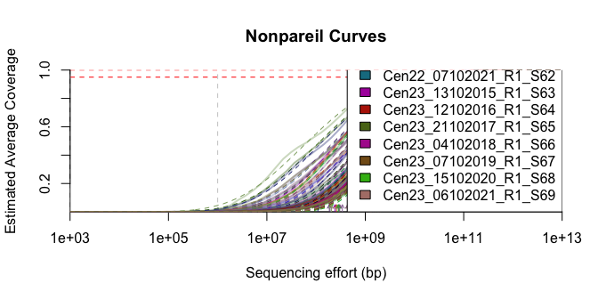<!-- -->

``` r
# Get the coverage curves
nonpareil.df = data.frame()
for (i in seq(1, length(nonpareil.full@np.curves))){
  nonpareil.df = rbind(nonpareil.df, 
                       data.frame(SequenceID = nonpareil.full@np.curves[[i]]$label,
                                  effort = nonpareil.full@np.curves[[i]]$x.adj,
                                  coverage = nonpareil.full@np.curves[[i]]$y.cov))
}

# Add in the metadata
nonpareil.df = nonpareil.df %>%
  left_join(sample.meta, by = "SequenceID")

# Get the summary table that includes coverage (at full sequencing depth) and diversity, along with other metrics.
nonpareil.sum = data.frame(summary(nonpareil.full)) %>%
  tibble::rownames_to_column(var="SequenceID") %>%
  mutate(SampleID = gsub("_S.*", "", SequenceID)) %>%
  left_join(sample.meta, by = c("SequenceID", "SampleID"))
```

## Coverage

Lets take a look at how well we covered these metagenomes. First lets
get coverage curves.

``` r
# Plot curves using ggplot
ggplot(data=nonpareil.df, aes(x=effort/1000000000/2, y=coverage)) +
  geom_hline(yintercept = 1) +
  geom_hline(yintercept = 0.95, linetype=2) +
  geom_line(aes(group=SequenceID, color=CoreTemp_C)) +
  scale_color_gradient(low="blue", high="red") +
  lims(x=c(0,NA), y=c(0,1)) +
  labs(x="Sequencing effort (Gbp)", y="Estimated average coverage", color="Soil temp.\n(˚C)") +
  present_theme +
  facet_wrap(~FireClassification)
```

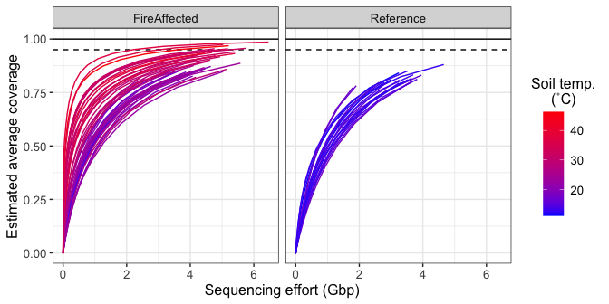<!-- -->

Now look at coverage for each sample (at full sequencing depth).

``` r
# Plot genome size by fire class
coverage_FC.wilcox = wilcox.test(x=filter(nonpareil.sum, FireClassification=="Reference")$C,
                              y=filter(nonpareil.sum, FireClassification=="FireAffected")$C,
                              conf.int=TRUE, conf.level=0.95)
coverage_FC.wilcox
```

    ## 
    ##  Wilcoxon rank sum exact test
    ## 
    ## data:  filter(nonpareil.sum, FireClassification == "Reference")$C and filter(nonpareil.sum, FireClassification == "FireAffected")$C
    ## W = 67, p-value = 2.703e-10
    ## alternative hypothesis: true location shift is not equal to 0
    ## 95 percent confidence interval:
    ##  -0.09844787 -0.04529796
    ## sample estimates:
    ## difference in location 
    ##            -0.06556381

``` r
coverage_FC.plot = ggplot(data=nonpareil.sum, aes(x=FireClassification, y=C)) +
  geom_boxplot(outlier.shape = NA) +
  geom_jitter(aes(fill=SiteID, shape=FireClassification), size=3, width=0.25, height=0) +
  annotate("text", label="< 0.001", fontface="bold", x=1.5, y=1) +
  lims(y=c(NA, 1)) +
  scale_fill_manual(values=site.col) +
  scale_shape_manual(values=FC.shape) +
  labs(x="FireClassification", y="Estimated proportion metagenome coverage") +
  present_theme +
  theme(legend.position = "none") +
  guides(fill=guide_legend(override.aes=list(shape=site.shape), ncol=2))

# Plot genome size by temperature
coverage_temp.model.old = lme(C ~ CoreTemp_C, random = ~1|SiteID, data=nonpareil.sum)
coverage_temp.model = lmer(C ~ CoreTemp_C + (1|SiteID) + (1|Year), data=nonpareil.sum)

## Get regression for plot
coverage_temp.model.reg.df = data.frame(summary(coverage_temp.model)$coefficients) %>%
  tibble::rownames_to_column(var="factor") %>%
  mutate(p_slope = ifelse(factor == "CoreTemp_C", Pr...t.., 1),
         factor = ifelse(factor == "(Intercept)", "Intercept", factor)) %>%
  mutate(p_slope = min(p_slope)) %>%
  ungroup %>%
  select(factor, Estimate, p_slope) %>%
  tidyr::spread(key=factor, value = Estimate) %>%
  mutate(sig = ifelse(p_slope < 0.05, "< 0.05", "≥ 0.05"))
summary(coverage_temp.model)
```

    ## Linear mixed model fit by REML. t-tests use Satterthwaite's method [
    ## lmerModLmerTest]
    ## Formula: C ~ CoreTemp_C + (1 | SiteID) + (1 | Year)
    ##    Data: nonpareil.sum
    ## 
    ## REML criterion at convergence: -275.6
    ## 
    ## Scaled residuals: 
    ##      Min       1Q   Median       3Q      Max 
    ## -2.08815 -0.63316  0.00983  0.66702  2.00943 
    ## 
    ## Random effects:
    ##  Groups   Name        Variance  Std.Dev.
    ##  SiteID   (Intercept) 0.0002206 0.01485 
    ##  Year     (Intercept) 0.0001011 0.01005 
    ##  Residual             0.0006246 0.02499 
    ## Number of obs: 69, groups:  SiteID, 10; Year, 7
    ## 
    ## Fixed effects:
    ##              Estimate Std. Error        df t value Pr(>|t|)    
    ## (Intercept) 7.509e-01  1.464e-02 1.833e+01  51.275  < 2e-16 ***
    ## CoreTemp_C  4.867e-03  5.608e-04 2.434e+01   8.678 6.46e-09 ***
    ## ---
    ## Signif. codes:  0 '***' 0.001 '**' 0.01 '*' 0.05 '.' 0.1 ' ' 1
    ## 
    ## Correlation of Fixed Effects:
    ##            (Intr)
    ## CoreTemp_C -0.887

``` r
## Plot
coverage_temp.plot = ggplot(data=nonpareil.sum, aes(x=CoreTemp_C, y=C)) +
  geom_point(aes(fill=SiteID, shape=FireClassification), size=3) +
  geom_abline(data=coverage_temp.model.reg.df, aes(intercept = Intercept, slope = CoreTemp_C), 
              linetype = 1, size=2, color="black") +
  geom_abline(data=coverage_temp.model.reg.df, aes(intercept = Intercept, slope = CoreTemp_C, linetype = sig), 
              size=1, color="white") +
  lims(y=c(NA, 1)) +
  scale_fill_manual(values=site.col) +
  scale_shape_manual(values=FC.shape) +
  scale_linetype_manual(values=c("< 0.05" = 1, "≥ 0.05" = 2)) +
  #lims(y=c(4,7)) +
  labs(x="Soil temperature (˚C)", y="Estimated proportion metagenome coverage", linetype="Regression\nslope p-value") +
  present_theme +
  guides(fill=guide_legend(override.aes=list(shape=site.shape), ncol=2),
         linetype="none")

cowplot::plot_grid(coverage_FC.plot,
                   coverage_temp.plot + theme(axis.title.y=element_blank()), 
                   rel_widths = c(0.5, 1))
```

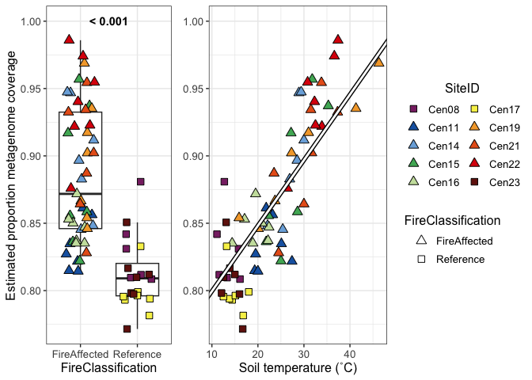<!-- -->

## Diversity

Now lets take a look at the diversity.

``` r
# Now look at diversity over fire classification
nonpareil_diversity_FC.wilcox = wilcox.test(x=filter(nonpareil.sum, FireClassification=="Reference")$diversity,
                                            y=filter(nonpareil.sum, FireClassification=="FireAffected")$diversity,
                                            conf.int=TRUE, conf.level=0.95)
nonpareil_diversity_FC.wilcox
```

    ## 
    ##  Wilcoxon rank sum exact test
    ## 
    ## data:  filter(nonpareil.sum, FireClassification == "Reference")$diversity and filter(nonpareil.sum, FireClassification == "FireAffected")$diversity
    ## W = 816, p-value = 5.543e-06
    ## alternative hypothesis: true location shift is not equal to 0
    ## 95 percent confidence interval:
    ##  0.2578372 1.0135277
    ## sample estimates:
    ## difference in location 
    ##              0.4918761

``` r
# Plot by fire classification
nonpareil_diversity_FC.plot = ggplot(data=nonpareil.sum, aes(x=FireClassification, y=diversity)) +
  geom_boxplot(outlier.shape=NA) +
  geom_jitter(aes(fill=SiteID, shape=FireClassification), size=2, width=0.25) +
  annotate("text", label="< 0.001", fontface="bold", x=1.5, y=22) +
  lims(y=c(NA, 22)) +
  scale_fill_manual(values=site.col) +
  scale_shape_manual(values=FC.shape) +
  labs(x="FireClassification", y="Nonpareil diversity") +
  present_theme +
  theme(legend.position = "none") +
  guides(fill=guide_legend(override.aes=list(shape=site.shape), ncol=2))

# Plot by temperature

# Plot genome size by temperature
diversity_temp.model.old = lme(diversity ~ CoreTemp_C, random = ~1|SiteID, data=nonpareil.sum)
diversity_temp.model = lmer(diversity ~ CoreTemp_C + (1|SiteID) + (1|Year), data=nonpareil.sum)

## Get regression for plot
diversity_temp.model.reg.df = data.frame(summary(diversity_temp.model)$coefficients) %>%
  tibble::rownames_to_column(var="factor") %>%
  mutate(p_slope = ifelse(factor == "CoreTemp_C", Pr...t.., 1),
         factor = ifelse(factor == "(Intercept)", "Intercept", factor)) %>%
  mutate(p_slope = min(p_slope)) %>%
  ungroup %>%
  select(factor, Estimate, p_slope) %>%
  tidyr::spread(key=factor, value = Estimate) %>%
  mutate(sig = ifelse(p_slope < 0.05, "< 0.05", "≥ 0.05"))
summary(diversity_temp.model)
```

    ## Linear mixed model fit by REML. t-tests use Satterthwaite's method [
    ## lmerModLmerTest]
    ## Formula: diversity ~ CoreTemp_C + (1 | SiteID) + (1 | Year)
    ##    Data: nonpareil.sum
    ## 
    ## REML criterion at convergence: 109.6
    ## 
    ## Scaled residuals: 
    ##     Min      1Q  Median      3Q     Max 
    ## -2.9939 -0.6335  0.1021  0.6467  2.0363 
    ## 
    ## Random effects:
    ##  Groups   Name        Variance Std.Dev.
    ##  SiteID   (Intercept) 0.04457  0.2111  
    ##  Year     (Intercept) 0.02839  0.1685  
    ##  Residual             0.20596  0.4538  
    ## Number of obs: 69, groups:  SiteID, 10; Year, 7
    ## 
    ## Fixed effects:
    ##              Estimate Std. Error        df t value Pr(>|t|)    
    ## (Intercept) 22.517730   0.241479 22.346260  93.249  < 2e-16 ***
    ## CoreTemp_C  -0.080681   0.009329 25.193457  -8.648 5.18e-09 ***
    ## ---
    ## Signif. codes:  0 '***' 0.001 '**' 0.01 '*' 0.05 '.' 0.1 ' ' 1
    ## 
    ## Correlation of Fixed Effects:
    ##            (Intr)
    ## CoreTemp_C -0.896

``` r
## Note I'm not running a linear model because as you'll see this is definitely not linear.
nonpareil_diversity_temp.plot = ggplot(data=nonpareil.sum, aes(x=CoreTemp_C, y=diversity)) +
  geom_point(aes(fill=SiteID, shape=FireClassification), size=2) +
  geom_abline(data=diversity_temp.model.reg.df, aes(intercept = Intercept, slope = CoreTemp_C), 
              linetype = 1, size=2, color="black") +
  geom_abline(data=diversity_temp.model.reg.df, aes(intercept = Intercept, slope = CoreTemp_C, linetype = sig), 
              size=1, color="white") +
  lims(y=c(NA, 22)) +
  scale_fill_manual(values=site.col) +
  scale_shape_manual(values=FC.shape) +
  labs(x="Soil temperature (˚C)", y="Nonpareil diversity") +
  present_theme +
  guides(fill=guide_legend(override.aes=list(shape=site.shape), ncol=2))

cowplot::plot_grid(nonpareil_diversity_FC.plot,
                   nonpareil_diversity_temp.plot + theme(axis.title.y=element_blank()), 
                   rel_widths = c(0.5, 1))
```

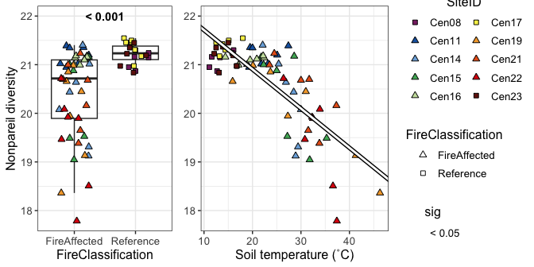<!-- -->

Lets also see how diversity changes over time.

``` r
# Compare across time
nonpareil_diversity_time.model.df = data.frame()
for (FC in c("FireAffected", "Reference")){
  sub_nonpareil_diversity.model = lme(diversity ~ Year, random = ~1|SiteID, data=filter(nonpareil.sum, FireClassification == FC))
  nonpareil_diversity_time.model.df = rbind(nonpareil_diversity_time.model.df,
                           data.frame(summary(sub_nonpareil_diversity.model)$tTable) %>%
                             tibble::rownames_to_column(var="factor") %>%
                             mutate(FireClassification = FC))
}
nonpareil_diversity_time.model.df
```

    ##        factor         Value   Std.Error DF    t.value      p.value
    ## 1 (Intercept) -471.84012159 80.20778675 41 -5.8827221 6.352571e-07
    ## 2        Year    0.24392667  0.03974602 41  6.1371339 2.760816e-07
    ## 3 (Intercept)  -16.47817969 45.16621678 16 -0.3648342 7.200126e-01
    ## 4        Year    0.01868128  0.02238224 16  0.8346478 4.162047e-01
    ##   FireClassification
    ## 1       FireAffected
    ## 2       FireAffected
    ## 3          Reference
    ## 4          Reference

``` r
# Get regressions for plot
nonpareil_diversity_time.model.reg = nonpareil_diversity_time.model.df %>%
  mutate(p_slope = ifelse(factor == "Year", p.value, 1),
         factor = ifelse(factor == "(Intercept)", "Intercept", factor)) %>%
  group_by(FireClassification) %>%
  mutate(p_slope = min(p_slope)) %>%
  ungroup %>%
  select(FireClassification, factor, Value, p_slope) %>%
  tidyr::spread(key="factor", value="Value") %>%
  mutate(sig = ifelse(p_slope < 0.05, "< 0.05", "≥ 0.05"))

# Plot
ggplot(data=nonpareil.sum, aes(x=Year, y=diversity)) +
  geom_line(aes(group=SiteID), color="black", size=1) + 
  geom_line(aes(color=SiteID), size=0.5) + 
  geom_point(size=2, aes(fill=SiteID, shape=FireClassification)) +
  geom_abline(data=nonpareil_diversity_time.model.reg, 
              aes(intercept = Intercept, slope = Year), linetype = 1, size=2, color="black") +
  geom_abline(data=nonpareil_diversity_time.model.reg, 
              aes(intercept = Intercept, slope = Year, linetype = sig), size=1, color="white") +
  scale_shape_manual(values=FC.shape) +
  scale_fill_manual(values=site.col) +
  scale_color_manual(values=site.col) +
  scale_linetype_manual(values=c("< 0.05" = 1, "≥ 0.05" = 2)) +
  labs(x="Year", y="Nonpareil diversity", linetype="LME p-value") +
  present_theme +
  theme(legend.direction = "vertical") +
  facet_wrap(~FireClassification) +
  guides(fill=guide_legend(override.aes=list(shape=site.shape), ncol=2),
         linetype=guide_legend(override.aes=list(color="black")))
```

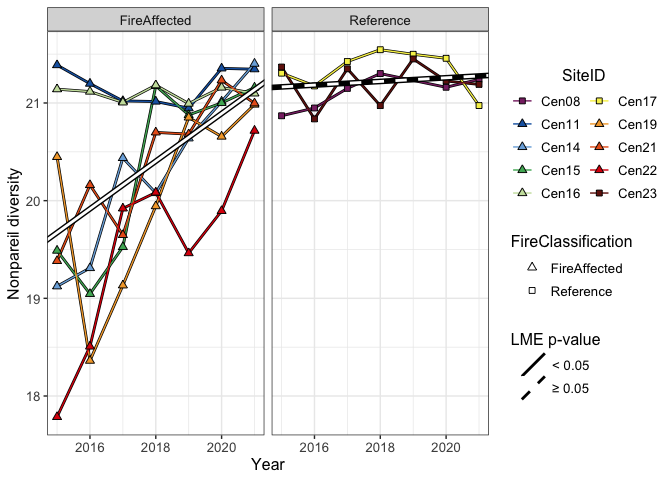<!-- -->

# Estimated genome size

We used microbecensus to estimate average genome size.

``` r
# Import microbecensus data
microbe_census.df = read.table("/Users/sambarnett/Documents/Shade_lab/Centralia_project/Metagenomics/Data/microbecensus_comb_out.txt",
                               header=TRUE, sep="\t") %>%
  mutate(average_genome_size_Mbp = average_genome_size/1000000) %>%
  arrange(-average_genome_size) %>%
  mutate(Gsize_rank = row_number()) %>%
  left_join(sample.meta, by = "SequenceID") %>%
  left_join(readstats.df, by = "SequenceID")

# Plot genome size by fire class
Gsize_FC.wilcox = wilcox.test(x=filter(microbe_census.df, FireClassification=="Reference")$average_genome_size_Mbp,
                              y=filter(microbe_census.df, FireClassification=="FireAffected")$average_genome_size_Mbp,
                              conf.int=TRUE, conf.level=0.95)
Gsize_FC.wilcox
```

    ## 
    ##  Wilcoxon rank sum exact test
    ## 
    ## data:  filter(microbe_census.df, FireClassification == "Reference")$average_genome_size_Mbp and filter(microbe_census.df, FireClassification == "FireAffected")$average_genome_size_Mbp
    ## W = 856, p-value = 1.838e-07
    ## alternative hypothesis: true location shift is not equal to 0
    ## 95 percent confidence interval:
    ##  0.3404824 0.8422117
    ## sample estimates:
    ## difference in location 
    ##              0.5518273

``` r
Gsize_FC.plot = ggplot(data=microbe_census.df, aes(x=FireClassification, y=average_genome_size_Mbp)) +
  geom_boxplot(outlier.shape = NA) +
  geom_jitter(aes(fill=SiteID, shape=FireClassification), size=3, width=0.25, height=0) +
  annotate("text", label="< 0.001", fontface="bold", x=1.5, y=6.75) +
  lims(y=c(NA, 6.75)) +
  scale_fill_manual(values=site.col) +
  scale_shape_manual(values=FC.shape) +
  labs(x="FireClassification", y="Estimated average genome size (Mbp)") +
  present_theme +
  theme(legend.position = "none") +
  guides(fill=guide_legend(override.aes=list(shape=site.shape), ncol=2))

# Plot genome size by temperature
Gsize_temp.model.old = lme(average_genome_size_Mbp ~ CoreTemp_C, random = ~1|SiteID, data=microbe_census.df)
Gsize_temp.model = lmer(average_genome_size_Mbp ~ CoreTemp_C + (1|SiteID) + (1|Year), data=microbe_census.df)

## Get regression for plot
Gsize_temp.model.reg.df = data.frame(summary(Gsize_temp.model)$coefficients) %>%
  tibble::rownames_to_column(var="factor") %>%
  mutate(p_slope = ifelse(factor == "CoreTemp_C", Pr...t.., 1),
         factor = ifelse(factor == "(Intercept)", "Intercept", factor)) %>%
  mutate(p_slope = min(p_slope)) %>%
  ungroup %>%
  select(factor, Estimate, p_slope) %>%
  tidyr::spread(key=factor, value = Estimate) %>%
  mutate(sig = ifelse(p_slope < 0.05, "< 0.05", "≥ 0.05"))
summary(Gsize_temp.model)
```

    ## Linear mixed model fit by REML. t-tests use Satterthwaite's method [
    ## lmerModLmerTest]
    ## Formula: average_genome_size_Mbp ~ CoreTemp_C + (1 | SiteID) + (1 | Year)
    ##    Data: microbe_census.df
    ## 
    ## REML criterion at convergence: 57.6
    ## 
    ## Scaled residuals: 
    ##     Min      1Q  Median      3Q     Max 
    ## -1.7972 -0.8217  0.0301  0.5294  2.3511 
    ## 
    ## Random effects:
    ##  Groups   Name        Variance Std.Dev.
    ##  SiteID   (Intercept) 0.03345  0.1829  
    ##  Year     (Intercept) 0.01434  0.1198  
    ##  Residual             0.08979  0.2996  
    ## Number of obs: 69, groups:  SiteID, 10; Year, 7
    ## 
    ## Fixed effects:
    ##              Estimate Std. Error        df t value Pr(>|t|)    
    ## (Intercept)  6.749009   0.177186 25.746309  38.090  < 2e-16 ***
    ## CoreTemp_C  -0.048049   0.006782 32.282131  -7.084 4.67e-08 ***
    ## ---
    ## Signif. codes:  0 '***' 0.001 '**' 0.01 '*' 0.05 '.' 0.1 ' ' 1
    ## 
    ## Correlation of Fixed Effects:
    ##            (Intr)
    ## CoreTemp_C -0.887

``` r
## Plot
Gsize_temp.plot = ggplot(data=microbe_census.df, aes(x=CoreTemp_C, y=average_genome_size_Mbp)) +
  geom_point(aes(fill=SiteID, shape=FireClassification), size=3) +
  geom_abline(data=Gsize_temp.model.reg.df, aes(intercept = Intercept, slope = CoreTemp_C), 
              linetype = 1, size=2, color="black") +
  geom_abline(data=Gsize_temp.model.reg.df, aes(intercept = Intercept, slope = CoreTemp_C, linetype = sig), 
              size=1, color="white") +
  lims(y=c(NA, 6.75)) +
  scale_fill_manual(values=site.col) +
  scale_shape_manual(values=FC.shape) +
  scale_linetype_manual(values=c("< 0.05" = 1, "≥ 0.05" = 2)) +
  #lims(y=c(4,7)) +
  labs(x="Soil temperature (˚C)", y="Estimated average genome size (Mbp)", linetype="Regression\nslope p-value") +
  present_theme +
  guides(fill=guide_legend(override.aes=list(shape=site.shape), ncol=2),
         linetype="none")

cowplot::plot_grid(Gsize_FC.plot,
                   Gsize_temp.plot + theme(axis.title.y=element_blank()), 
                   rel_widths = c(0.5, 1))
```

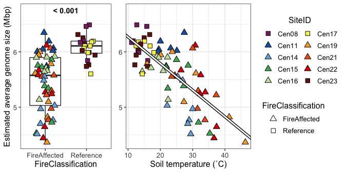<!-- -->

Now lets look at this over time like before

``` r
# Compare across time
Gsize_time.model.df = data.frame()
for (FC in c("FireAffected", "Reference")){
  sub_Gsize.model = lme(average_genome_size_Mbp ~ Year, random = ~1|SiteID, data=filter(microbe_census.df, FireClassification == FC))
  Gsize_time.model.df = rbind(Gsize_time.model.df,
                           data.frame(summary(sub_Gsize.model)$tTable) %>%
                             tibble::rownames_to_column(var="factor") %>%
                             mutate(FireClassification = FC))
}
Gsize_time.model.df
```

    ##        factor         Value   Std.Error DF     t.value      p.value
    ## 1 (Intercept) -2.612163e+02 51.68421550 41 -5.05408215 9.423397e-06
    ## 2        Year  1.321400e-01  0.02561152 41  5.15939755 6.707101e-06
    ## 3 (Intercept)  2.564951e+00 51.83020546 16  0.04948757 9.611433e-01
    ## 4        Year  1.740852e-03  0.02568457 16  0.06777813 9.468020e-01
    ##   FireClassification
    ## 1       FireAffected
    ## 2       FireAffected
    ## 3          Reference
    ## 4          Reference

``` r
## Get regression for plot
Gsize_time.model.reg = Gsize_time.model.df %>%
  mutate(p_slope = ifelse(factor == "Year", p.value, 1),
         factor = ifelse(factor == "(Intercept)", "Intercept", factor)) %>%
  group_by(FireClassification) %>%
  mutate(p_slope = min(p_slope)) %>%
  ungroup %>%
  select(FireClassification, factor, Value, p_slope) %>%
  tidyr::spread(key="factor", value="Value") %>%
  mutate(sig = ifelse(p_slope < 0.05, "< 0.05", "≥ 0.05"))

## Plot
ggplot(data=microbe_census.df, aes(x=Year, y=average_genome_size_Mbp)) +
  geom_line(aes(group=SiteID), color="black", size=1) + 
  geom_line(aes(color=SiteID), size=0.5) + 
  geom_point(size=2, aes(fill=SiteID, shape=FireClassification)) +
  geom_abline(data=Gsize_time.model.reg, 
              aes(intercept = Intercept, slope = Year), linetype = 1, size=2, color="black") +
  geom_abline(data=Gsize_time.model.reg, 
              aes(intercept = Intercept, slope = Year, linetype = sig), size=1, color="white") +
  scale_shape_manual(values=FC.shape) +
  scale_fill_manual(values=site.col) +
  scale_color_manual(values=site.col) +
  scale_linetype_manual(values=c("< 0.05" = 1, "≥ 0.05" = 2)) +
  labs(x="Year", y="Estimated average genome size (Mbp)", linetype="LME p-value") +
  present_theme +
  theme(legend.direction = "vertical") +
  facet_wrap(~FireClassification) +
  guides(fill=guide_legend(override.aes=list(shape=site.shape), ncol=2),
         linetype=guide_legend(override.aes=list(color="black")))
```

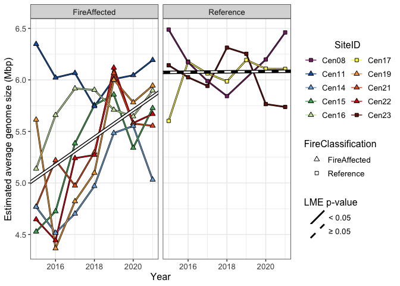<!-- -->

## Coverage, diversity and genome size plots for publication

Lets make a nice plot with both results for publication

``` r
# Coverage plots
coverage_FC.plot = ggplot(data=nonpareil.sum, aes(x=FireClassification, y=C)) +
  geom_boxplot(outlier.shape = NA) +
  geom_jitter(aes(fill=SiteID, shape=FireClassification), size=2, width=0.25, height=0) +
  annotate("text", label="< 0.001", x=1.5, y=1, size=6*5/14) +
  lims(y=c(NA, 1)) +
  scale_fill_manual(values=site.col) +
  scale_shape_manual(values=FC.shape) +
  labs(x="FireClassification", y="Estimated proportion\nmetagenome coverage") +
  publication_theme +
  theme(legend.position = "none") +
  guides(fill=guide_legend(override.aes=list(shape=site.shape), ncol=2))

coverage_temp.plot = ggplot(data=nonpareil.sum, aes(x=CoreTemp_C, y=C)) +
  geom_point(aes(fill=SiteID, shape=FireClassification), size=2) +
  geom_abline(data=filter(coverage_temp.model.reg.df, p_slope < 0.05), 
              aes(intercept = Intercept, slope = CoreTemp_C), 
              linetype = 2, size=1, color="black") +
  lims(y=c(NA, 1)) +
  scale_fill_manual(values=site.col) +
  scale_shape_manual(values=FC.shape) +
  scale_linetype_manual(values=c("< 0.05" = 1, "≥ 0.05" = 2)) +
  #lims(y=c(4,7)) +
  labs(x="Soil temperature (˚C)", y="Estimated proportion\nmetagenome coverage", linetype="Regression\nslope p-value") +
  publication_theme +
  guides(fill=guide_legend(override.aes=list(shape=site.shape), ncol=2),
         linetype="none")

coverage.plots = cowplot::plot_grid(coverage_FC.plot,
                                    coverage_temp.plot + theme(axis.title.y=element_blank(), legend.position = "none"), 
                                    rel_widths = c(0.7, 1))

# Diversity plots
nonpareil_diversity_FC.plot = ggplot(data=nonpareil.sum, aes(x=FireClassification, y=diversity)) +
  geom_boxplot(outlier.shape=NA) +
  geom_jitter(aes(fill=SiteID, shape=FireClassification), size=2, width=0.25) +
  annotate("text", label="< 0.001", x=1.5, y=22, size=6*5/14) +
  lims(y=c(NA, 22)) +
  scale_fill_manual(values=site.col) +
  scale_shape_manual(values=FC.shape) +
  labs(x="FireClassification", y="Nonpareil diversity") +
  publication_theme +
  theme(legend.position = "none") +
  guides(fill=guide_legend(override.aes=list(shape=site.shape), ncol=2))

nonpareil_diversity_temp.plot = ggplot(data=nonpareil.sum, aes(x=CoreTemp_C, y=diversity)) +
  geom_point(aes(fill=SiteID, shape=FireClassification), size=2) +
  geom_abline(data=filter(diversity_temp.model.reg.df, p_slope < 0.05), 
              aes(intercept = Intercept, slope = CoreTemp_C), 
              linetype = 2, size=1, color="black") +
  lims(y=c(NA, 22)) +
  scale_fill_manual(values=site.col) +
  scale_shape_manual(values=FC.shape) +
  labs(x="Soil temperature (˚C)", y="Nonpareil diversity") +
  publication_theme +
  guides(fill=guide_legend(override.aes=list(shape=site.shape), ncol=2))

nonpareil_diversity.plots = cowplot::plot_grid(nonpareil_diversity_FC.plot,
                                               nonpareil_diversity_temp.plot + theme(axis.title.y=element_blank(), legend.position = "none"), 
                                               rel_widths = c(0.7, 1))

# Genome size plots
Gsize_FC.plot = ggplot(data=microbe_census.df, aes(x=FireClassification, y=average_genome_size_Mbp)) +
  geom_boxplot(outlier.shape = NA) +
  geom_jitter(aes(fill=SiteID, shape=FireClassification), size=2, width=0.25, height=0) +
  annotate("text", label="< 0.001", x=1.5, y=6.75, size=6*5/14) +
  lims(y=c(NA, 6.75)) +
  scale_fill_manual(values=site.col) +
  scale_shape_manual(values=FC.shape) +
  labs(x="FireClassification", y="Estimated average\ngenome size (Mbp)") +
  publication_theme +
  theme(legend.position = "none") +
  guides(fill=guide_legend(override.aes=list(shape=site.shape), ncol=2))

Gsize_temp.plot = ggplot(data=microbe_census.df, aes(x=CoreTemp_C, y=average_genome_size_Mbp)) +
  geom_point(aes(fill=SiteID, shape=FireClassification), size=2) +
  geom_abline(data=filter(Gsize_temp.model.reg.df, p_slope < 0.05), 
              aes(intercept = Intercept, slope = CoreTemp_C), 
              linetype = 2, size=1, color="black") +
  lims(y=c(NA, 6.75)) +
  scale_fill_manual(values=site.col) +
  scale_shape_manual(values=FC.shape) +
  scale_linetype_manual(values=c("< 0.05" = 1, "≥ 0.05" = 2)) +
  #lims(y=c(4,7)) +
  labs(x="Soil temperature (˚C)", y="Estimated average\ngenome size (Mbp)", linetype="Regression\nslope p-value") +
  publication_theme +
  guides(fill=guide_legend(override.aes=list(shape=site.shape), ncol=2),
         linetype="none")

Gsize.plots = cowplot::plot_grid(Gsize_FC.plot,
                                 Gsize_temp.plot + theme(axis.title.y=element_blank(), legend.position = "none"), 
                                 rel_widths = c(0.7, 1))

# Plot all together
read_sum.plots = cowplot::plot_grid(coverage.plots,
                                    nonpareil_diversity.plots,
                                    Gsize.plots, ncol=1, labels = c("A", "B", "C"),
                                    label_size = 8)
read_sum.plots = cowplot::plot_grid(read_sum.plots, 
                                    g_legend(Gsize_temp.plot + guides(fill=guide_legend(override.aes=list(shape=site.shape), ncol=1))), 
                                    nrow=1, rel_widths = c(1,0.3))


read_sum.plots
```

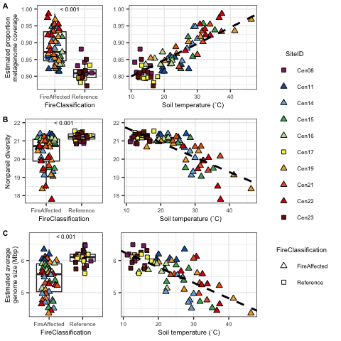<!-- -->

``` r
ggsave(read_sum.plots, file="/Users/sambarnett/Documents/Shade_lab/Centralia_project/Metagenomics/Manuscript/Revision_1/Figures/Supplemental/FigS1.tiff",
       device="tiff", width=5, height=5, units="in", bg="white")
```

# Taxonomy

## Read based taxonomy

We estimated read based taxonomy using braken Lets take a look at the
broad taxonomic breakdown of these metagenomes.

``` r
# Read in taxonomy IDs and their taxonomy breakdown used by braken. We will use these to link the taxonomy IDs from the braken output to taxonomy.
Main_taxonomy.df = read.table("/Users/sambarnett/Documents/Shade_lab/Centralia_project/Metagenomics/Data/Annotations/main_taxonomic_ranks.txt",
                              header=TRUE, sep="\t", quote="", comment.char="") %>%
  tidyr::spread(key=Ancestor_level, value=Ancestor) %>%
  rename(Domain = D,
         Phylum = P,
         Class = C,
         Order = O,
         Family = F,
         Genus = G,
         Species = S)

# Read in the braken results and map taxonomies and summarize read percentages per class and only indicate those with over 1% of the reads.

bracken.df = read.table("/Users/sambarnett/Documents/Shade_lab/Centralia_project/Metagenomics/Data/Read_taxonomy.txt",
                               header=TRUE, sep="\t", quote="", comment.char="") %>%
  rename(TaxID = taxonomy_id) %>%
  left_join(Main_taxonomy.df, by="TaxID") %>%
  filter(Domain == "Bacteria") %>%
  group_by(SequenceID) %>%
  mutate(total_classified_reads = sum(fraction_total_reads)) %>%
  ungroup %>%
  mutate(percent_class_reads = fraction_total_reads/total_classified_reads*100) %>%
  group_by(Domain, Class) %>%
  mutate(max_perc_reads = max(percent_class_reads)) %>%
  ungroup %>%
  mutate(Class = ifelse(max_perc_reads < 1, "Less than 1%", Class)) %>%
  group_by(SequenceID, Class) %>%
  summarize(percent_class_reads = sum(percent_class_reads)) %>%
  ungroup %>%
  left_join(sample.meta, by = "SequenceID") %>%
  mutate(SequenceID = factor(SequenceID, levels = arrange(sample.meta, CoreTemp_C)$SequenceID))
bracken.df$Class = factor(bracken.df$Class,
                          levels = c(sort(unique(filter(bracken.df, Class != "Less than 1%")$Class)), "Less than 1%"))

class.col = c(paultol_colors(length(levels(bracken.df$Class))-1), "#777777")
names(class.col) = levels(bracken.df$Class)

# Plot (with temperature for fun)
ggplot(data=bracken.df, aes(x=as.factor(Year), y=percent_class_reads)) +
  geom_bar(stat="identity", aes(fill=Class), color="black") +
  geom_line(data=sample.meta, aes(y=CoreTemp_C/0.5, group=1), size=1, color="black") +
  geom_line(data=sample.meta, aes(y=CoreTemp_C/0.5, group=1), size=0.5, color="green") +
  scale_fill_manual(values = class.col) +
  scale_y_continuous(name = "Percent of Bacterial reads (%)", limits = c(-4, 101), 
                    sec.axis = sec_axis(~.*0.5, name="Soil temperature (˚C)")) +
  labs(x="Year", fill="Bacterial class") +
  present_theme +
  theme(axis.text.x = element_text(angle=90)) +
  facet_wrap(~FireClassification*SiteID, nrow=2)
```

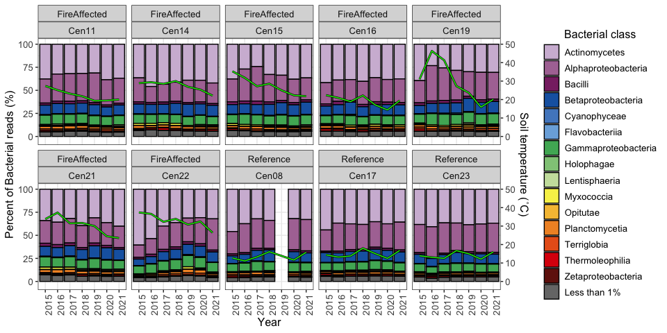<!-- -->

## Contig taxonomy

From the assembled contigs we used kraken to taxonomically assign. Lets
see the taxonomic breakdown of these assemblies.

``` r
# Read in the taxonomy from the IDs
Main_taxonomy.df = read.table("/Users/sambarnett/Documents/Shade_lab/Centralia_project/Metagenomics/Data/Annotations/main_taxonomic_ranks.txt",
                              header=TRUE, sep="\t", quote="", comment.char="") %>%
  tidyr::spread(key=Ancestor_level, value=Ancestor) %>%
  rename(Domain = D,
         Phylum = P,
         Class = C,
         Order = O,
         Family = F,
         Genus = G,
         Species = S)

# Read in the contig taxonomic assignments and match with their IDs
contig_tax.df = read.table("/Users/sambarnett/Documents/Shade_lab/Centralia_project/Metagenomics/Data/Annotations/Contig_taxonomy.txt",
                               header=TRUE, sep="\t", quote="", comment.char="") %>%
  rename(TaxID = TaxonomyID) %>%
  left_join(Main_taxonomy.df, by="TaxID") %>%
  mutate(Taxa = ifelse(is.na(Domain) | Domain == "Unclassified", "Unclassified",
                       ifelse(is.na(Phylum) | Phylum == "Unclassified", paste("Unclassified", Domain),
                              paste(Domain, Phylum, sep = "; "))))

# Summarize contig percentages per phyla and only indicate those with over 1% of the contigs
classified_contig.sum = contig_tax.df %>%
  group_by(SequenceID) %>%
  mutate(total_contigs = n()) %>%
  ungroup %>%
  filter(!grepl("Unclassified", Taxa)) %>%
  group_by(SequenceID, total_contigs) %>%
  summarize(classified_contigs = n()) %>%
  ungroup %>%
  mutate(percent_classified_contigs = classified_contigs/total_contigs*100) %>%
  left_join(sample.meta, by = "SequenceID")

contig_tax.sum = contig_tax.df %>%
  filter(!grepl("Unclassified", Taxa)) %>%
  group_by(SequenceID) %>%
  mutate(classified_contigs = n()) %>%
  ungroup %>%
  group_by(SequenceID, classified_contigs, Taxa) %>%
  summarize(n_contigs = n()) %>%
  ungroup %>%
  mutate(percent_contigs = n_contigs/classified_contigs*100) %>%
  group_by(Taxa) %>%
  mutate(max_percent_contigs = max(percent_contigs)) %>%
  ungroup %>%
  mutate(Taxa = ifelse(max_percent_contigs < 1, "Less than 1%", Taxa)) %>%
  group_by(SequenceID, Taxa) %>%
  summarize(percent_contigs = sum(percent_contigs)) %>%
  ungroup %>%
  left_join(sample.meta, by = "SequenceID")

contig_tax.sum$Taxa = factor(contig_tax.sum$Taxa,
                          levels = c(sort(unique(filter(contig_tax.sum, Taxa != "Less than 1%")$Taxa)), "Less than 1%"))

taxa.col = c(paultol_colors(length(levels(contig_tax.sum$Taxa))-1), "#777777")
names(taxa.col) = levels(contig_tax.sum$Taxa)

# Plot (with temperature for fun)
contig_tax.plot = ggplot(data=contig_tax.sum, aes(x=as.factor(Year), y=percent_contigs)) +
  geom_bar(stat="identity", aes(fill=Taxa), color="black", size=0.3) +
  geom_line(data=sample.meta, aes(y=CoreTemp_C/0.5, group=1), size=1, color="black") +
  geom_line(data=sample.meta, aes(y=CoreTemp_C/0.5, group=1), size=0.5, color="white") +
  #geom_text(data=classified_contig.sum, aes(label=round(percent_classified_contigs, digits = 1)), 
  #          y=102, size=5*5/14, angle=90, hjust=0) +
  scale_fill_manual(values = taxa.col) +
  scale_y_continuous(name = "Percent of phylum-classified contigs (%)", limits = c(-1, 101), 
                    sec.axis = sec_axis(~.*0.5, name="Soil temperature (˚C)")) +
  labs(x="Year", fill="Domain; Phylum") +
  publication_theme +
  theme(axis.text.x = element_text(angle=90)) +
  facet_wrap(~FireClassification*SiteID, nrow=2)
contig_tax.plot
```

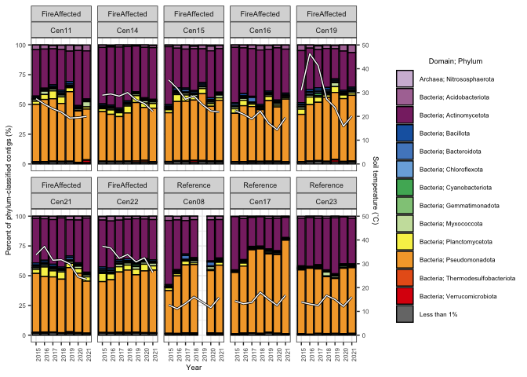<!-- -->

``` r
#ggsave(contig_tax.plot, file="/Users/sambarnett/Documents/Shade_lab/Centralia_project/Metagenomics/Resource announcement/Fig1.tiff",
#       device="tiff", width=7, height=5, units="in", bg="white")
```

# Sequencing stats for resource announcement

Here are some sequencing stats used for the resource announcement.

``` r
MRA.df = sample.meta %>%
  mutate(Collection_date = paste(Day, "Oct", Year)) %>%
  select(SequenceID, SiteID, Year, Collection_date, CoreTemp_C, FireClassification) %>%
  left_join(read.table("/Users/sambarnett/Documents/Shade_lab/Centralia_project/Metagenomics/Data/Contig_summaries.txt",
                       header=TRUE, sep="\t", quote="", comment.char="")) %>%
  left_join(readstats.df) %>%
  arrange(SiteID, Year) %>%
  select(-Year)
MRA.df
```

    ## # A tibble: 69 × 10
    ##    SequenceID         SiteID Collection_date CoreTemp_C FireClassification   N50
    ##    <chr>              <chr>  <chr>                <dbl> <chr>              <int>
    ##  1 Cen08_13102015_R1… Cen08  13 Oct 2015           12.7 Reference           2279
    ##  2 Cen08_12102016_R1… Cen08  12 Oct 2016           11.1 Reference           2683
    ##  3 Cen08_21102017_R1… Cen08  21 Oct 2017           13.3 Reference           2816
    ##  4 Cen08_04102018_R1… Cen08  4 Oct 2018            16.1 Reference           3067
    ##  5 Cen08_15102020_R1… Cen08  15 Oct 2020           11.6 Reference           3389
    ##  6 Cen08_06102021_R1… Cen08  6 Oct 2021            15.8 Reference           3720
    ##  7 Cen11_12102015_R1… Cen11  12 Oct 2015           27.4 FireAffected        2024
    ##  8 Cen11_11102016_R1… Cen11  11 Oct 2016           25.1 FireAffected        2221
    ##  9 Cen11_20102017_R1… Cen11  20 Oct 2017           23.2 FireAffected        2358
    ## 10 Cen11_03102018_R1… Cen11  3 Oct 2018            21.8 FireAffected        2626
    ## # ℹ 59 more rows
    ## # ℹ 4 more variables: Contig_count <int>, Total_length <int>,
    ## #   Longest_contig <int>, total_reads <int>

``` r
#write.table(MRA.df, file="/Users/sambarnett/Documents/Shade_lab/Centralia_project/Metagenomics/Resource announcement/Table1.txt",
#            sep="\t", quote=FALSE, row.names = FALSE)
```

# Centralia Map for revision

Now lets make a map of Centralia and all our sites for manuscript
revision.

``` r
library(ggmap)
```

    ## ℹ Google's Terms of Service: <https://mapsplatform.google.com>
    ##   Stadia Maps' Terms of Service: <https://stadiamaps.com/terms-of-service/>
    ##   OpenStreetMap's Tile Usage Policy: <https://operations.osmfoundation.org/policies/tiles/>
    ## ℹ Please cite ggmap if you use it! Use `citation("ggmap")` for details.

``` r
library(grid)
library(sf)
```

    ## Warning: package 'sf' was built under R version 4.4.3

    ## Linking to GEOS 3.13.0, GDAL 3.8.5, PROJ 9.5.1; sf_use_s2() is TRUE

``` r
# Get site coordinates. These are found in a table with longitude (long) and latitude (lat) for each site.
site.coords = read_xlsx("/Users/sambarnett/Documents/Shade_lab/Centralia_project/Centralia_soil_metadata.xlsx", sheet = "Site_metadata")  %>%
  mutate(longitude = -1*as.numeric(measurements::conv_unit(longitude, from = 'deg_dec_min', to = 'dec_deg')),
         latitude = as.numeric(measurements::conv_unit(latitude, from = 'deg_dec_min', to = 'dec_deg'))) %>%
  filter(SiteID %in% used_sites)

## Getting the center point of the cite locations.
center = c(lon=mean(c(max(site.coords$longitude), min(site.coords$longitude))), 
           lat=mean(c(max(site.coords$latitude), min(site.coords$latitude))))

## Get the 4 edges of the region around the above center point.
Nlat = geosphere::destPoint(center, b=0, d=150)[2]
Slat = geosphere::destPoint(center, b=180, d=150)[2]
Elong = geosphere::destPoint(center, b=90, d=250)[1]
Wlong = geosphere::destPoint(center, b=270, d=250)[1]

## Making a polygon (rectangle) of these edges.
region.poly = data.frame(corner = c("NE", "SE", "SW", "NW"), 
                         lat = c(Nlat, Slat, Slat, Nlat), 
                         long = c(Elong, Elong, Wlong, Wlong),
                         group=3)

# Front coordinates
front_coord.df = data.frame(front = c(1, 2),
                            lon_start = -76.332739, lat_start = 40.801547,
                            lon_end = c(-76.345905, -76.344572),
                            lat_end = c(40.801056, 40.796094)) %>%
  mutate(m = (lat_end-lat_start)/(lon_end-lon_start)) %>%
  mutate(b = lat_start-(m*lon_start))
```

Make the Pennsylvania map.

``` r
## Make state map for inset. The field sites were in PA, USA so we want to easily show where in the state the regional map (above polygon) is located
pa.coords = map_data("state", "pennsylvania")

pa.region.map = ggplot(data = pa.coords, aes(x=long, y = lat, group = group)) + 
  geom_polygon(fill="grey", color="black", size=0.25) + 
  #geom_polygon(data=region.poly, fill="red") +
  annotate("point", x=center["lon"], y=center["lat"], fill="red", color="black", shape=21, size=1) +
  theme_bw() +
  publication_theme +
  theme(legend.position = "none",
        panel.grid = element_blank(),
        axis.text=element_blank(),
        axis.title=element_blank(),
        axis.ticks=element_blank(),
        plot.background=element_blank(),
        panel.background = element_blank(),
        panel.border = element_blank()) +
  coord_fixed(1.3)
pa.region.map
```

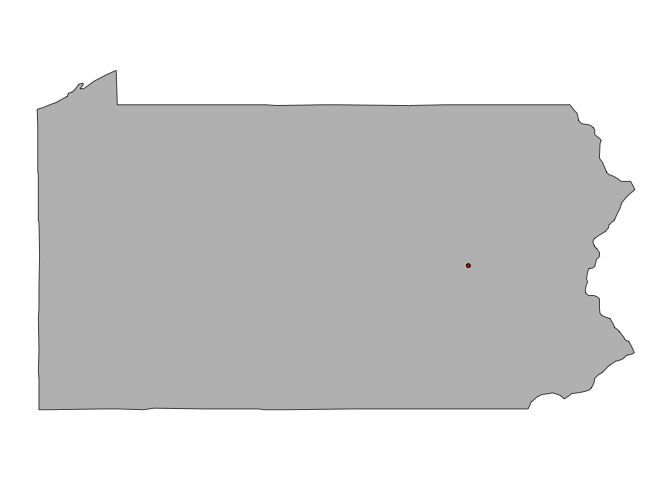<!-- -->

Make a USA map.

``` r
## Make state map for inset. The field sites were in PA, USA so we want to easily show where in the state the regional map (above polygon) is located
usa.coords = map_data("usa")

pa_usa.region.map = ggplot(data = usa.coords, aes(x=long, y = lat, group = group)) + 
  geom_polygon(fill="white", color="black", size=0.25) + 
  geom_polygon(data=pa.coords, fill="grey", color="black", size=0.25) + 
  #geom_polygon(data=region.poly, fill="red") +
  #annotate("point", x=center["lon"], y=center["lat"], fill="orange", color="black", shape=21, size=1) +
  theme_bw() +
  publication_theme +
  theme(legend.position = "none",
        panel.grid = element_blank(),
        axis.text=element_blank(),
        axis.title=element_blank(),
        axis.ticks=element_blank(),
        plot.background=element_blank(),
        panel.background = element_blank(),
        panel.border = element_blank()) +
  coord_fixed(1.3)
pa_usa.region.map
```

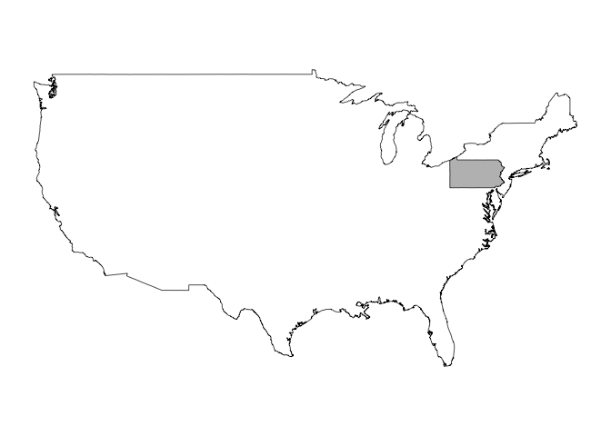<!-- -->

Now make the Centralia map and put it all together

``` r
## Make map of the specific region using the stamen terrain map.
sbbox <- make_bbox(lon = c(Elong, Wlong), lat = c(Slat, Nlat), f = .1)
region.map = get_googlemap(center = c(lon=-76.343139, lat=40.800804),
                           maptype="satellite", zoom=16, scale=2) %>% 
  ggmap()
```

    ## ℹ <https://maps.googleapis.com/maps/api/staticmap?center=40.800804,-76.343139&zoom=16&size=640x640&scale=2&maptype=satellite&key=xxx-dt6kMq9FGkHIA>

``` r
site.coords$lon = site.coords$longitude
site.coords$lat = site.coords$latitude

xmax = max(layer_scales(region.map)$x$range$range)
region.points.map = region.map +
  geom_segment(data=filter(front_coord.df, front == 1), x=xmax,
               aes(y=(m*xmax + b), xend=lon_end, yend=lat_end),
               arrow = arrow(length = unit(0.05, "npc")), color="white") +
  geom_point(data=filter(site.coords, SiteID %in% used_sites), 
             aes(x=lon, y=lat, fill=SiteID, shape=FireClassification), size=2, color="white") +
  scale_shape_manual(values=FC.shape) +
  scale_fill_manual(values=site.col) +
  labs(x="Longitude", y="Latitude", fill="SiteID", shape="Fire classification") +
  lims(x=sbbox[c(1,3)], y=sbbox[c(2,4)]) +
  theme_bw() +
  publication_theme +
  theme(legend.position = "bottom") +
  guides(fill=guide_legend(override.aes=list(shape=site.shape, color="black"), title.position="top", title.hjust=0.5, ncol=3),
         shape=guide_legend(override.aes=list(color="black"), title.position="top", title.hjust=0.5, ncol=1))
```

    ## Scale for x is already present.
    ## Adding another scale for x, which will replace the existing scale.

    ## Scale for y is already present.
    ## Adding another scale for y, which will replace the existing scale.

``` r
map.leg = g_legend(region.points.map)
```

    ## Warning in min(x): no non-missing arguments to min; returning Inf

    ## Warning in max(x): no non-missing arguments to max; returning -Inf

    ## Warning in min(x): no non-missing arguments to min; returning Inf

    ## Warning in max(x): no non-missing arguments to max; returning -Inf

``` r
# Combine the maps together
USA_PA.map = cowplot::plot_grid(pa_usa.region.map, pa.region.map, nrow=1)

Centralia.map = cowplot::plot_grid(USA_PA.map, 
                                   region.points.map + theme(legend.position="none"),
                                   map.leg, ncol=1, rel_heights = c(0.5,1,0.5))
```

    ## Warning in min(x): no non-missing arguments to min; returning Inf
    ## Warning in min(x): no non-missing arguments to max; returning -Inf

    ## Warning in min(x): no non-missing arguments to min; returning Inf

    ## Warning in max(x): no non-missing arguments to max; returning -Inf

``` r
Centralia.map
```

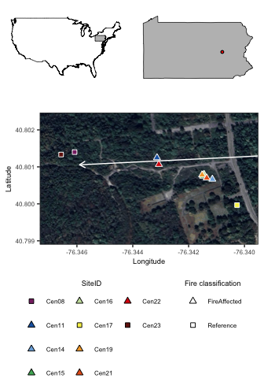<!-- -->

# New Figure S1

Combine original figure S1 with map

``` r
# Plot all together
read_sum.plots = cowplot::plot_grid(coverage.plots,
                                    nonpareil_diversity.plots,
                                    Gsize.plots, ncol=1, labels = c("B", "C", "D"),
                                    label_size = 8)
read_sum.plots = cowplot::plot_grid(Centralia.map, read_sum.plots,
                                    nrow=1, labels = c("A", ""),
                                    label_size = 8)
read_sum.plots
```

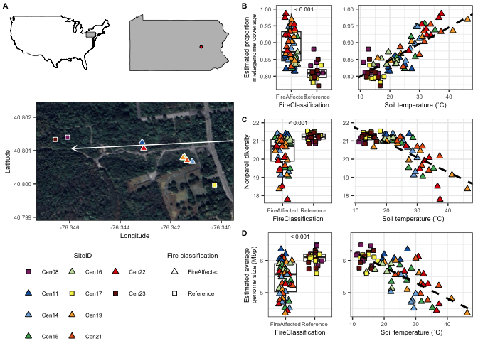<!-- -->

``` r
ggsave(read_sum.plots, file="/Users/sambarnett/Documents/Shade_lab/Centralia_project/Metagenomics/Manuscript/Revision_1/Figures/Supplemental/FigS1.tiff",
       device="tiff", width=7, height=5, units="in", bg="white")
```

# Session info

``` r
sessionInfo()
```

    ## R version 4.4.1 (2024-06-14)
    ## Platform: aarch64-apple-darwin20
    ## Running under: macOS 26.3.1
    ## 
    ## Matrix products: default
    ## BLAS:   /Library/Frameworks/R.framework/Versions/4.4-arm64/Resources/lib/libRblas.0.dylib 
    ## LAPACK: /Library/Frameworks/R.framework/Versions/4.4-arm64/Resources/lib/libRlapack.dylib;  LAPACK version 3.12.0
    ## 
    ## locale:
    ## [1] en_US.UTF-8/en_US.UTF-8/en_US.UTF-8/C/en_US.UTF-8/en_US.UTF-8
    ## 
    ## time zone: America/Detroit
    ## tzcode source: internal
    ## 
    ## attached base packages:
    ## [1] grid      stats     graphics  grDevices utils     datasets  methods  
    ## [8] base     
    ## 
    ## other attached packages:
    ##  [1] sf_1.1-0        ggmap_4.0.0     ggplot2_4.0.1   lmerTest_3.2-0 
    ##  [5] lme4_1.1-37     Matrix_1.7-0    Nonpareil_3.5.3 picante_1.8.2  
    ##  [9] nlme_3.1-166    vegan_2.7-1     permute_0.9-7   readxl_1.4.3   
    ## [13] ape_5.8         phyloseq_1.48.0 dplyr_1.1.4    
    ## 
    ## loaded via a namespace (and not attached):
    ##   [1] Rdpack_2.6.4            DBI_1.2.3               bitops_1.0-8           
    ##   [4] rlang_1.1.4             magrittr_2.0.3          ade4_1.7-22            
    ##   [7] e1071_1.7-16            compiler_4.4.1          mgcv_1.9-1             
    ##  [10] maps_3.4.2              png_0.1-8               systemfonts_1.3.1      
    ##  [13] vctrs_0.6.5             reshape2_1.4.4          stringr_1.5.1          
    ##  [16] pkgconfig_2.0.3         crayon_1.5.3            fastmap_1.2.0          
    ##  [19] XVector_0.44.0          labeling_0.4.3          utf8_1.2.4             
    ##  [22] rmarkdown_2.29          UCSC.utils_1.0.0        nloptr_2.2.1           
    ##  [25] ragg_1.3.2              purrr_1.0.2             xfun_0.52              
    ##  [28] zlibbioc_1.50.0         GenomeInfoDb_1.40.1     jsonlite_1.8.8         
    ##  [31] biomformat_1.32.0       highr_0.11              rhdf5filters_1.16.0    
    ##  [34] Rhdf5lib_1.26.0         jpeg_0.1-10             parallel_4.4.1         
    ##  [37] cluster_2.1.6           R6_2.5.1                stringi_1.8.4          
    ##  [40] RColorBrewer_1.1-3      boot_1.3-31             cellranger_1.1.0       
    ##  [43] numDeriv_2016.8-1.1     Rcpp_1.1.0              iterators_1.0.14       
    ##  [46] knitr_1.48              IRanges_2.38.1          splines_4.4.1          
    ##  [49] igraph_2.0.3            tidyselect_1.2.1        rstudioapi_0.16.0      
    ##  [52] yaml_2.3.10             codetools_0.2-20        curl_5.2.2             
    ##  [55] lattice_0.22-6          tibble_3.2.1            plyr_1.8.9             
    ##  [58] Biobase_2.64.0          withr_3.0.1             S7_0.2.1               
    ##  [61] geosphere_1.5-20        evaluate_0.24.0         survival_3.7-0         
    ##  [64] units_1.0-1             proxy_0.4-27            Biostrings_2.72.1      
    ##  [67] pillar_1.9.0            KernSmooth_2.23-24      foreach_1.5.2          
    ##  [70] stats4_4.4.1            reformulas_0.4.0        measurements_1.5.1     
    ##  [73] generics_0.1.3          sp_2.1-4                S4Vectors_0.42.1       
    ##  [76] scales_1.4.0            minqa_1.2.8             class_7.3-22           
    ##  [79] glue_1.7.0              tools_4.4.1             data.table_1.16.0      
    ##  [82] cowplot_1.1.3           rhdf5_2.48.0            tidyr_1.3.1            
    ##  [85] rbibutils_2.3           colorspace_2.1-1        GenomeInfoDbData_1.2.12
    ##  [88] cli_3.6.3               textshaping_0.4.0       fansi_1.0.6            
    ##  [91] gtable_0.3.6            digest_0.6.37           classInt_0.4-11        
    ##  [94] BiocGenerics_0.50.0     farver_2.1.2            htmltools_0.5.8.1      
    ##  [97] multtest_2.60.0         lifecycle_1.0.4         httr_1.4.7             
    ## [100] MASS_7.3-61
