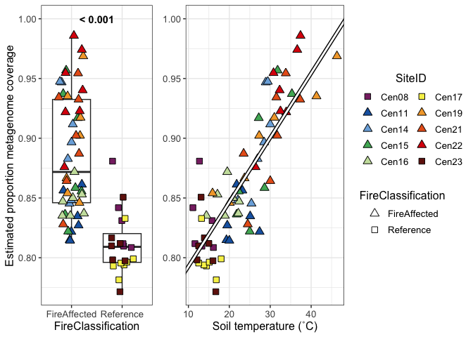
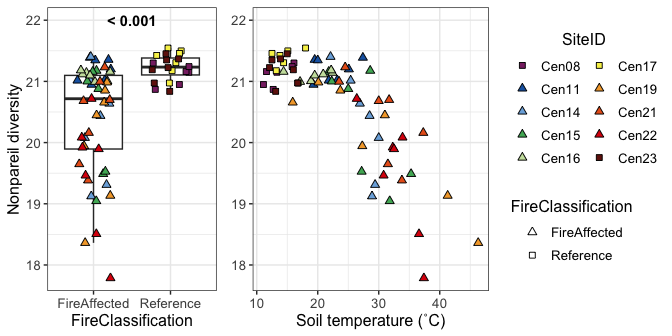

Overall metagenome statistics
================
Sam Barnett
08 August, 2025

- [Introduction](#introduction)
  - [Librarys and global variables](#librarys-and-global-variables)
  - [Metadata](#metadata)
- [Metagenome coverage and
  diversity](#metagenome-coverage-and-diversity)
- [Estimated genome size](#estimated-genome-size)
- [Taxonomy](#taxonomy)
  - [Read based taxonomy](#read-based-taxonomy)
  - [Contig taxonomy](#contig-taxonomy)
- [Sequencing stats for resource
  announcement](#sequencing-stats-for-resource-announcement)
- [Session info](#session-info)

# Introduction

Included here is the inital analysis of the metagenome data. We are
specifically examining broad trends from reads such as estimated genome
size, diversity, and taxonomic makeup.

## Librarys and global variables

Here are some libraries used in this analysis and the global varaibles
that will be used throughout. Mostly variables for consistent plotting.

``` r
# Libraries for data
library(dplyr)
library(phyloseq)
library(ape)
library(readxl)

# Libraries for analysis
library(vegan)
library(picante)
library(Nonpareil)
              
# Libraries for plotting
library(ggplot2)
source("/Users/sambarnett/Documents/Misc_code/paul_tol_colors.R")

# Functon for extracting legends
g_legend<-function(a.gplot){
  tmp <- ggplot_gtable(ggplot_build(a.gplot))
  leg <- which(sapply(tmp$grobs, function(x) x$name) == "guide-box")
  legend <- tmp$grobs[[leg]]
  return(legend)} 


# Site lists
used_sites = c("Cen08", "Cen11", "Cen14", "Cen15", "Cen16", "Cen17", "Cen19", 
               "Cen21", "Cen22", "Cen23")

# Setting repeated plot aesthetics
## Sites
site.col = paultol_colors(length(used_sites))
names(site.col) = used_sites

site.shape = c(22, 24, 24, 24, 24, 22, 24, 24, 24, 22)
names(site.shape) = used_sites

## Fire Classifications
FC.col = c("FireAffected" = "red", "Reference" = "grey")
FC.shape = c("FireAffected" = 24, "Reference" = 22)

# Basic plotting theme so as not to continually repeat it
publication_theme = theme_bw() +
  theme(axis.text = element_text(size=6),
        axis.title = element_text(size=7),
        legend.text = element_text(size=6),
        legend.title = element_text(size=7, hjust=0.5),
        strip.text = element_text(size=7),
        plot.title = element_text(size=8, hjust=0.5))

present_theme = theme_bw() +
  theme(axis.text = element_text(size=10),
        axis.title = element_text(size=12),
        legend.text = element_text(size=10),
        legend.title = element_text(size=12, hjust=0.5),
        strip.text = element_text(size=10),
        plot.title = element_text(size=14, hjust=0.5))
```

## Metadata

Read in the metadata.

``` r
# Sample metadata
sample.meta = read_xlsx("/Users/sambarnett/Documents/Shade_lab/Centralia_project/Centralia_soil_metadata.xlsx", 
                        sheet = "Metagenomic_samples", na="NA") %>%
  filter(SampleID != "Cen08_07102019_R1") %>%
  arrange(SiteID, Year) %>%
  mutate(Seq_number = row_number()) %>%
  mutate(nonpareil_file = paste("/Users/sambarnett/Documents/Shade_lab/Centralia_project/Metagenomics/Data/nonpareil/", SampleID, "_S", Seq_number, ".npo", sep=""),
         SequenceID = paste(SampleID, Seq_number, sep="_S"))

readstats.df = read.table("/Users/sambarnett/Documents/Shade_lab/Centralia_project/Metagenomics/Data/Filtered_read_statistics.txt", 
                          header=TRUE, sep="\t", comment.char = "", quote = "") %>%
  mutate(total_reads = Forward_read_count + Reverse_read_count) %>%
  select(SampleID, total_reads) %>%
  rename(SequenceID = SampleID) 

mapped_reads.df = read.table("/Users/sambarnett/Documents/Shade_lab/Centralia_project/Metagenomics/Data/Mapped_read_totals.txt", 
                          header=TRUE, sep="\t", comment.char = "", quote = "")
```

# Metagenome coverage and diversity

Lets see how well we sequenced these metagenomes. We used nonpareil to
estimate the coverage of these metagenomes as well as estimate
diversity. First lets see how well covered these metagenomes are.

``` r
# Read in the the nonpareil data. These are separate files.
nonpareil.full = Nonpareil.set(sample.meta$nonpareil_file)
```

<!-- -->

``` r
# First look at coverage
nonpareil.df = data.frame()
for (i in seq(1, length(nonpareil.full@np.curves))){
  nonpareil.df = rbind(nonpareil.df, 
                       data.frame(SequenceID = nonpareil.full@np.curves[[i]]$label,
                                  effort = nonpareil.full@np.curves[[i]]$x.adj,
                                  coverage = nonpareil.full@np.curves[[i]]$y.cov))
}

# Add in the metadata
nonpareil.df = nonpareil.df %>%
  left_join(sample.meta, by = "SequenceID")

# Plot curves using ggplot
ggplot(data=nonpareil.df, aes(x=effort/1000000000/2, y=coverage)) +
  geom_hline(yintercept = 1) +
  geom_hline(yintercept = 0.95, linetype=2) +
  geom_line(aes(group=SequenceID, color=CoreTemp_C)) +
  scale_color_gradient(low="blue", high="red") +
  lims(x=c(0,NA), y=c(0,1)) +
  labs(x="Sequencing effort (Gbp)", y="Estimated average coverage", color="Soil temp.\n(˚C)") +
  present_theme +
  facet_wrap(~FireClassification)
```

<!-- -->

Now lets take a look at the diversity.

``` r
# Now look at diversity
nonpareil.sum = data.frame(summary(nonpareil.full)) %>%
  tibble::rownames_to_column(var="SequenceID") %>%
  mutate(SampleID = gsub("_S.*", "", SequenceID)) %>%
  left_join(sample.meta, by = c("SequenceID", "SampleID"))

nonpareil_diversity_FC.wilcox = wilcox.test(x=filter(nonpareil.sum, FireClassification=="Reference")$diversity,
                                            y=filter(nonpareil.sum, FireClassification=="FireAffected")$diversity,
                                            conf.int=TRUE, conf.level=0.95)
nonpareil_diversity_FC.wilcox
```

    ## 
    ##  Wilcoxon rank sum exact test
    ## 
    ## data:  filter(nonpareil.sum, FireClassification == "Reference")$diversity and filter(nonpareil.sum, FireClassification == "FireAffected")$diversity
    ## W = 816, p-value = 5.543e-06
    ## alternative hypothesis: true location shift is not equal to 0
    ## 95 percent confidence interval:
    ##  0.2578372 1.0135277
    ## sample estimates:
    ## difference in location 
    ##              0.4918761

``` r
# Plot by fire classification
nonpareil_diversity_FC.plot = ggplot(data=nonpareil.sum, aes(x=FireClassification, y=diversity)) +
  geom_boxplot(outlier.shape=NA) +
  geom_jitter(aes(fill=SiteID, shape=FireClassification), size=2, width=0.25) +
  annotate("text", label="< 0.001", fontface="bold", x=1.5, y=22) +
  lims(y=c(NA, 22)) +
  scale_fill_manual(values=site.col) +
  scale_shape_manual(values=FC.shape) +
  labs(x="FireClassification", y="Nonpareil diversity") +
  present_theme +
  theme(legend.position = "none") +
  guides(fill=guide_legend(override.aes=list(shape=site.shape), ncol=2))

# Plot by temperature
nonpareil_diversity_temp.plot = ggplot(data=nonpareil.sum, aes(x=CoreTemp_C, y=diversity)) +
  geom_point(aes(fill=SiteID, shape=FireClassification), size=2) +
  lims(y=c(NA, 22)) +
  scale_fill_manual(values=site.col) +
  scale_shape_manual(values=FC.shape) +
  labs(x="Soil temperature (˚C)", y="Nonpareil diversity") +
  present_theme +
  guides(fill=guide_legend(override.aes=list(shape=site.shape), ncol=2))

cowplot::plot_grid(nonpareil_diversity_FC.plot,
                   nonpareil_diversity_temp.plot + theme(axis.title.y=element_blank()), 
                   rel_widths = c(0.5, 1))
```

<!-- -->

Lets also see how diversity changes over time.

``` r
# Compare across time
nonpareil_diversity_time.model.df = data.frame()
for (FC in c("FireAffected", "Reference")){
  sub_nonpareil_diversity.model = lme(diversity ~ Year, random = ~1|SiteID, data=filter(nonpareil.sum, FireClassification == FC))
  nonpareil_diversity_time.model.df = rbind(nonpareil_diversity_time.model.df,
                           data.frame(summary(sub_nonpareil_diversity.model)$tTable) %>%
                             tibble::rownames_to_column(var="factor") %>%
                             mutate(FireClassification = FC))
}
nonpareil_diversity_time.model.df
```

    ##        factor         Value   Std.Error DF    t.value      p.value
    ## 1 (Intercept) -471.84012062 80.20778440 41 -5.8827223 6.352568e-07
    ## 2        Year    0.24392667  0.03974602 41  6.1371340 2.760814e-07
    ## 3 (Intercept)  -16.47818088 45.16621688 16 -0.3648342 7.200126e-01
    ## 4        Year    0.01868129  0.02238224 16  0.8346479 4.162047e-01
    ##   FireClassification
    ## 1       FireAffected
    ## 2       FireAffected
    ## 3          Reference
    ## 4          Reference

``` r
# Get regressions for plot
nonpareil_diversity_time.model.reg = nonpareil_diversity_time.model.df %>%
  mutate(p_slope = ifelse(factor == "Year", p.value, 1),
         factor = ifelse(factor == "(Intercept)", "Intercept", factor)) %>%
  group_by(FireClassification) %>%
  mutate(p_slope = min(p_slope)) %>%
  ungroup %>%
  select(FireClassification, factor, Value, p_slope) %>%
  tidyr::spread(key="factor", value="Value") %>%
  mutate(sig = ifelse(p_slope < 0.05, "< 0.05", "≥ 0.05"))

# Plot
ggplot(data=nonpareil.sum, aes(x=Year, y=diversity)) +
  geom_line(aes(group=SiteID), color="black", size=1) + 
  geom_line(aes(color=SiteID), size=0.5) + 
  geom_point(size=2, aes(fill=SiteID, shape=FireClassification)) +
  geom_abline(data=nonpareil_diversity_time.model.reg, 
              aes(intercept = Intercept, slope = Year), linetype = 1, size=2, color="black") +
  geom_abline(data=nonpareil_diversity_time.model.reg, 
              aes(intercept = Intercept, slope = Year, linetype = sig), size=1, color="white") +
  scale_shape_manual(values=FC.shape) +
  scale_fill_manual(values=site.col) +
  scale_color_manual(values=site.col) +
  scale_linetype_manual(values=c("< 0.05" = 1, "≥ 0.05" = 2)) +
  labs(x="Year", y="Nonpareil diversity", linetype="LME p-value") +
  present_theme +
  theme(legend.direction = "vertical") +
  facet_wrap(~FireClassification) +
  guides(fill=guide_legend(override.aes=list(shape=site.shape), ncol=2),
         linetype=guide_legend(override.aes=list(color="black")))
```

<!-- -->

# Estimated genome size

We used microbecensus to estimate average genome size.

``` r
# Import microbecensus data
microbe_census.df = read.table("/Users/sambarnett/Documents/Shade_lab/Centralia_project/Metagenomics/Data/microbecensus_comb_out.txt",
                               header=TRUE, sep="\t") %>%
  mutate(average_genome_size_Mbp = average_genome_size/1000000) %>%
  arrange(-average_genome_size) %>%
  mutate(Gsize_rank = row_number()) %>%
  left_join(sample.meta, by = "SequenceID") %>%
  left_join(readstats.df, by = "SequenceID")

# Plot genome size by fire class
Gsize_FC.wilcox = wilcox.test(x=filter(microbe_census.df, FireClassification=="Reference")$average_genome_size_Mbp,
                              y=filter(microbe_census.df, FireClassification=="FireAffected")$average_genome_size_Mbp,
                              conf.int=TRUE, conf.level=0.95)
Gsize_FC.wilcox
```

    ## 
    ##  Wilcoxon rank sum exact test
    ## 
    ## data:  filter(microbe_census.df, FireClassification == "Reference")$average_genome_size_Mbp and filter(microbe_census.df, FireClassification == "FireAffected")$average_genome_size_Mbp
    ## W = 856, p-value = 1.838e-07
    ## alternative hypothesis: true location shift is not equal to 0
    ## 95 percent confidence interval:
    ##  0.3404824 0.8422117
    ## sample estimates:
    ## difference in location 
    ##              0.5518273

``` r
Gsize_FC.plot = ggplot(data=microbe_census.df, aes(x=FireClassification, y=average_genome_size_Mbp)) +
  geom_boxplot(outlier.shape = NA) +
  geom_jitter(aes(fill=SiteID, shape=FireClassification), size=3, width=0.25, height=0) +
  annotate("text", label="< 0.001", fontface="bold", x=1.5, y=6.75) +
  lims(y=c(NA, 6.75)) +
  scale_fill_manual(values=site.col) +
  scale_shape_manual(values=FC.shape) +
  labs(x="FireClassification", y="Estimated average genome size (Mbp)") +
  present_theme +
  theme(legend.position = "none") +
  guides(fill=guide_legend(override.aes=list(shape=site.shape), ncol=2))

# Plot genome size by temperature
Gsize_temp.model = lme(average_genome_size_Mbp ~ CoreTemp_C, random = ~1|SiteID, data=microbe_census.df)

## Get regression for plot
Gsize_temp.model.reg.df = data.frame(summary(Gsize_temp.model)$tTable) %>%
  tibble::rownames_to_column(var="factor") %>%
  mutate(p_slope = ifelse(factor == "CoreTemp_C", p.value, 1),
         factor = ifelse(factor == "(Intercept)", "Intercept", factor)) %>%
  mutate(p_slope = min(p_slope)) %>%
  ungroup %>%
  select(factor, Value, p_slope) %>%
  tidyr::spread(key=factor, value = Value) %>%
  mutate(sig = ifelse(p_slope < 0.05, "< 0.05", "≥ 0.05"))
summary(Gsize_temp.model)
```

    ## Linear mixed-effects model fit by REML
    ##   Data: microbe_census.df 
    ##        AIC      BIC    logLik
    ##   68.19567 77.01444 -30.09783
    ## 
    ## Random effects:
    ##  Formula: ~1 | SiteID
    ##         (Intercept)  Residual
    ## StdDev:   0.1749679 0.3217183
    ## 
    ## Fixed effects:  average_genome_size_Mbp ~ CoreTemp_C 
    ##                 Value  Std.Error DF  t-value p-value
    ## (Intercept)  6.806706 0.16640912 58 40.90344       0
    ## CoreTemp_C  -0.050666 0.00655782 58 -7.72597       0
    ##  Correlation: 
    ##            (Intr)
    ## CoreTemp_C -0.914
    ## 
    ## Standardized Within-Group Residuals:
    ##         Min          Q1         Med          Q3         Max 
    ## -1.87463339 -0.67791736 -0.07303353  0.54488834  2.41864288 
    ## 
    ## Number of Observations: 69
    ## Number of Groups: 10

``` r
## Plot
Gsize_temp.plot = ggplot(data=microbe_census.df, aes(x=CoreTemp_C, y=average_genome_size_Mbp)) +
  geom_point(aes(fill=SiteID, shape=FireClassification), size=3) +
  geom_abline(data=Gsize_temp.model.reg.df, aes(intercept = Intercept, slope = CoreTemp_C), 
              linetype = 1, size=2, color="black") +
  geom_abline(data=Gsize_temp.model.reg.df, aes(intercept = Intercept, slope = CoreTemp_C, linetype = sig), 
              size=1, color="white") +
  lims(y=c(NA, 6.75)) +
  scale_fill_manual(values=site.col) +
  scale_shape_manual(values=FC.shape) +
  scale_linetype_manual(values=c("< 0.05" = 1, "≥ 0.05" = 2)) +
  #lims(y=c(4,7)) +
  labs(x="Soil temperature (˚C)", y="Estimated average genome size (Mbp)", linetype="Regression\nslope p-value") +
  present_theme +
  guides(fill=guide_legend(override.aes=list(shape=site.shape), ncol=2),
         linetype="none")

cowplot::plot_grid(Gsize_FC.plot,
                   Gsize_temp.plot + theme(axis.title.y=element_blank()), 
                   rel_widths = c(0.5, 1))
```

<!-- -->

Now lets look at this over time like before

``` r
# Compare across time
Gsize_time.model.df = data.frame()
for (FC in c("FireAffected", "Reference")){
  sub_Gsize.model = lme(average_genome_size_Mbp ~ Year, random = ~1|SiteID, data=filter(microbe_census.df, FireClassification == FC))
  Gsize_time.model.df = rbind(Gsize_time.model.df,
                           data.frame(summary(sub_Gsize.model)$tTable) %>%
                             tibble::rownames_to_column(var="factor") %>%
                             mutate(FireClassification = FC))
}
Gsize_time.model.df
```

    ##        factor         Value   Std.Error DF     t.value      p.value
    ## 1 (Intercept) -2.612163e+02 51.68421550 41 -5.05408215 9.423397e-06
    ## 2        Year  1.321400e-01  0.02561152 41  5.15939755 6.707101e-06
    ## 3 (Intercept)  2.564951e+00 51.83020546 16  0.04948757 9.611433e-01
    ## 4        Year  1.740852e-03  0.02568457 16  0.06777813 9.468020e-01
    ##   FireClassification
    ## 1       FireAffected
    ## 2       FireAffected
    ## 3          Reference
    ## 4          Reference

``` r
## Get regression for plot
Gsize_time.model.reg = Gsize_time.model.df %>%
  mutate(p_slope = ifelse(factor == "Year", p.value, 1),
         factor = ifelse(factor == "(Intercept)", "Intercept", factor)) %>%
  group_by(FireClassification) %>%
  mutate(p_slope = min(p_slope)) %>%
  ungroup %>%
  select(FireClassification, factor, Value, p_slope) %>%
  tidyr::spread(key="factor", value="Value") %>%
  mutate(sig = ifelse(p_slope < 0.05, "< 0.05", "≥ 0.05"))

## Plot
ggplot(data=microbe_census.df, aes(x=Year, y=average_genome_size_Mbp)) +
  geom_line(aes(group=SiteID), color="black", size=1) + 
  geom_line(aes(color=SiteID), size=0.5) + 
  geom_point(size=2, aes(fill=SiteID, shape=FireClassification)) +
  geom_abline(data=Gsize_time.model.reg, 
              aes(intercept = Intercept, slope = Year), linetype = 1, size=2, color="black") +
  geom_abline(data=Gsize_time.model.reg, 
              aes(intercept = Intercept, slope = Year, linetype = sig), size=1, color="white") +
  scale_shape_manual(values=FC.shape) +
  scale_fill_manual(values=site.col) +
  scale_color_manual(values=site.col) +
  scale_linetype_manual(values=c("< 0.05" = 1, "≥ 0.05" = 2)) +
  labs(x="Year", y="Estimated average genome size (Mbp)", linetype="LME p-value") +
  present_theme +
  theme(legend.direction = "vertical") +
  facet_wrap(~FireClassification) +
  guides(fill=guide_legend(override.aes=list(shape=site.shape), ncol=2),
         linetype=guide_legend(override.aes=list(color="black")))
```

<!-- -->

# Taxonomy

## Read based taxonomy

We estimated read based taxonomy using braken Lets take a look at the
broad taxonomic breakdown of these metagenomes.

``` r
# Read in taxonomy IDs and their taxonomy breakdown used by braken. We will use these to link the taxonomy IDs from the braken output to taxonomy.
Main_taxonomy.df = read.table("/Users/sambarnett/Documents/Shade_lab/Centralia_project/Metagenomics/Data/Annotations/main_taxonomic_ranks.txt",
                              header=TRUE, sep="\t", quote="", comment.char="") %>%
  tidyr::spread(key=Ancestor_level, value=Ancestor) %>%
  rename(Domain = D,
         Phylum = P,
         Class = C,
         Order = O,
         Family = F,
         Genus = G,
         Species = S)

# Read in the braken results and map taxonomies and summarize read percentages per class and only indicate those with over 1% of the reads.

bracken.df = read.table("/Users/sambarnett/Documents/Shade_lab/Centralia_project/Metagenomics/Data/Read_taxonomy.txt",
                               header=TRUE, sep="\t", quote="", comment.char="") %>%
  rename(TaxID = taxonomy_id) %>%
  left_join(Main_taxonomy.df, by="TaxID") %>%
  filter(Domain == "Bacteria") %>%
  group_by(SequenceID) %>%
  mutate(total_classified_reads = sum(fraction_total_reads)) %>%
  ungroup %>%
  mutate(percent_class_reads = fraction_total_reads/total_classified_reads*100) %>%
  group_by(Domain, Class) %>%
  mutate(max_perc_reads = max(percent_class_reads)) %>%
  ungroup %>%
  mutate(Class = ifelse(max_perc_reads < 1, "Less than 1%", Class)) %>%
  group_by(SequenceID, Class) %>%
  summarize(percent_class_reads = sum(percent_class_reads)) %>%
  ungroup %>%
  left_join(sample.meta, by = "SequenceID") %>%
  mutate(SequenceID = factor(SequenceID, levels = arrange(sample.meta, CoreTemp_C)$SequenceID))
bracken.df$Class = factor(bracken.df$Class,
                          levels = c(sort(unique(filter(bracken.df, Class != "Less than 1%")$Class)), "Less than 1%"))

class.col = c(paultol_colors(length(levels(bracken.df$Class))-1), "#777777")
names(class.col) = levels(bracken.df$Class)

# Plot (with temperature for fun)
ggplot(data=bracken.df, aes(x=as.factor(Year), y=percent_class_reads)) +
  geom_bar(stat="identity", aes(fill=Class), color="black") +
  geom_line(data=sample.meta, aes(y=CoreTemp_C/0.5, group=1), size=1, color="black") +
  geom_line(data=sample.meta, aes(y=CoreTemp_C/0.5, group=1), size=0.5, color="green") +
  scale_fill_manual(values = class.col) +
  scale_y_continuous(name = "Percent of Bacterial reads (%)", limits = c(-4, 101), 
                    sec.axis = sec_axis(~.*0.5, name="Soil temperature (˚C)")) +
  labs(x="Year", fill="Bacterial class") +
  present_theme +
  theme(axis.text.x = element_text(angle=90)) +
  facet_wrap(~FireClassification*SiteID, nrow=2)
```

<!-- -->

## Contig taxonomy

From the assembled contigs we used kraken to taxonomically assign. Lets
see the taxonomic breakdown of these assemblies.

``` r
# Read in the taxonomy from the IDs
Main_taxonomy.df = read.table("/Users/sambarnett/Documents/Shade_lab/Centralia_project/Metagenomics/Data/Annotations/main_taxonomic_ranks.txt",
                              header=TRUE, sep="\t", quote="", comment.char="") %>%
  tidyr::spread(key=Ancestor_level, value=Ancestor) %>%
  rename(Domain = D,
         Phylum = P,
         Class = C,
         Order = O,
         Family = F,
         Genus = G,
         Species = S)

# Read in the contig taxonomic assignments and match with their IDs
contig_tax.df = read.table("/Users/sambarnett/Documents/Shade_lab/Centralia_project/Metagenomics/Data/Annotations/Contig_taxonomy.txt",
                               header=TRUE, sep="\t", quote="", comment.char="") %>%
  rename(TaxID = TaxonomyID) %>%
  left_join(Main_taxonomy.df, by="TaxID") %>%
  mutate(Taxa = ifelse(is.na(Domain) | Domain == "Unclassified", "Unclassified",
                       ifelse(is.na(Phylum) | Phylum == "Unclassified", paste("Unclassified", Domain),
                              paste(Domain, Phylum, sep = "; "))))

# Summarize contig percentages per phyla and only indicate those with over 1% of the contigs
classified_contig.sum = contig_tax.df %>%
  group_by(SequenceID) %>%
  mutate(total_contigs = n()) %>%
  ungroup %>%
  filter(!grepl("Unclassified", Taxa)) %>%
  group_by(SequenceID, total_contigs) %>%
  summarize(classified_contigs = n()) %>%
  ungroup %>%
  mutate(percent_classified_contigs = classified_contigs/total_contigs*100) %>%
  left_join(sample.meta, by = "SequenceID")

contig_tax.sum = contig_tax.df %>%
  filter(!grepl("Unclassified", Taxa)) %>%
  group_by(SequenceID) %>%
  mutate(classified_contigs = n()) %>%
  ungroup %>%
  group_by(SequenceID, classified_contigs, Taxa) %>%
  summarize(n_contigs = n()) %>%
  ungroup %>%
  mutate(percent_contigs = n_contigs/classified_contigs*100) %>%
  group_by(Taxa) %>%
  mutate(max_percent_contigs = max(percent_contigs)) %>%
  ungroup %>%
  mutate(Taxa = ifelse(max_percent_contigs < 1, "Less than 1%", Taxa)) %>%
  group_by(SequenceID, Taxa) %>%
  summarize(percent_contigs = sum(percent_contigs)) %>%
  ungroup %>%
  left_join(sample.meta, by = "SequenceID")

contig_tax.sum$Taxa = factor(contig_tax.sum$Taxa,
                          levels = c(sort(unique(filter(contig_tax.sum, Taxa != "Less than 1%")$Taxa)), "Less than 1%"))

taxa.col = c(paultol_colors(length(levels(contig_tax.sum$Taxa))-1), "#777777")
names(taxa.col) = levels(contig_tax.sum$Taxa)

# Plot (with temperature for fun)
contig_tax.plot = ggplot(data=contig_tax.sum, aes(x=as.factor(Year), y=percent_contigs)) +
  geom_bar(stat="identity", aes(fill=Taxa), color="black", size=0.3) +
  geom_line(data=sample.meta, aes(y=CoreTemp_C/0.5, group=1), size=1, color="black") +
  geom_line(data=sample.meta, aes(y=CoreTemp_C/0.5, group=1), size=0.5, color="white") +
  #geom_text(data=classified_contig.sum, aes(label=round(percent_classified_contigs, digits = 1)), 
  #          y=102, size=5*5/14, angle=90, hjust=0) +
  scale_fill_manual(values = taxa.col) +
  scale_y_continuous(name = "Percent of phylum-classified contigs (%)", limits = c(-1, 101), 
                    sec.axis = sec_axis(~.*0.5, name="Soil temperature (˚C)")) +
  labs(x="Year", fill="Domain; Phylum") +
  publication_theme +
  theme(axis.text.x = element_text(angle=90)) +
  facet_wrap(~FireClassification*SiteID, nrow=2)
contig_tax.plot
```

<!-- -->

``` r
#ggsave(contig_tax.plot, file="/Users/sambarnett/Documents/Shade_lab/Centralia_project/Metagenomics/Resource announcement/Fig1.tiff",
#       device="tiff", width=7, height=5, units="in", bg="white")
```

# Sequencing stats for resource announcement

Here are some sequencing stats used for the resource announcement.

``` r
MRA.df = sample.meta %>%
  mutate(Collection_date = paste(Day, "Oct", Year)) %>%
  select(SequenceID, SiteID, Year, Collection_date, CoreTemp_C, FireClassification) %>%
  left_join(read.table("/Users/sambarnett/Documents/Shade_lab/Centralia_project/Metagenomics/Data/Contig_summaries.txt",
                       header=TRUE, sep="\t", quote="", comment.char="")) %>%
  left_join(readstats.df) %>%
  arrange(SiteID, Year) %>%
  select(-Year)
MRA.df
```

    ## # A tibble: 69 × 10
    ##    SequenceID         SiteID Collection_date CoreTemp_C FireClassification   N50
    ##    <chr>              <chr>  <chr>                <dbl> <chr>              <int>
    ##  1 Cen08_13102015_R1… Cen08  13 Oct 2015           12.7 Reference           2279
    ##  2 Cen08_12102016_R1… Cen08  12 Oct 2016           11.1 Reference           2683
    ##  3 Cen08_21102017_R1… Cen08  21 Oct 2017           13.3 Reference           2816
    ##  4 Cen08_04102018_R1… Cen08  4 Oct 2018            16.1 Reference           3067
    ##  5 Cen08_15102020_R1… Cen08  15 Oct 2020           11.6 Reference           3389
    ##  6 Cen08_06102021_R1… Cen08  6 Oct 2021            15.8 Reference           3720
    ##  7 Cen11_12102015_R1… Cen11  12 Oct 2015           27.4 FireAffected        2024
    ##  8 Cen11_11102016_R1… Cen11  11 Oct 2016           25.1 FireAffected        2221
    ##  9 Cen11_20102017_R1… Cen11  20 Oct 2017           23.2 FireAffected        2358
    ## 10 Cen11_03102018_R1… Cen11  3 Oct 2018            21.8 FireAffected        2626
    ## # ℹ 59 more rows
    ## # ℹ 4 more variables: Contig_count <int>, Total_length <int>,
    ## #   Longest_contig <int>, total_reads <int>

``` r
#write.table(MRA.df, file="/Users/sambarnett/Documents/Shade_lab/Centralia_project/Metagenomics/Resource announcement/Table1.txt",
#            sep="\t", quote=FALSE, row.names = FALSE)
```

# Session info

``` r
sessionInfo()
```

    ## R version 4.4.1 (2024-06-14)
    ## Platform: aarch64-apple-darwin20
    ## Running under: macOS Ventura 13.0.1
    ## 
    ## Matrix products: default
    ## BLAS:   /Library/Frameworks/R.framework/Versions/4.4-arm64/Resources/lib/libRblas.0.dylib 
    ## LAPACK: /Library/Frameworks/R.framework/Versions/4.4-arm64/Resources/lib/libRlapack.dylib;  LAPACK version 3.12.0
    ## 
    ## locale:
    ## [1] en_US.UTF-8/en_US.UTF-8/en_US.UTF-8/C/en_US.UTF-8/en_US.UTF-8
    ## 
    ## time zone: America/Detroit
    ## tzcode source: internal
    ## 
    ## attached base packages:
    ## [1] stats     graphics  grDevices utils     datasets  methods   base     
    ## 
    ## other attached packages:
    ##  [1] ggplot2_3.5.2   Nonpareil_3.5.3 picante_1.8.2   nlme_3.1-166   
    ##  [5] vegan_2.6-8     lattice_0.22-6  permute_0.9-7   readxl_1.4.3   
    ##  [9] ape_5.8         phyloseq_1.48.0 dplyr_1.1.4    
    ## 
    ## loaded via a namespace (and not attached):
    ##  [1] ade4_1.7-22             tidyselect_1.2.1        farver_2.1.2           
    ##  [4] Biostrings_2.72.1       fastmap_1.2.0           digest_0.6.37          
    ##  [7] lifecycle_1.0.4         cluster_2.1.6           survival_3.7-0         
    ## [10] magrittr_2.0.3          compiler_4.4.1          rlang_1.1.4            
    ## [13] tools_4.4.1             igraph_2.0.3            utf8_1.2.4             
    ## [16] yaml_2.3.10             data.table_1.16.0       knitr_1.48             
    ## [19] labeling_0.4.3          plyr_1.8.9              withr_3.0.1            
    ## [22] purrr_1.0.2             BiocGenerics_0.50.0     grid_4.4.1             
    ## [25] stats4_4.4.1            fansi_1.0.6             multtest_2.60.0        
    ## [28] biomformat_1.32.0       colorspace_2.1-1        Rhdf5lib_1.26.0        
    ## [31] scales_1.3.0            iterators_1.0.14        MASS_7.3-61            
    ## [34] cli_3.6.3               rmarkdown_2.29          crayon_1.5.3           
    ## [37] generics_0.1.3          rstudioapi_0.16.0       httr_1.4.7             
    ## [40] reshape2_1.4.4          rhdf5_2.48.0            stringr_1.5.1          
    ## [43] zlibbioc_1.50.0         splines_4.4.1           parallel_4.4.1         
    ## [46] cellranger_1.1.0        XVector_0.44.0          vctrs_0.6.5            
    ## [49] Matrix_1.7-0            jsonlite_1.8.8          IRanges_2.38.1         
    ## [52] S4Vectors_0.42.1        foreach_1.5.2           tidyr_1.3.1            
    ## [55] glue_1.7.0              codetools_0.2-20        cowplot_1.1.3          
    ## [58] stringi_1.8.4           gtable_0.3.5            GenomeInfoDb_1.40.1    
    ## [61] UCSC.utils_1.0.0        munsell_0.5.1           tibble_3.2.1           
    ## [64] pillar_1.9.0            htmltools_0.5.8.1       rhdf5filters_1.16.0    
    ## [67] GenomeInfoDbData_1.2.12 R6_2.5.1                evaluate_0.24.0        
    ## [70] Biobase_2.64.0          highr_0.11              Rcpp_1.0.13            
    ## [73] mgcv_1.9-1              xfun_0.52               pkgconfig_2.0.3
