Analysis of overall annotations
================
Sam Barnett
08 August, 2025

- [Introduction](#introduction)
  - [Librarys and global variables](#librarys-and-global-variables)
  - [Metadata](#metadata)
  - [KEGG annotations](#kegg-annotations)
  - [Get OTU data](#get-otu-data)
- [Amplicon analysis](#amplicon-analysis)
  - [PERMANOVA](#permanova)
  - [Ordination](#ordination)
- [KEGG annotation analysis](#kegg-annotation-analysis)
  - [PERMANOVA](#permanova-1)
  - [Ordination](#ordination-1)
  - [CAP analysis](#cap-analysis)
- [Comparing community struture and metagenome
  structure](#comparing-community-struture-and-metagenome-structure)
- [More metagenome beta-diversity
  analyses](#more-metagenome-beta-diversity-analyses)
  - [Nestedness and turnover across space and
    time](#nestedness-and-turnover-across-space-and-time)
  - [Time lag analysis](#time-lag-analysis)
  - [Trajectory analysis](#trajectory-analysis)
  - [Community functional distances to reference over time and
    disturbance
    intensity.](#community-functional-distances-to-reference-over-time-and-disturbance-intensity)
- [Session info](#session-info)

# Introduction

In this notebook, lets look at the overall annotations. We will ask the
questions: How different are these communities functionally? How do
these community functional potentials change over time and temperature?
Annotations were made on contigs (and MAGs) by matching genes to KEGG
orthologues (KOs).

## Librarys and global variables

Here are some libraries used in this analysis and the global varaibles
that will be used throughout. Mostly variables for consistent plotting.

``` r
# Libraries for data
library(dplyr)
library(phyloseq)
library(ape)
library(readxl)

# Libraries for analysis
library(vegan)
library(picante)
library(Nonpareil)
library(ecotraj)
library(betapart)

# Libraries for plotting
library(ggplot2)
source("/Users/sambarnett/Documents/Misc_code/paul_tol_colors.R")

# Functon for extracting legends
g_legend<-function(a.gplot){
  tmp <- ggplot_gtable(ggplot_build(a.gplot))
  leg <- which(sapply(tmp$grobs, function(x) x$name) == "guide-box")
  legend <- tmp$grobs[[leg]]
  return(legend)} 


# Site lists
used_sites = c("Cen08", "Cen11", "Cen14", "Cen15", "Cen16", "Cen17", "Cen19", 
               "Cen21", "Cen22", "Cen23")

# Setting repeated plot aesthetics
## Sites
site.col = paultol_colors(length(used_sites))
names(site.col) = used_sites

site.shape = c(22, 24, 24, 24, 24, 22, 24, 24, 24, 22)
names(site.shape) = used_sites

## Fire Classifications
FC.col = c("FireAffected" = "red", "Reference" = "grey")
FC.shape = c("FireAffected" = 24, "Reference" = 22)

# Basic plotting theme so as not to continually repeat it
publication_theme = theme_bw() +
  theme(axis.text = element_text(size=6),
        axis.title = element_text(size=7),
        legend.text = element_text(size=6),
        legend.title = element_text(size=7, hjust=0.5),
        strip.text = element_text(size=7),
        plot.title = element_text(size=8, hjust=0.5))

present_theme = theme_bw() +
  theme(axis.text = element_text(size=10),
        axis.title = element_text(size=12),
        legend.text = element_text(size=10),
        legend.title = element_text(size=12, hjust=0.5),
        strip.text = element_text(size=10),
        plot.title = element_text(size=14, hjust=0.5))
```

## Metadata

Read in the metadata.

``` r
# Sample metadata
sample.meta = read_xlsx("/Users/sambarnett/Documents/Shade_lab/Centralia_project/Centralia_soil_metadata.xlsx", 
                        sheet = "Metagenomic_samples", na="NA") %>%
  filter(SampleID != "Cen08_07102019_R1") %>%
  arrange(SiteID, Year) %>%
  mutate(Seq_number = row_number()) %>%
  mutate(nonpareil_file = paste("/Users/sambarnett/Documents/Shade_lab/Centralia_project/Metagenomics/Data/nonpareil/", SampleID, "_S", Seq_number, ".npo", sep=""),
         SequenceID = paste(SampleID, Seq_number, sep="_S"))

# Total mapped reads. Used for RPKM measures.
mapped_reads.df = read.table("/Users/sambarnett/Documents/Shade_lab/Centralia_project/Metagenomics/Data/Mapped_read_totals.txt", 
                          header=TRUE, sep="\t", comment.char = "", quote = "")
```

## KEGG annotations

Read in the KEGG annotions. This is a massive file so it might take a
little while.

``` r
KEGG_long.df = read.table("/Users/sambarnett/Documents/Shade_lab/Centralia_project/Metagenomics/Data/Annotations/KEGG_COG_annotations.txt",
                       header=TRUE, sep="\t", comment.char = "", quote = "") %>%
  filter(KEGG_ortho_kofamscan != "") %>%
  mutate(mapped_reads = Plus_reads + Minus_reads) %>%
  select(locus_tag, KEGG_ortho_kofamscan, SequenceID, mapped_reads) %>%
  arrange(locus_tag, KEGG_ortho_kofamscan) %>%
  left_join(mapped_reads.df, by = "SequenceID") %>%
  left_join(read.table("/Users/sambarnett/Documents/Shade_lab/Centralia_project/Metagenomics/Data/Annotations/prokka_CDS_annotations.txt",
                       header=TRUE, sep="\t", comment.char = "", quote = "") %>%
              select(locus_tag, SequenceID, length_bp)) %>%
  mutate(RPKM = mapped_reads/((length_bp/1000)*(total_mapped_reads/1000000))) %>%
  mutate(RPKM = ifelse(is.na(RPKM), 0, RPKM))
```

## Get OTU data

In order to compare to previous amplicon based data (OTUs) lets load up
and process that data like we did for that study.

For this data we need to remove the RNA sample set, the sample set from
2014 (not flash frozen and extracted with MoBio kits not the
Phenol-Chloroform method). We also want to remove any sites that don’t
have samples in less than 3 years so that we can get an analysis using
the timeseries.

``` r
# Import filtered phyloseq
DNA_RNA.physeq = readRDS(file="/Users/sambarnett/Documents/Shade_lab/Centralia_project/Multi_year_project/Data/RNA_DNA_physeq.RDS")

# Remove RNA samples
DNA.physeq = subset_samples(DNA_RNA.physeq, NucAcid_type == "DNA")
DNA.physeq = prune_taxa(taxa_sums(DNA.physeq) > 0, DNA.physeq)
DNA_RNA.physeq = NULL

# Samples just included in metagenome
meta.DNA.physeq = subset_samples(DNA.physeq, SampleID %in% sample.meta$SampleID)
meta.DNA.physeq = prune_taxa(taxa_sums(meta.DNA.physeq) > 0, meta.DNA.physeq)
DNA.physeq = NULL

## Rarefy dataset
set.seed(4242)
meta.rare.physeq = rarefy_even_depth(meta.DNA.physeq)
meta.DNA.physeq = NULL

rare_depth = mean(colSums(otu_table(meta.rare.physeq)))
print(paste("Rarifying to:", rare_depth))
```

    ## [1] "Rarifying to: 161171"

``` r
sample_data(meta.rare.physeq)$SiteID = factor(sample_data(meta.rare.physeq)$SiteID, levels=used_sites)
```

# Amplicon analysis

First run basic beta diversity analyses on the amplicon data. This is
similar to what has been already published. We are essentially seeing if
community composition varies across our samples.

## PERMANOVA

Does fire class or sampling year explain any of the variation in
community composition differences?

``` r
# Set up the blocking design for the permanova. In this case since we are repeatedly sampling the same sites over multiple years I include SiteID as the block. This is similar to "strata" in the old version of adonis.
perm <- how(nperm = 999)
dat = data.frame(sample_data(meta.rare.physeq))
setBlocks(perm) <- with(dat, SiteID)

# Get the Bray-Curtis dissimilarity
OTU_BC.dist = vegdist(t(otu_table(meta.rare.physeq)), method="bray", binary=FALSE, diag=TRUE, upper=TRUE)

# Run adonis2 
set.seed(4242)
OTU_BC.adonis = adonis2(formula = OTU_BC.dist ~ FireClassification*as.factor(Year), 
                        permutations = perm, data = dat, by="terms")
OTU_BC.adonis
```

    ## Permutation test for adonis under reduced model
    ## Terms added sequentially (first to last)
    ## Blocks:  with(dat, SiteID) 
    ## Permutation: free
    ## Number of permutations: 999
    ## 
    ## adonis2(formula = OTU_BC.dist ~ FireClassification * as.factor(Year), data = dat, permutations = perm, by = "terms")
    ##                                    Df SumOfSqs      R2       F Pr(>F)    
    ## FireClassification                  1   3.0389 0.16211 12.3303  0.001 ***
    ## as.factor(Year)                     6   1.3972 0.07453  0.9448  0.001 ***
    ## FireClassification:as.factor(Year)  6   0.7546 0.04026  0.5103  0.001 ***
    ## Residual                           55  13.5554 0.72310                   
    ## Total                              68  18.7461 1.00000                   
    ## ---
    ## Signif. codes:  0 '***' 0.001 '**' 0.01 '*' 0.05 '.' 0.1 ' ' 1

## Ordination

Plot ordinations for the OTU based analysis. This will be later compared
to that from the metagenomes.

``` r
# Run PCoA
set.seed(4242)
OTU_BC.ord = pcoa(OTU_BC.dist)

# Get axes labels with percent variation
Xaxis = paste("PCo1 (", round(OTU_BC.ord$values[1,2]*100, digits=2), "%)", sep="")
Yaxis = paste("PCo2 (", round(OTU_BC.ord$values[2,2]*100, digits=2), "%)", sep="")

# Get PCoA points in dataframe
OTU_BC.ord.df = data.frame(OTU_BC.ord$vectors) %>%
  tibble::rownames_to_column(var="SampleID") %>%
  select(SampleID, Axis.1, Axis.2) %>%
  left_join(sample_data(meta.rare.physeq), by = "SampleID") %>%
  arrange(Year) %>%
  group_by(SiteID) %>%
  mutate(YearRank = row_number()) %>%
  ungroup %>%
  mutate(AirTemperature_C = as.numeric(AirTemperature_C)) %>%
  mutate(diff_temp = CoreTemp_C-AirTemperature_C)

## Now plot
OTU_BC.plot = ggplot(data=OTU_BC.ord.df, aes(x=Axis.1, y=Axis.2)) +
  geom_point(aes(fill=SiteID, shape=FireClassification, size=Year)) +
  scale_shape_manual(values=c("FireAffected" = 24, "Reference" = 22)) +
  scale_fill_manual(values=site.col) +
  scale_size_continuous(range=c(1,4)) +
  labs(x=Xaxis, y=Yaxis) +
  publication_theme +
  theme(legend.position = "bottom",
        legend.direction = "vertical") +
  guides(shape = guide_legend(order = 1, ncol=1),
         fill = guide_legend(order = 2, override.aes=list(shape=site.shape), ncol=2),
         size = guide_legend(order = 3, override.aes=list(shape=22), ncol=2))

OTU_BC.plot
```

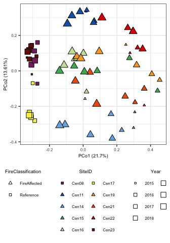<!-- -->

# KEGG annotation analysis

Now lets look at functional composition of these communities based on
KEGG orthologues. For abundance we will be using summed RPKM for each
orthologue.

``` r
# Make community matrix with RPKM as abundance measure.
KEGG_RPKM.mat = KEGG_long.df %>%
  group_by(SequenceID, KEGG_ortho_kofamscan) %>%
  summarize(sum_RPKM = sum(RPKM)) %>%
  ungroup %>%
  select(SequenceID, KEGG_ortho_kofamscan, sum_RPKM) %>%
  tidyr::spread(key="SequenceID", value="sum_RPKM") %>%
  tibble::column_to_rownames(var="KEGG_ortho_kofamscan") %>%
  as.matrix
KEGG_RPKM.mat[is.na(KEGG_RPKM.mat)] = 0

KEGG_RPKM.mat = KEGG_RPKM.mat[,sample.meta$SequenceID]
KEGG_RPKM.mat[1:10, 1:10]
```

    ##        Cen08_13102015_R1_S1 Cen08_12102016_R1_S2 Cen08_21102017_R1_S3
    ## K00001              0.00000             0.000000             0.000000
    ## K00003            191.95369           168.270397           148.613571
    ## K00004              0.00000            15.386677             0.000000
    ## K00005              0.00000             0.000000             0.000000
    ## K00007              0.00000             0.000000            10.695375
    ## K00008              0.00000             0.000000             0.000000
    ## K00009              0.00000             5.165033             0.000000
    ## K00010             31.21375            10.346641             4.662766
    ## K00012            235.77693           290.198533           187.792253
    ## K00013            109.40443           111.422285           119.392673
    ##        Cen08_04102018_R1_S4 Cen08_15102020_R1_S5 Cen08_06102021_R1_S6
    ## K00001             0.000000             6.755832              0.00000
    ## K00003           234.312807           158.653568            142.09748
    ## K00004             6.124049             5.519062              0.00000
    ## K00005             0.000000             0.000000              0.00000
    ## K00007             5.920700             0.000000              0.00000
    ## K00008             0.000000             0.000000              0.00000
    ## K00009             0.000000             0.000000              0.00000
    ## K00010             7.575732             0.000000             23.54696
    ## K00012           246.292400           291.626278            279.51844
    ## K00013            91.779807           117.355470            121.77436
    ##        Cen11_12102015_R1_S7 Cen11_11102016_R1_S8 Cen11_20102017_R1_S9
    ## K00001             0.000000             0.000000             0.000000
    ## K00003           159.433755           132.572305           181.137648
    ## K00004             6.280446             2.815210             2.623173
    ## K00005             0.000000             0.000000             2.959138
    ## K00007             0.000000             3.756124             3.305585
    ## K00008            10.244806             2.672032             4.516962
    ## K00009             0.000000             0.000000             0.955599
    ## K00010            60.333374            27.590971            30.088901
    ## K00012           224.589405           247.296713           252.632780
    ## K00013            86.613294           123.989678           142.775028
    ##        Cen11_03102018_R1_S10
    ## K00001              0.000000
    ## K00003            187.676701
    ## K00004             10.888306
    ## K00005              4.954576
    ## K00007              2.763991
    ## K00008              0.000000
    ## K00009              4.076666
    ## K00010             31.248915
    ## K00012            269.082445
    ## K00013            174.206111

## PERMANOVA

Does fire class or sampling year explain any of the variation in
community potential functional differences?

``` r
# Set up the blocking design for the permanova. In this case since we are repeatedly sampling the same sites over multiple years I include SiteID as the block. This is similar to "strata" in the old version of adonis.
perm <- how(nperm = 999)
setBlocks(perm) <- with(sample.meta, SiteID)

# Get the Bray-Curtis dissimilarity
BC.dist = vegdist(t(KEGG_RPKM.mat), method="bray", binary=FALSE, diag=TRUE, upper=TRUE)

# Run adonis2 
set.seed(4242)
BC.adonis = adonis2(formula = BC.dist ~ FireClassification*as.factor(Year), 
                    permutations = perm, data = sample.meta, by="terms")
BC.adonis
```

    ## Permutation test for adonis under reduced model
    ## Terms added sequentially (first to last)
    ## Blocks:  with(sample.meta, SiteID) 
    ## Permutation: free
    ## Number of permutations: 999
    ## 
    ## adonis2(formula = BC.dist ~ FireClassification * as.factor(Year), data = sample.meta, permutations = perm, by = "terms")
    ##                                    Df SumOfSqs      R2       F Pr(>F)   
    ## FireClassification                  1  0.58059 0.26090 23.2830  0.003 **
    ## as.factor(Year)                     6  0.13903 0.06248  0.9293  0.002 **
    ## FireClassification:as.factor(Year)  6  0.13425 0.06033  0.8973  0.112   
    ## Residual                           55  1.37150 0.61630                  
    ## Total                              68  2.22538 1.00000                  
    ## ---
    ## Signif. codes:  0 '***' 0.001 '**' 0.01 '*' 0.05 '.' 0.1 ' ' 1

## Ordination

Plot ordinations for the KEGG annotation based analysis.

``` r
# Run PCoA
set.seed(4242)
BC.ord = pcoa(BC.dist)

# Get axes labels with percent variation
Xaxis = paste("PCo1 (", round(BC.ord$values[1,2]*100, digits=2), "%)", sep="")
Yaxis = paste("PCo2 (", round(BC.ord$values[2,2]*100, digits=2), "%)", sep="")

# Get PCoA points in dataframe
BC.ord.df = data.frame(BC.ord$vectors) %>%
  tibble::rownames_to_column(var="SequenceID") %>%
  select(SequenceID, Axis.1, Axis.2) %>%
  left_join(sample.meta, by = "SequenceID") %>%
  arrange(Year) %>%
  group_by(SiteID) %>%
  mutate(YearRank = row_number()) %>%
  ungroup %>%
  mutate(AirTemperature_C = as.numeric(AirTemperature_C)) %>%
  mutate(diff_temp = CoreTemp_C-AirTemperature_C)

## Now plot

BC.plot = ggplot(data=BC.ord.df, aes(x=Axis.1, y=Axis.2)) +
  geom_point(aes(fill=SiteID, shape=FireClassification, size=Year)) +
  scale_shape_manual(values=c("FireAffected" = 24, "Reference" = 22)) +
  scale_fill_manual(values=site.col) +
  scale_size_continuous(range=c(1,4)) +
  labs(x=Xaxis, y=Yaxis) +
  publication_theme +
  theme(legend.position = "bottom",
        legend.direction = "vertical") +
  guides(shape = guide_legend(order = 1, ncol=1),
         fill = guide_legend(order = 2, override.aes=list(shape=site.shape), ncol=2),
         size = guide_legend(order = 3, override.aes=list(shape=22), ncol=2))

BC.plot
```

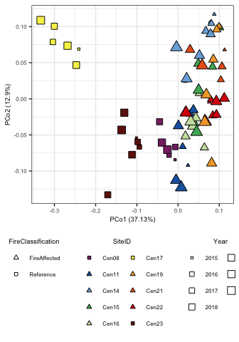<!-- -->

## CAP analysis

Now lets see how this community functional structure varies over soil
parameters.

``` r
test.physeq = phyloseq(otu_table(KEGG_RPKM.mat, taxa_are_rows = TRUE),
                       sample_data(tibble::column_to_rownames(sample.meta, var="SequenceID")))

var_goodnames = data.frame(labels = c("CoreTemp_C", "Ca_ppm", "Fe_ppm", "NO3N_ppm",
                                      "Mg_ppm", "OrganicMatter_360", "pH", "P_ppm",
                                      "CarbonDioxide_ppm", "NH4N_ppm", "K_ppm", "As_ppm"),
                           goodnames = c("Temp.", "Ca", "Fe", "NO3", "Mg", "SOM", 
                                         "pH", "P", "CO2", "NH4", "K", "As"))

set.seed(4242)
cap_ord.full <- ordinate(physeq = test.physeq, method = "CAP", distance = BC.dist, 
                    formula = ~ CoreTemp_C + pH + CarbonDioxide_ppm + OrganicMatter_360 +
                      P_ppm + K_ppm + Ca_ppm + Mg_ppm + Fe_ppm + NO3N_ppm + NH4N_ppm + 
                      SulfateSulfur_ppm + As_ppm)

set.seed(4242)
cap_ord.null <- ordinate(physeq = test.physeq, method = "CAP", distance = BC.dist, 
                         formula = ~ 1)

# Model selection to get just significant variables
set.seed(4242)
ordistep.res = ordistep(cap_ord.null, scope = formula(cap_ord.full), perm.max = 1000, trace=F)
goodform = ordistep.res$call$formula
set.seed(4242)
cap_ord <- ordinate(physeq = test.physeq, method = "CAP", distance = BC.dist, formula = goodform)

# CAP plot
cap.ord.df = data.frame(vegan::scores(cap_ord, display="sites")) %>%
  tibble::rownames_to_column(var="SequenceID") %>%
  select(SequenceID, CAP1, CAP2) %>%
  left_join(sample.meta, by = "SequenceID") %>%
  arrange(Year) %>%
  group_by(SiteID) %>%
  mutate(YearRank = row_number()) %>%
  ungroup %>%
  mutate(AirTemperature_C = as.numeric(AirTemperature_C)) %>%
  mutate(diff_temp = CoreTemp_C-AirTemperature_C)

eigvec = vegan::eigenvals(cap_ord)
fracvar = round(eigvec/sum(eigvec)*100, 2)

cap_plot = ggplot(data=cap.ord.df, aes(x=CAP1, y=CAP2)) +
  geom_point(aes(fill=SiteID, shape=FireClassification, size=Year)) +
  scale_shape_manual(values=c("FireAffected" = 24, "Reference" = 22)) +
  scale_fill_manual(values=site.col) +
  scale_size_continuous(range=c(1,4)) +
  labs(x=paste("CAP1 (", fracvar[1], "%)", sep=""),
       y=paste("CAP2 (", fracvar[2], "%)", sep=""))


# Now add the environmental variables as arrows
arrowmat <- vegan::scores(cap_ord, display = "bp")

# Add labels, make a data.frame
arrowdf <- data.frame(labels = rownames(arrowmat), arrowmat) %>%
  mutate(labels = gsub("\\.", ":", labels))
colnames(arrowdf) = c("labels", "xend", "yend")
arrowdf = arrowdf %>%
  left_join(var_goodnames, by = "labels") %>%
  rename(old_labels = labels) %>%
  rename(labels = goodnames)

# Define the arrow aesthetic mapping
arrow_map <- aes(xend = xend, yend = yend, x = 0, y = 0, 
                 color = NULL)

label_map <- aes(x = xend + 0.02*xend/abs(xend), y = yend, 
                 color = NULL, label = labels)

arrowhead = arrow(length = unit(0.02, "npc"), type = "closed")

# Make a new graphic
cap.plot = cap_plot + 
  geom_segment(mapping = arrow_map, size = 1.2, data = arrowdf, color = "black", arrow = arrowhead) + 
  geom_segment(mapping = arrow_map, size = 0.5, data = arrowdf, color = "orange", arrow = arrowhead) + 
  geom_label(mapping = label_map, data = filter(arrowdf, xend < 0), show.legend = FALSE, size=6*5/14, hjust=1, fill="orange", color="black") +
  geom_label(mapping = label_map, data = filter(arrowdf, xend > 0), show.legend = FALSE, size=6*5/14, hjust=0, fill="orange", color="black") +
  labs(title = paste("Variables explain ", round(100*RsquareAdj(cap_ord)$r.squared, 3), "% of genetic variation", sep="")) +
  publication_theme +
  theme(legend.position = "bottom",
        legend.direction = "vertical") +
  guides(shape = guide_legend(order = 1, nrow=2),
         fill = guide_legend(order = 2, override.aes=list(shape=site.shape), nrow=4),
         size = guide_legend(order = 3, override.aes=list(shape=22), nrow=4))
cap.plot
```

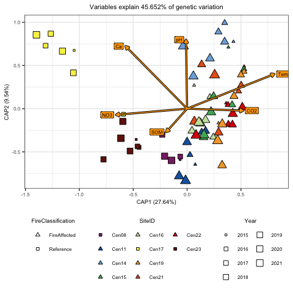<!-- -->

``` r
ggsave(cap.plot, file="/Users/sambarnett/Documents/Shade_lab/Centralia_project/Metagenomics/Manuscript/Figures/Supplemental/FigS4.tiff",
       device="tiff", width=5, height=5, units="in", bg = "white")
```

# Comparing community struture and metagenome structure

Now lets compare the two measures of community structure. First lets
plot the ordinations next to eachother.

``` r
MetaG_OTU_BC.plot = cowplot::plot_grid(cowplot::plot_grid(OTU_BC.plot + ggtitle("Amplicon") + theme(legend.position = "none"),
                                                          BC.plot + ggtitle("Metagenome") + theme(legend.position = "none"), nrow=1),
                                       g_legend(BC.plot + theme(legend.position = "bottom", legend.direction="vertical") + 
                                                  guides(shape = guide_legend(order = 1, nrow=2),
                                                         fill = guide_legend(order = 2, override.aes=list(shape=site.shape), nrow=2),
                                                         size = guide_legend(order = 3, override.aes=list(shape=22), nrow=2))),
                                       ncol=1, rel_heights = c(1,0.3))
MetaG_OTU_BC.plot
```

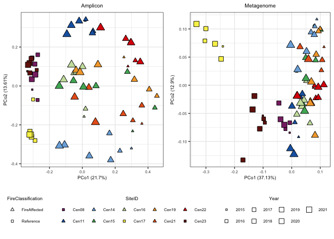<!-- -->

``` r
ggsave(MetaG_OTU_BC.plot, file="/Users/sambarnett/Documents/Shade_lab/Centralia_project/Metagenomics/Manuscript/Figures/Supplemental/FigS3.tiff",
       device="tiff", width=7, height=5, units="in", bg = "white")
```

Now lets directly compare them using both a Mantel test and a procrustes
analysis. These compare the dissimilarites across samples and
ordinations respectively.

First run the mantel test:

``` r
# Make sure the distance matrices are ordered correctly and have the same sample names. Note we used slightly different formats for sample names so we are changing those here.
BC.dist.mat = as.matrix(BC.dist)
rownames(BC.dist.mat) = gsub("_S.*", "", rownames(BC.dist.mat))
colnames(BC.dist.mat) = gsub("_S.*", "", colnames(BC.dist.mat))

OTU_BC.dist.mat = as.matrix(OTU_BC.dist)
OTU_BC.dist.mat = OTU_BC.dist.mat[rownames(BC.dist.mat),colnames(BC.dist.mat)]

# Run the mantel test
OTU_BC.mantel = mantel(OTU_BC.dist.mat, BC.dist.mat, permutations = 9999)
OTU_BC.mantel
```

    ## 
    ## Mantel statistic based on Pearson's product-moment correlation 
    ## 
    ## Call:
    ## mantel(xdis = OTU_BC.dist.mat, ydis = BC.dist.mat, permutations = 9999) 
    ## 
    ## Mantel statistic r: 0.4245 
    ##       Significance: 1e-04 
    ## 
    ## Upper quantiles of permutations (null model):
    ##    90%    95%  97.5%    99% 
    ## 0.0734 0.0973 0.1203 0.1453 
    ## Permutation: free
    ## Number of permutations: 9999

Next run the procrustes analysis:

``` r
# Rerun the PCoA ordinations with the same ordered samples. Note this is important otherwise the comparison doesn't work right.
ordered_OTU_BC.ord = pcoa(as.dist(OTU_BC.dist.mat))
ordered_BC.ord = pcoa(as.dist(BC.dist.mat))

# Run the Procrustes analysis
protest(X = ordered_BC.ord$vectors, Y = ordered_OTU_BC.ord$vectors, permutations = 999, symmetric = TRUE)
```

    ## 
    ## Call:
    ## protest(X = ordered_BC.ord$vectors, Y = ordered_OTU_BC.ord$vectors,      permutations = 999, symmetric = TRUE) 
    ## 
    ## Procrustes Sum of Squares (m12 squared):        0.2761 
    ## Correlation in a symmetric Procrustes rotation: 0.8508 
    ## Significance:  0.001 
    ## 
    ## Permutation: free
    ## Number of permutations: 999

``` r
# Run the Procrustes analysis again and plot
KEGG_OTU.procrustes = procrustes(X = ordered_BC.ord$vectors, Y = ordered_OTU_BC.ord$vectors, permutations = 999, symmetric = TRUE)
KEGG_OTU.procrustes
```

    ## 
    ## Call:
    ## procrustes(X = ordered_BC.ord$vectors, Y = ordered_OTU_BC.ord$vectors,      symmetric = TRUE, permutations = 999) 
    ## 
    ## Procrustes sum of squares:
    ## 0.2761

``` r
plot(KEGG_OTU.procrustes, kind=1)
```

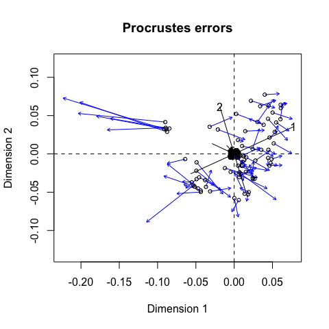<!-- -->

``` r
# Save figure
tiff(filename = "/Users/sambarnett/Documents/Shade_lab/Centralia_project/Metagenomics/Manuscript/Figures/Supplemental/FigS2.tiff", 
     width = 5, height = 5, units = "in", res=300)
plot(KEGG_OTU.procrustes, kind=1)
dev.off()
```

    ## quartz_off_screen 
    ##                 2

# More metagenome beta-diversity analyses

Now that we’ve got an inital understanding of the metagenome structure,
lets run some more analyses.

## Nestedness and turnover across space and time

Lets use beta-partitioning to break down the beta-diversity into
nestedness and turnover components. Lets then see if there is greater
nestedness or turnover over space (across sites within a year) or over
time (across years within a site).

### Bray-Curtis based analysis

First do this using Bray-Curtis based analysis which utilizes abundances
(RPKM). In this case “balanced variation” is equivalent to turnover and
“abundance gradient” is equivalent to nestedness.

``` r
# Run the beta-partitioning
KEGG.bray.part = bray.part(t(KEGG_RPKM.mat))

# Pull out the different components of the partitioning
## Balanced variation (similar to turnover)
KEGG.bray.bal = as.matrix(KEGG.bray.part$bray.bal)
KEGG.bray.bal[upper.tri(KEGG.bray.bal, diag=TRUE)] = NA
## Abundance gradient (similar to nestedness)
KEGG.bray.gra = as.matrix(KEGG.bray.part$bray.gra)
KEGG.bray.gra[upper.tri(KEGG.bray.gra, diag=TRUE)] = NA
## Overall Bray-Curtis dissimilarity
KEGG.bray.full = as.matrix(KEGG.bray.part$bray)
KEGG.bray.full[upper.tri(KEGG.bray.full, diag=TRUE)] = NA

# Put all components back together into a dataframe
betapart.bray.df = full_join(data.frame(KEGG.bray.bal) %>%
                      tibble::rownames_to_column(var="SequenceID_1") %>%
                      tidyr::gather(key="SequenceID_2", value="bal", -SequenceID_1) %>%
                      filter(!is.na(bal)),
                    data.frame(KEGG.bray.gra) %>%
                      tibble::rownames_to_column(var="SequenceID_1") %>%
                      tidyr::gather(key="SequenceID_2", value="gra", -SequenceID_1) %>%
                      filter(!is.na(gra))) %>%
  full_join(data.frame(KEGG.bray.full) %>%
                      tibble::rownames_to_column(var="SequenceID_1") %>%
                      tidyr::gather(key="SequenceID_2", value="bray", -SequenceID_1) %>%
                      filter(!is.na(bray))) %>%
  left_join(select(sample.meta, SequenceID, SiteID, Year, FireClassification) %>%
              rename(SequenceID_1=SequenceID, SiteID_1=SiteID, Year_1=Year, FireClassification_1 = FireClassification)) %>%
  left_join(select(sample.meta, SequenceID, SiteID, Year, FireClassification) %>%
              rename(SequenceID_2=SequenceID, SiteID_2=SiteID, Year_2=Year, FireClassification_2 = FireClassification)) %>%
  mutate(site_comp = ifelse(SiteID_1 == SiteID_2, "Temporal", "Spatial")) %>%
  filter((site_comp == "Spatial" & Year_1 == Year_2) | site_comp == "Temporal") %>%
  mutate(FC_comp = ifelse(FireClassification_1 == FireClassification_2, FireClassification_1, "Between fire classes")) %>%
  mutate(per_bal = bal/bray*100,
         per_gra = gra/bray*100)

# Now see if there are variations in these components between spatial or temporal scale
print("Bray-Curtis dissimilarity")
```

    ## [1] "Bray-Curtis dissimilarity"

``` r
BCfull_SpatialTemporal.wlx = wilcox.test(bray~site_comp, data=betapart.bray.df)
BCfull_SpatialTemporal.wlx
```

    ## 
    ##  Wilcoxon rank sum test with continuity correction
    ## 
    ## data:  bray by site_comp
    ## W = 49134, p-value < 2.2e-16
    ## alternative hypothesis: true location shift is not equal to 0

``` r
BCfull_SpatialTemporal.plot = ggplot(data=betapart.bray.df, aes(x=site_comp, y=bray)) +
  geom_boxplot(outlier.shape = NA) +
  geom_jitter(width = 0.25, height=0, size=1, alpha=0.5) +
  annotate("text", x=1.5, y=1.1, size = 6*5/14,
           label="p < 0.001") +
  labs(x="Sample comparison scale", y="Bray-Curtis\ndissimilarity") +
  publication_theme

print("Abundance gradient partition")
```

    ## [1] "Abundance gradient partition"

``` r
wilcox.test(gra~site_comp, data=betapart.bray.df)
```

    ## 
    ##  Wilcoxon rank sum test with continuity correction
    ## 
    ## data:  gra by site_comp
    ## W = 35561, p-value = 0.00765
    ## alternative hypothesis: true location shift is not equal to 0

``` r
GraPart_SpatialTemporal.plot = ggplot(data=betapart.bray.df, aes(x=site_comp, y=gra)) +
  geom_boxplot(outlier.shape = NA) +
  geom_jitter(width = 0.25, height=0, size=1, alpha=0.5) +
  annotate("text", x=1.5, y=max(betapart.bray.df$gra), size = 6*5/14,
           label="p = 0.043") +
  labs(x="Sample comparison scale", y="Abundance gradient\npartition") +
  publication_theme

print("Balanced species abundances partition")
```

    ## [1] "Balanced species abundances partition"

``` r
wilcox.test(bal~site_comp, data=betapart.bray.df)
```

    ## 
    ##  Wilcoxon rank sum test with continuity correction
    ## 
    ## data:  bal by site_comp
    ## W = 49381, p-value < 2.2e-16
    ## alternative hypothesis: true location shift is not equal to 0

``` r
BalPart_SpatialTemporal.plot = ggplot(data=betapart.bray.df, aes(x=site_comp, y=bal)) +
  geom_boxplot(outlier.shape = NA) +
  geom_jitter(width = 0.25, height=0, size=1, alpha=0.5) +
  annotate("text", x=1.5, y=1.1, size = 6*5/14,
           label="p < 0.001") +
  labs(x="Sample comparison scale", y="Balanced variation in\nKEGG abundance partition") +
  publication_theme

cowplot::plot_grid(BCfull_SpatialTemporal.plot, GraPart_SpatialTemporal.plot, BalPart_SpatialTemporal.plot,
                   nrow = 1)
```

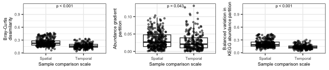<!-- -->

### Sorensen based analysis

Now run the basic analysis using the Sorensen index which is binary
(presence and absence).

``` r
# Get binary matrix
KEGG_binary.mat = KEGG_RPKM.mat
KEGG_binary.mat[KEGG_binary.mat > 0] = 1

# Run partitioning
KEGG.sor.part = beta.pair(t(KEGG_binary.mat))

# Pull out the different components of the partitioning
## Turnover
KEGG.sor.sim = as.matrix(KEGG.sor.part$beta.sim)
KEGG.sor.sim[upper.tri(KEGG.sor.sim, diag=TRUE)] = NA
## Nestedness
KEGG.sor.sne = as.matrix(KEGG.sor.part$beta.sne)
KEGG.sor.sne[upper.tri(KEGG.sor.sne, diag=TRUE)] = NA
## Sorensen
KEGG.sor.full = as.matrix(KEGG.sor.part$beta.sor)
KEGG.sor.full[upper.tri(KEGG.sor.full, diag=TRUE)] = NA

# Put all components back together into a dataframe
betapart.sor.df = full_join(data.frame(KEGG.sor.sim) %>%
                      tibble::rownames_to_column(var="SequenceID_1") %>%
                      tidyr::gather(key="SequenceID_2", value="sim", -SequenceID_1) %>%
                      filter(!is.na(sim)),
                    data.frame(KEGG.sor.sne) %>%
                      tibble::rownames_to_column(var="SequenceID_1") %>%
                      tidyr::gather(key="SequenceID_2", value="sne", -SequenceID_1) %>%
                      filter(!is.na(sne))) %>%
  full_join(data.frame(KEGG.sor.full) %>%
                      tibble::rownames_to_column(var="SequenceID_1") %>%
                      tidyr::gather(key="SequenceID_2", value="sor", -SequenceID_1) %>%
                      filter(!is.na(sor))) %>%
  left_join(select(sample.meta, SequenceID, SiteID, Year, FireClassification) %>%
              rename(SequenceID_1=SequenceID, SiteID_1=SiteID, Year_1=Year, FireClassification_1 = FireClassification)) %>%
  left_join(select(sample.meta, SequenceID, SiteID, Year, FireClassification) %>%
              rename(SequenceID_2=SequenceID, SiteID_2=SiteID, Year_2=Year, FireClassification_2 = FireClassification)) %>%
  mutate(site_comp = ifelse(SiteID_1 == SiteID_2, "Temporal", "Spatial")) %>%
  filter((site_comp == "Spatial" & Year_1 == Year_2) | site_comp == "Temporal") %>%
  mutate(FC_comp = ifelse(FireClassification_1 == FireClassification_2, FireClassification_1, "Between fire classes")) %>%
  mutate(per_sim = sim/sor*100,
         per_sne = sne/sor*100)


# Now see if there are variations in these components between spatial or temporal scale
print("Sorensen dissimilarity")
```

    ## [1] "Sorensen dissimilarity"

``` r
SORfull_SpatialTemporal.wlx = wilcox.test(sor~site_comp, data=betapart.sor.df)
SORfull_SpatialTemporal.wlx
```

    ## 
    ##  Wilcoxon rank sum test with continuity correction
    ## 
    ## data:  sor by site_comp
    ## W = 46548, p-value < 2.2e-16
    ## alternative hypothesis: true location shift is not equal to 0

``` r
SORfull_SpatialTemporal.plot = ggplot(data=betapart.sor.df, aes(x=site_comp, y=sor)) +
  geom_boxplot(outlier.shape = NA) +
  geom_jitter(width = 0.25, height=0, size=1, alpha=0.5) +
  annotate("text", x=1.5, y=1.1, size = 6*5/14,
           label="p < 0.001") +
  labs(x="Sample comparison scale", y="Sorensen dissimilarity") +
  publication_theme

print("Nestedness partition")
```

    ## [1] "Nestedness partition"

``` r
wilcox.test(sne~site_comp, data=betapart.sor.df)
```

    ## 
    ##  Wilcoxon rank sum test with continuity correction
    ## 
    ## data:  sne by site_comp
    ## W = 42474, p-value = 4.944e-12
    ## alternative hypothesis: true location shift is not equal to 0

``` r
snePart_SpatialTemporal.plot = ggplot(data=betapart.sor.df, aes(x=site_comp, y=sne)) +
  geom_boxplot(outlier.shape = NA) +
  geom_jitter(width = 0.25, height=0, size=1, alpha=0.5) +
  annotate("text", x=1.5, y=max(betapart.sor.df$sne), size = 6*5/14,
           label="p < 0.001") +
  labs(x="Sample comparison scale", y="Nestedness partition") +
  publication_theme

print("Turnover partition")
```

    ## [1] "Turnover partition"

``` r
wilcox.test(sim~site_comp, data=betapart.sor.df)
```

    ## 
    ##  Wilcoxon rank sum test with continuity correction
    ## 
    ## data:  sim by site_comp
    ## W = 28805, p-value = 0.1399
    ## alternative hypothesis: true location shift is not equal to 0

``` r
simPart_SpatialTemporal.plot = ggplot(data=betapart.sor.df, aes(x=site_comp, y=sim)) +
  geom_boxplot(outlier.shape = NA) +
  geom_jitter(width = 0.25, height=0, size=1, alpha=0.5) +
  annotate("text", x=1.5, y=1.1, size = 6*5/14,
           label="p < 0.501") +
  labs(x="Sample comparison scale", y="Turnover partition") +
  publication_theme

cowplot::plot_grid(SORfull_SpatialTemporal.plot, snePart_SpatialTemporal.plot, simPart_SpatialTemporal.plot,
                   nrow = 1)
```

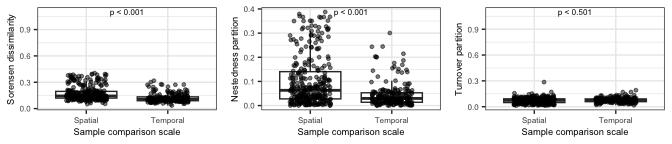<!-- -->

## Time lag analysis

To see if the communities are significantly changing in functional
composition over time. We expect more distant timepoints to be more
distant in composition.

``` r
# Metadata for both samples
SamID_1.meta = sample.meta %>%
  select(SequenceID, SiteID, Year, FireClassification, CoreTemp_C, pH) %>%
  rename(SequenceID_1 = SequenceID, SiteID_1 = SiteID, Year_1 = Year, 
         FireClassification_1 = FireClassification, 
         CoreTemp_C_1 = CoreTemp_C, pH_1 = pH)

SamID_2.meta = sample.meta %>%
  select(SequenceID, SiteID, Year, FireClassification, CoreTemp_C, pH) %>%
  rename(SequenceID_2 = SequenceID, SiteID_2 = SiteID, Year_2 = Year, 
         FireClassification_2 = FireClassification, 
         CoreTemp_C_2 = CoreTemp_C, pH_2 = pH)

# Get paired community distances
test.dist.mat = as.matrix(BC.dist)
test.dist.mat[upper.tri(test.dist.mat, diag=TRUE)] = NA
time.test.dist.df = data.frame(test.dist.mat) %>%
  tibble::rownames_to_column(var="SequenceID_1") %>%
  tidyr::gather(key="SequenceID_2", value="dist", -SequenceID_1) %>%
  filter(!is.na(dist)) %>%
  left_join(SamID_1.meta, by= "SequenceID_1") %>%
  left_join(SamID_2.meta, by= "SequenceID_2") %>%
  filter(Year_1 != Year_2,
         SiteID_1 == SiteID_2) %>%
  mutate(delta_year = abs(Year_1 - Year_2),
         delta_temp = abs(CoreTemp_C_1-CoreTemp_C_2),
         delta_pH = abs(pH_1-pH_2)) %>%
  mutate(sqrt_delta_year = sqrt(delta_year))

# Linear regressions
timelag.model.df = data.frame()
for (FC in c("FireAffected", "Reference")){
  ctrl <- lmeControl(opt='optim')
  FC_timelag.model = lme(dist ~ sqrt_delta_year, random = ~1|SiteID_1, control=ctrl,
                         data=filter(time.test.dist.df, FireClassification_1 == FC))
  timelag.model.df = rbind(timelag.model.df,
                              data.frame(summary(FC_timelag.model)$tTable) %>%
                                tibble::rownames_to_column(var="factor") %>%
                                mutate(FireClassification_1 = FC))
}

timelag.model.reg = timelag.model.df %>%
  mutate(p_slope = ifelse(factor == "sqrt_delta_year", p.value, 1),
         factor = ifelse(factor == "(Intercept)", "Intercept", factor)) %>%
  group_by(FireClassification_1) %>%
  mutate(p_slope = min(p_slope)) %>%
  ungroup %>%
  select(factor, Value, p_slope, FireClassification_1) %>%
  tidyr::spread(key=factor, value = Value) %>%
  mutate(sig = ifelse(p_slope < 0.05, "< 0.05", "≥ 0.05"))
timelag.model.reg
```

    ## # A tibble: 2 × 5
    ##        p_slope FireClassification_1 Intercept sqrt_delta_year sig   
    ##          <dbl> <chr>                    <dbl>           <dbl> <chr> 
    ## 1 0.0000000235 FireAffected            0.0816       0.0460    < 0.05
    ## 2 0.996        Reference               0.197        0.0000881 ≥ 0.05

``` r
timelag.plot = ggplot(data=time.test.dist.df, aes(x=sqrt_delta_year, y=dist)) +
  geom_point(size=2, aes(fill=SiteID_1, shape=FireClassification_1)) +
  geom_abline(data=filter(timelag.model.reg, p_slope < 0.05), 
              aes(intercept = Intercept, slope = sqrt_delta_year), linetype = 2, size=1, color="black") +
  scale_shape_manual(values=c("FireAffected" = 24, "Reference" = 22)) +
  scale_fill_manual(values=site.col) +
  labs(x="Square root of the difference in years", y="Bray Curtis dissimilarity", 
       fill="SiteID", shape="Fire Classification") +
  facet_grid(~FireClassification_1, scales = "free_y", switch="y") +
  publication_theme +
  guides(fill=guide_legend(ncol=2, override.aes=list(shape=site.shape)))
timelag.plot
```

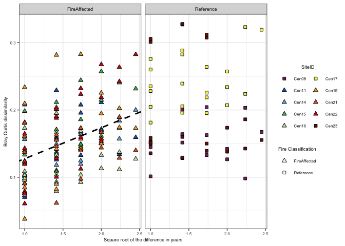<!-- -->
Now lets see if the time lag slopes are associated with disturbance
intensity (max temperature)

``` r
# Get separate time-lag slopes for each site
timelag.sep.df = data.frame()
for (SiteID in unique(time.test.dist.df$SiteID_1)){
  sub.model = lm(dist ~ sqrt_delta_year, filter(time.test.dist.df, SiteID_1 == SiteID))
  timelag.sep.df = rbind(timelag.sep.df,
                         data.frame(Intercept = summary(sub.model)$coefficients[1],
                                    slope = summary(sub.model)$coefficients[2],
                                    p_slope = summary(sub.model)$coefficients[8]) %>%
                           mutate(SiteID = SiteID))
}

# Get new metadata for each site with maximum temperature for each site
timelag.meta.df = sample.meta %>%
  group_by(SiteID, FireClassification) %>%
  summarize(min_temp = min(CoreTemp_C),
            max_temp = max(CoreTemp_C),
            mean_pH = mean(pH),
            n_year = n()) %>%
  ungroup %>%
  mutate(delta_temp = max_temp-min_temp,
         FireClassification_1 = FireClassification) %>%
  mutate(testemp = delta_temp/max_temp)
timelag.sep.df = left_join(timelag.sep.df, timelag.meta.df, by = "SiteID") %>%
  mutate(sig = ifelse(p_slope < 0.05, "< 0.05", "≥ 0.05"))

## Compare slopes and maximum temperature
maxtempslope.model = lm(slope ~ max_temp, data=timelag.sep.df)
summary(maxtempslope.model)
```

    ## 
    ## Call:
    ## lm(formula = slope ~ max_temp, data = timelag.sep.df)
    ## 
    ## Residuals:
    ##       Min        1Q    Median        3Q       Max 
    ## -0.036311 -0.029233  0.001021  0.019610  0.059071 
    ## 
    ## Coefficients:
    ##              Estimate Std. Error t value Pr(>|t|)  
    ## (Intercept) -0.037805   0.032017  -1.181   0.2716  
    ## max_temp     0.002449   0.001056   2.320   0.0489 *
    ## ---
    ## Signif. codes:  0 '***' 0.001 '**' 0.01 '*' 0.05 '.' 0.1 ' ' 1
    ## 
    ## Residual standard error: 0.03277 on 8 degrees of freedom
    ## Multiple R-squared:  0.4021, Adjusted R-squared:  0.3274 
    ## F-statistic: 5.381 on 1 and 8 DF,  p-value: 0.04894

``` r
timelag_slope_temp.plot = ggplot(data=timelag.sep.df, aes(x=max_temp, y=slope)) +
  geom_point(size=2, aes(fill=SiteID, shape=FireClassification)) +
  geom_abline(intercept = summary(maxtempslope.model)$coefficients[[1]], 
              slope = summary(maxtempslope.model)$coefficients[[2]], 
              linetype = 2, size=1, color="black") +
  scale_shape_manual(values=c("FireAffected" = 24, "Recovered" = 21, "Reference" = 22)) +
  scale_fill_manual(values=site.col) +
  labs(x="Maximum temperature (˚C)", y="Time lag slope", fill="SiteID") +
  publication_theme +
  theme(legend.position = "none")
timelag_slope_temp.plot
```

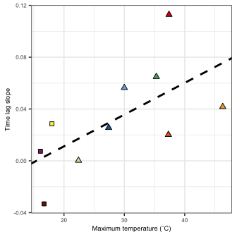<!-- -->

Plot time lag figure together

``` r
full_timelag.plot = cowplot::plot_grid(timelag.plot + theme(legend.position = "none"),
                                       cowplot::plot_grid(timelag_slope_temp.plot, g_legend(timelag.plot),
                                                          ncol=1),
                                       nrow=1, rel_widths = c(1, 0.5), labels=c("A", "B"), label_size = 8)
full_timelag.plot
```

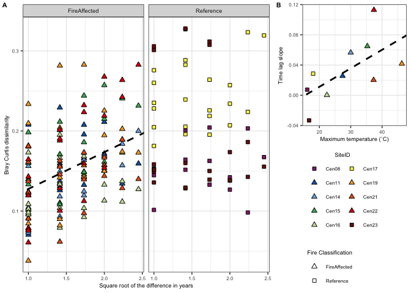<!-- -->

``` r
#ggsave(full_timelag.plot, file="/Users/sambarnett/Documents/Shade_lab/Centralia_project/Metagenomics/Manuscript/Figures/Supplemental/FigS5.tiff",
#       device="tiff", width=7, height=5, units="in", bg = "white")
```

## Trajectory analysis

Now we want to see if the community functions are changing directionally
over time which would potentially indicate a change in state.

``` r
# Metadata for both samples
SiteID_1.meta = sample.meta %>%
  group_by(SiteID, FireClassification) %>%
  summarize(mean_pH_1 = mean(pH),
            sd_pH_1 = sd(pH),
            n_year_1 = n(),
            max_temp_1 = max(CoreTemp_C),
            min_temp_1 = min(CoreTemp_C)) %>%
  ungroup %>%
  rename(SiteID_1 = SiteID,
         FireClassification_1 = FireClassification)

SiteID_2.meta = sample.meta %>%
  group_by(SiteID, FireClassification) %>%
  summarize(mean_pH_2 = mean(pH),
            sd_pH_2 = sd(pH),
            n_year_2 = n(),
            max_temp_2 = max(CoreTemp_C),
            min_temp_2 = min(CoreTemp_C)) %>%
  ungroup %>%
  rename(SiteID_2 = SiteID,
         FireClassification_2 = FireClassification)

# data for analysis
D = as.matrix(BC.dist)
All.samples.meta = sample.meta %>%
  arrange(SiteID, Year)
D = D[All.samples.meta$SequenceID, All.samples.meta$SequenceID] %>%
  as.dist()
sites = All.samples.meta$SiteID
surveys = All.samples.meta$survey

# Trajectory directionality
siteID.traj = defineTrajectories(D, sites, surveys)
traj.direct.df = trajectoryMetrics(siteID.traj) %>%
  rename(SiteID_1 = trajectory) %>%
  left_join(SiteID_1.meta, by = "SiteID_1") %>%
  mutate(delta_temp = max_temp_1-min_temp_1)
```

First look at directionalitiy across fire classifications

``` r
traj.direct.wilcox = wilcox.test(filter(traj.direct.df, FireClassification_1 == "FireAffected")$directionality,
                                 filter(traj.direct.df, FireClassification_1 == "Reference")$directionality)
traj.direct.wilcox
```

    ## 
    ##  Wilcoxon rank sum exact test
    ## 
    ## data:  filter(traj.direct.df, FireClassification_1 == "FireAffected")$directionality and filter(traj.direct.df, FireClassification_1 == "Reference")$directionality
    ## W = 16, p-value = 0.2667
    ## alternative hypothesis: true location shift is not equal to 0

Next look at directionality over maximum disturbance intensity

``` r
traj_max_temp.model = lm(directionality~max_temp_1, data=traj.direct.df)
summary(traj_max_temp.model)
```

    ## 
    ## Call:
    ## lm(formula = directionality ~ max_temp_1, data = traj.direct.df)
    ## 
    ## Residuals:
    ##       Min        1Q    Median        3Q       Max 
    ## -0.067828 -0.043537 -0.005186  0.023908  0.108276 
    ## 
    ## Coefficients:
    ##             Estimate Std. Error t value Pr(>|t|)   
    ## (Intercept) 0.283820   0.056427   5.030  0.00101 **
    ## max_temp_1  0.003178   0.001861   1.708  0.12604   
    ## ---
    ## Signif. codes:  0 '***' 0.001 '**' 0.01 '*' 0.05 '.' 0.1 ' ' 1
    ## 
    ## Residual standard error: 0.05776 on 8 degrees of freedom
    ## Multiple R-squared:  0.2672, Adjusted R-squared:  0.1756 
    ## F-statistic: 2.917 on 1 and 8 DF,  p-value: 0.126

Now plot these results

``` r
# Across fire class
traj.direct.plot = ggplot(data=traj.direct.df, aes(x=FireClassification_1, y=directionality)) +
  geom_boxplot(outlier.shape = NA) +
  geom_jitter(height=0, width=0.25, size=2, aes(shape=FireClassification_1, fill=SiteID_1)) +
  scale_shape_manual(values=c("FireAffected" = 24, "Recovered" = 21, "Reference" = 22)) +
  scale_fill_manual(values=site.col) +
  #lims(y=c(0.30, 0.52)) +
  labs(x = "Fire Classification", y = "Community function\ntrajectory directionality") +
  present_theme +
  theme(legend.position = "none")

# Across disturbance intensity
traj_max_temp.plot = ggplot(data=traj.direct.df, aes(x=max_temp_1, y=directionality)) +
  geom_point(aes(shape=FireClassification_1, fill=SiteID_1), size=2) +
  geom_abline(intercept = summary(traj_max_temp.model)$coefficients[[1]], 
              slope = summary(traj_max_temp.model)$coefficients[[2]], 
              linetype = 1, size=2, color="black") +
  geom_abline(intercept = summary(traj_max_temp.model)$coefficients[[1]], 
              slope = summary(traj_max_temp.model)$coefficients[[2]], 
              linetype = 2, size=1, color="white") +
  scale_shape_manual(values=c("FireAffected" = 24, "Recovered" = 21, "Reference" = 22)) +
  scale_fill_manual(values=site.col) +
  #lims(y=c(0.30, 0.52)) +
  labs(x="Maximum soil temperature (˚C)", y="Community function\ntrajectory directionality") +
  present_theme +
  theme(legend.position = "none")

trajectory_full.plot = cowplot::plot_grid(traj.direct.plot, traj_max_temp.plot, 
                                          ncol=1, labels = c("A", "B"), label_size = 8)
trajectory_full.plot
```

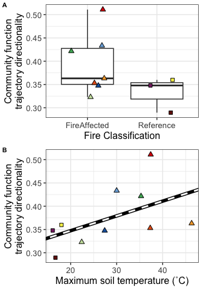<!-- -->

## Community functional distances to reference over time and disturbance intensity.

Now lets see if there is a change in the similarity between the
functional structure of the disturbed communities and the undisturbed
reference communities over time. We saw a notable shift with temperature
for the amplicon based data so lets see if we also see that here. Note
we are using similarity here, rather than dissimilarity.

First do this with the metagenomes (community function).

``` r
# Metadata dataframe
Reference.meta = sample.meta %>%
  filter(FireClassification == "Reference") %>%
  select(SequenceID, Year) %>%
  rename(Reference_sample = SequenceID)
Disturbed.meta = sample.meta %>%
  filter(FireClassification == "FireAffected") %>%
  rename(Disturbed_sample = SequenceID)

# Similarity dataframe for disturbed soils. Note conversion from dissimilarity to similarity (1-distance).
Disturbed_Dist.df = data.frame(as.matrix(BC.dist)) %>%
  tibble::rownames_to_column(var="Disturbed_sample") %>%
  tidyr::gather(key="Reference_sample", value="dist", -Disturbed_sample) %>%
  filter(!is.na(dist)) %>%
  mutate(dist = 1-dist) %>%
  inner_join(Disturbed.meta, by = "Disturbed_sample") %>%
  inner_join(Reference.meta, by = c("Reference_sample", "Year")) %>%
  group_by(Disturbed_sample) %>%
  summarize(mean_dist = mean(dist),
            sd_dist = sd(dist),
            n_comp = n()) %>%
  ungroup %>%
  mutate(SE_dist = sd_dist/sqrt(n_comp)) %>%
  left_join(Disturbed.meta, by = "Disturbed_sample")
  
# Similarity dataframe for dataframe for reference soils. Note conversion from dissimilarity to similarity (1-distance).
test.dist.mat = as.matrix(BC.dist)
test.dist.mat[upper.tri(test.dist.mat, diag = TRUE)] = NA
Reference_Dist.df = data.frame(test.dist.mat) %>%
  tibble::rownames_to_column(var="Reference_sample1") %>%
  tidyr::gather(key="Reference_sample2", value="dist", -Reference_sample1) %>%
  filter(!is.na(dist)) %>%
  mutate(dist = 1-dist) %>%
  inner_join(rename(Reference.meta, Reference_sample1 = Reference_sample), 
             by = c("Reference_sample1")) %>%
  inner_join(rename(Reference.meta, Reference_sample2 = Reference_sample), 
             by = c("Reference_sample2", "Year"))
```

Now lets plot the similarity over temperature

``` r
# Weighted UniFrac
dist_by_temp.model = lme(mean_dist ~ CoreTemp_C, random = ~1|SiteID, data=Disturbed_Dist.df)
dist_by_temp.model.sum = summary(dist_by_temp.model)$tTable
dist_by_temp.model.sum
```

    ##                    Value    Std.Error DF   t-value      p-value
    ## (Intercept)  0.738678717 0.0219359257 41 33.674381 1.685833e-31
    ## CoreTemp_C  -0.001316869 0.0007877245 41 -1.671738 1.021923e-01

``` r
dist_by_temp.plot = ggplot(data=Disturbed_Dist.df, aes(x=CoreTemp_C, y=mean_dist)) +
  geom_hline(yintercept = Reference_Dist.df$dist, color="grey", linetype=2) +
  geom_errorbar(aes(ymin=mean_dist-SE_dist, ymax=mean_dist+SE_dist), color="black", size=1, width=0) +
  geom_errorbar(aes(ymin=mean_dist-SE_dist, ymax=mean_dist+SE_dist, color=SiteID), size=0.5, width=0) +
  geom_point(aes(fill=SiteID, shape=FireClassification, size=Year)) +
  scale_size_continuous(range=c(1,4)) +
  scale_shape_manual(values=FC.shape) +
  scale_fill_manual(values=site.col) +
  scale_color_manual(values=site.col) +
  labs(x="Soil temperature (˚C)", y="Metagenome Mean Bray-Curtis\nsimilarity to references") +
  lims(y=c(0,1)) +
  publication_theme +
  theme(legend.position = "none")


dist_by_temp.plot
```

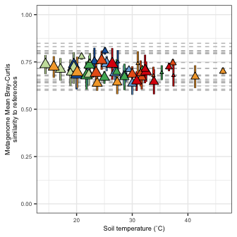<!-- -->

Now run the same analysis for the amplicon based data (OTUs) to show how
these two datasets are very different in this way.

``` r
# Metadata dataframe
Reference.meta = sample.meta %>%
  filter(FireClassification == "Reference") %>%
  select(SampleID, Year) %>%
  rename(Reference_sample = SampleID)
Disturbed.meta = sample.meta %>%
  filter(FireClassification == "FireAffected") %>%
  rename(Disturbed_sample = SampleID)

# Similarity dataframe for disturbed soils
OTU_Disturbed_Dist.df = data.frame(as.matrix(OTU_BC.dist)) %>%
  tibble::rownames_to_column(var="Disturbed_sample") %>%
  tidyr::gather(key="Reference_sample", value="dist", -Disturbed_sample) %>%
  filter(!is.na(dist)) %>%
  mutate(dist = 1-dist) %>%
  inner_join(Disturbed.meta, by = "Disturbed_sample") %>%
  inner_join(Reference.meta, by = c("Reference_sample", "Year")) %>%
  group_by(Disturbed_sample) %>%
  summarize(mean_dist = mean(dist),
            sd_dist = sd(dist),
            n_comp = n()) %>%
  ungroup %>%
  mutate(SE_dist = sd_dist/sqrt(n_comp)) %>%
  left_join(Disturbed.meta, by = "Disturbed_sample")
  
# Similarity dataframe for reference soils
test.dist.mat = as.matrix(OTU_BC.dist)
test.dist.mat[upper.tri(test.dist.mat, diag = TRUE)] = NA
OTU_Reference_Dist.df = data.frame(test.dist.mat) %>%
  tibble::rownames_to_column(var="Reference_sample1") %>%
  tidyr::gather(key="Reference_sample2", value="dist", -Reference_sample1) %>%
  filter(!is.na(dist)) %>%
  mutate(dist = 1-dist) %>%
  inner_join(rename(Reference.meta, Reference_sample1 = Reference_sample), 
             by = c("Reference_sample1")) %>%
  inner_join(rename(Reference.meta, Reference_sample2 = Reference_sample), 
             by = c("Reference_sample2", "Year"))
```

Now lets plot the similarities over temperature

``` r
OTU_dist_by_temp.model = lme(mean_dist ~ CoreTemp_C, random = ~1|SiteID, data=OTU_Disturbed_Dist.df)
OTU_dist_by_temp.model.sum = summary(OTU_dist_by_temp.model)$tTable
OTU_dist_by_temp.model.sum
```

    ##                   Value   Std.Error DF   t-value      p-value
    ## (Intercept)  0.52021460 0.035399043 41 14.695725 6.143608e-18
    ## CoreTemp_C  -0.01099161 0.001254062 41 -8.764803 6.060038e-11

``` r
OTU_dist_by_temp.plot = ggplot(data=OTU_Disturbed_Dist.df, aes(x=CoreTemp_C, y=mean_dist)) +
  geom_hline(yintercept = OTU_Reference_Dist.df$dist, color="grey", linetype=2) +
  geom_errorbar(aes(ymin=mean_dist-SE_dist, ymax=mean_dist+SE_dist), color="black", size=1, width=0) +
  geom_errorbar(aes(ymin=mean_dist-SE_dist, ymax=mean_dist+SE_dist, color=SiteID), size=0.5, width=0) +
  geom_point(aes(fill=SiteID, shape=FireClassification, size=Year)) +
  scale_size_continuous(range=c(1,4)) +
  geom_abline(slope=OTU_dist_by_temp.model.sum[2], intercept = OTU_dist_by_temp.model.sum[1], size=1, color="black", linetype=2) +
  #scale_linetype_manual(values=c("< 0.05" = 1, "≥ 0.05" = 2)) +
  scale_shape_manual(values=FC.shape) +
  scale_fill_manual(values=site.col) +
  scale_color_manual(values=site.col) +
  labs(x="Soil temperature (˚C)", y="Amplicon Mean Bray-Curtis\nsimilarity to references") +
  lims(y=c(0,1)) +
  publication_theme +
  theme(legend.position = "none")


OTU_dist_by_temp.plot
```

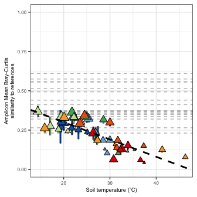<!-- -->

Plot Together to see these different results side by side. Also include
the metagenome PCoA for publication figure 1.

``` r
Fig1.plot = cowplot::plot_grid(BC.plot + theme(legend.position="none"), 
                   g_legend(BC.plot + 
                              theme(legend.position = "right") +
                              guides(shape = guide_legend(order = 2, ncol=2),
                                     fill = guide_legend(order = 3, override.aes=list(shape=site.shape), ncol=3),
                                     size = guide_legend(order = 1, override.aes=list(shape=22), ncol=3))), 
                   OTU_dist_by_temp.plot, dist_by_temp.plot,
                   labels=c("A", "", "B", "C"), label_size=8)

Fig1.plot
```

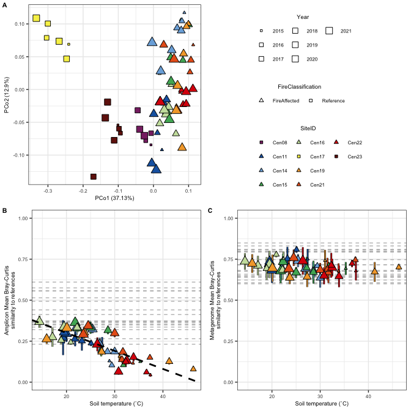<!-- -->

``` r
ggsave(Fig1.plot, file="/Users/sambarnett/Documents/Shade_lab/Centralia_project/Metagenomics/Manuscript/Figures/Supplemental/Fig1.tiff",
       device="tiff", width=7, height=7, units="in", bg = "white")
```

# Session info

``` r
sessionInfo()
```

    ## R version 4.4.1 (2024-06-14)
    ## Platform: aarch64-apple-darwin20
    ## Running under: macOS Ventura 13.0.1
    ## 
    ## Matrix products: default
    ## BLAS:   /Library/Frameworks/R.framework/Versions/4.4-arm64/Resources/lib/libRblas.0.dylib 
    ## LAPACK: /Library/Frameworks/R.framework/Versions/4.4-arm64/Resources/lib/libRlapack.dylib;  LAPACK version 3.12.0
    ## 
    ## locale:
    ## [1] en_US.UTF-8/en_US.UTF-8/en_US.UTF-8/C/en_US.UTF-8/en_US.UTF-8
    ## 
    ## time zone: America/Detroit
    ## tzcode source: internal
    ## 
    ## attached base packages:
    ## [1] stats     graphics  grDevices utils     datasets  methods   base     
    ## 
    ## other attached packages:
    ##  [1] ggplot2_3.5.2   betapart_1.6    ecotraj_1.1.0   Rcpp_1.0.13    
    ##  [5] Nonpareil_3.5.3 picante_1.8.2   nlme_3.1-166    vegan_2.6-8    
    ##  [9] lattice_0.22-6  permute_0.9-7   readxl_1.4.3    ape_5.8        
    ## [13] phyloseq_1.48.0 dplyr_1.1.4    
    ## 
    ## loaded via a namespace (and not attached):
    ##  [1] ade4_1.7-22             tidyselect_1.2.1        farver_2.1.2           
    ##  [4] Biostrings_2.72.1       fastmap_1.2.0           Kendall_2.2.1          
    ##  [7] digest_0.6.37           lifecycle_1.0.4         cluster_2.1.6          
    ## [10] survival_3.7-0          magrittr_2.0.3          compiler_4.4.1         
    ## [13] rlang_1.1.4             tools_4.4.1             doSNOW_1.0.20          
    ## [16] igraph_2.0.3            utf8_1.2.4              yaml_2.3.10            
    ## [19] geometry_0.5.0          data.table_1.16.0       knitr_1.48             
    ## [22] labeling_0.4.3          plyr_1.8.9              abind_1.4-5            
    ## [25] purrr_1.0.2             withr_3.0.1             itertools_0.1-3        
    ## [28] BiocGenerics_0.50.0     grid_4.4.1              stats4_4.4.1           
    ## [31] fansi_1.0.6             multtest_2.60.0         biomformat_1.32.0      
    ## [34] colorspace_2.1-1        Rhdf5lib_1.26.0         scales_1.3.0           
    ## [37] iterators_1.0.14        MASS_7.3-61             cli_3.6.3              
    ## [40] rmarkdown_2.29          crayon_1.5.3            ragg_1.3.2             
    ## [43] generics_0.1.3          rcdd_1.6                rstudioapi_0.16.0      
    ## [46] httr_1.4.7              reshape2_1.4.4          magic_1.6-1            
    ## [49] rhdf5_2.48.0            stringr_1.5.1           zlibbioc_1.50.0        
    ## [52] splines_4.4.1           parallel_4.4.1          cellranger_1.1.0       
    ## [55] XVector_0.44.0          vctrs_0.6.5             boot_1.3-31            
    ## [58] Matrix_1.7-0            minpack.lm_1.2-4        jsonlite_1.8.8         
    ## [61] IRanges_2.38.1          S4Vectors_0.42.1        systemfonts_1.1.0      
    ## [64] foreach_1.5.2           tidyr_1.3.1             snow_0.4-4             
    ## [67] glue_1.7.0              codetools_0.2-20        cowplot_1.1.3          
    ## [70] stringi_1.8.4           gtable_0.3.5            GenomeInfoDb_1.40.1    
    ## [73] UCSC.utils_1.0.0        munsell_0.5.1           tibble_3.2.1           
    ## [76] pillar_1.9.0            htmltools_0.5.8.1       rhdf5filters_1.16.0    
    ## [79] GenomeInfoDbData_1.2.12 R6_2.5.1                textshaping_0.4.0      
    ## [82] evaluate_0.24.0         Biobase_2.64.0          highr_0.11             
    ## [85] fastmatch_1.1-4         mgcv_1.9-1              xfun_0.52              
    ## [88] pkgconfig_2.0.3
