Analysis of Annotated Pathways
================
Sam Barnett
31 March, 2026

- [Introduction](#introduction)
  - [Librarys and global variables](#librarys-and-global-variables)
  - [Metadata](#metadata)
  - [KEGG annotations](#kegg-annotations)
  - [Find single copy genes](#find-single-copy-genes)
- [Nitrogen cycling](#nitrogen-cycling)
  - [Find the genes in each pathway](#find-the-genes-in-each-pathway)
  - [Nitrogen cycling investment over soil
    temperature](#nitrogen-cycling-investment-over-soil-temperature)
  - [Nitrogen cycling investment over soil nitrate and ammonium
    concentrations](#nitrogen-cycling-investment-over-soil-nitrate-and-ammonium-concentrations)
- [Carbon cycling](#carbon-cycling)
  - [Find the genes in each pathway](#find-the-genes-in-each-pathway-1)
  - [Carbohydrate metabolism investment over soil
    temperature](#carbohydrate-metabolism-investment-over-soil-temperature)
  - [CAZyme investment over soil
    temperature](#cazyme-investment-over-soil-temperature)
- [Environmental response genes](#environmental-response-genes)
  - [Find transcription factor genes](#find-transcription-factor-genes)
  - [Transcription factor investment over soil
    temperature](#transcription-factor-investment-over-soil-temperature)
  - [Transcription factor diversity](#transcription-factor-diversity)
- [Session info](#session-info)

# Introduction

In this notebook, lets look at some notable pathways, metabolisms, and
other genome features from the whole metagenome assembly. We will be
using this to back up and further examine some of the findings from the
MAGs in the previous analysis. For this analysis we will be using a
term, per-genome investment as a measure of gene/pathway abundance. This
measure is a normalized measure to account for differences in sequencing
depth across samples and calculated as the number of genes (KEGG
orthologes) present in in a sample divided by the number of single copy
genes present.

## Librarys and global variables

Here are some libraries used in this analysis and the global variables
that will be used throughout. Mostly variables for consistent plotting.

``` r
# Libraries for data
library(dplyr)
library(phyloseq)
library(ape)
library(readxl)
library(jsonlite)

# Libraries for analysis
library(vegan)
library(picante)
library(Nonpareil)
library(lme4)
library(lmerTest)
library(ecotraj)
library(ggkegg)

# Libraries for plotting
library(ggplot2)
source("/Users/sambarnett/Documents/Misc_code/paul_tol_colors.R")

# Functon for extracting legends
g_legend<-function(a.gplot){
  tmp <- ggplot_gtable(ggplot_build(a.gplot))
  leg <- which(sapply(tmp$grobs, function(x) x$name) == "guide-box")
  legend <- tmp$grobs[[leg]]
  return(legend)} 

# Site lists
used_sites = c("Cen08", "Cen11", "Cen14", "Cen15", "Cen16", "Cen17", "Cen19", 
               "Cen21", "Cen22", "Cen23")

# Setting repeated plot aesthetics
## Sites
site.col = paultol_colors(length(used_sites))
names(site.col) = used_sites

site.shape = c(22, 24, 24, 24, 24, 22, 24, 24, 24, 22)
names(site.shape) = used_sites

## Fire Classifications
FC.col = c("FireAffected" = "red", "Reference" = "grey")
FC.shape = c("FireAffected" = 24, "Reference" = 22)

# Basic plotting theme so as not to continually repeat it
publication_theme = theme_bw() +
  theme(axis.text = element_text(size=6),
        axis.title = element_text(size=7),
        legend.text = element_text(size=6),
        legend.title = element_text(size=7, hjust=0.5),
        strip.text = element_text(size=7),
        plot.title = element_text(size=8, hjust=0.5))

present_theme = theme_bw() +
  theme(axis.text = element_text(size=10),
        axis.title = element_text(size=12),
        legend.text = element_text(size=10),
        legend.title = element_text(size=12, hjust=0.5),
        strip.text = element_text(size=10),
        plot.title = element_text(size=14, hjust=0.5))
```

## Metadata

Read in the metadata.

``` r
# Sample metadata
sample.meta = read_xlsx("/Users/sambarnett/Documents/Shade_lab/Centralia_project/Centralia_soil_metadata.xlsx", 
                        sheet = "Metagenomic_samples", na="NA") %>%
  filter(SampleID != "Cen08_07102019_R1") %>%
  arrange(SiteID, Year) %>%
  mutate(Seq_number = row_number()) %>%
  mutate(nonpareil_file = paste("/Users/sambarnett/Documents/Shade_lab/Centralia_project/Metagenomics/Data/nonpareil/", SampleID, "_S", Seq_number, ".npo", sep=""),
         SequenceID = paste(SampleID, Seq_number, sep="_S"))

# Contig mapped Read counts
mapped_reads.df = read.table("/Users/sambarnett/Documents/Shade_lab/Centralia_project/Metagenomics/Data/Mapped_read_totals.txt", 
                          header=TRUE, sep="\t", comment.char = "", quote = "")
```

## KEGG annotations

Read in the table of KEGG orthologue annotations.

``` r
KEGG_long.df = read.table("/Users/sambarnett/Documents/Shade_lab/Centralia_project/Metagenomics/Data/Annotations/KEGG_COG_annotations.txt",
                       header=TRUE, sep="\t", comment.char = "", quote = "") %>%
  filter(KEGG_ortho_kofamscan != "") %>%
  mutate(mapped_reads = Plus_reads + Minus_reads) %>%
  select(locus_tag, KEGG_ortho_kofamscan, SequenceID, mapped_reads) %>%
  arrange(locus_tag, KEGG_ortho_kofamscan) %>%
  left_join(mapped_reads.df, by = "SequenceID") %>%
  left_join(read.table("/Users/sambarnett/Documents/Shade_lab/Centralia_project/Metagenomics/Data/Annotations/prokka_CDS_annotations.txt",
                       header=TRUE, sep="\t", comment.char = "", quote = "") %>%
              select(locus_tag, SequenceID, length_bp, ContigID)) %>%
  mutate(RPKM = mapped_reads/((length_bp/1000)*(total_mapped_reads/1000000))) %>%
  mutate(RPKM = ifelse(is.na(RPKM), 0, RPKM))
```

## Find single copy genes

To normalize gene presenece accounting for different sequencing depths
across samples, lets find the single copy genes that we will use as a
proxy for genome count. These single copy genes are those used by checkM
(Parks et al. 2015.)

First get a list of the single copy genes we will utilize identified by
their KEGG othologue ID (ko).

``` r
# Small subunit ribosomal proteins
KEGG_SSU_proteins.df = data.frame(KEGG_ortho_kofamscan = c("K02967", "K02982", "K02986", "K02988", "K02992", 
                                                           "K02994", "K02996", "K02946", "K02948", "K02950", 
                                                           "K02952", "K02956", "K02959", "K02961", "K02965", "K02968"),
                                  ribosomal_protein = c("S2", "S3", "S4", "S5", "S7", 
                                                        "S8", "S9", "S10", "S11", "S12", 
                                                        "S13", "S15", "S16", "S17", "S19", "S20"),
                                  ribosomal_subunit = "Small subunit")

# Large subunit ribosomal proteins
KEGG_LSU_proteins.df = data.frame(KEGG_ortho_kofamscan = c("K02886", "K02906", "K02926", "K02931", 
                                                           "K02864", "K02867", "K02871", "K02874", "K02876", "K02878", "K02879",
                                                           "K02881", "K02884", "K02887", "K02888", "K02890", "K02892", "K02895", "K02899"),
                                  ribosomal_protein = c("L2", "L3", "L4", "L5",
                                                        "L10", "L11", "L13", "L14", "L15", "L16", "L17",
                                                        "L18", "L19", "L20", "L21", "L22", "L23", "L24", "L27"),
                                  ribosomal_subunit = "Large subunit")

# Non-ribosomal proteins
KEGG_SC_proteins.df = data.frame(KEGG_ortho_kofamscan = c("K01873", "K03553", "K03076", "K01889", "K01869", "K01892",
                                                          "K02469", "K01876", "K01872"),
                                  ribosomal_protein = c("valS", "recA", "secY", "pheS", "leuS", "hisS", 
                                                        "gyrA", "aspS", "alaS"),
                                  ribosomal_subunit = "NonRibosomal")

# Join them together
KEGG_ribosomal_proteins.df = rbind(KEGG_SSU_proteins.df, KEGG_LSU_proteins.df, KEGG_SC_proteins.df)
```

``` r
#KEGG_SSU_proteins.df = data.frame(KEGG_ortho_kofamscan = c("K02967", "K02982", "K02986", "K02988", "K02992", 
#                                                           "K02994", "K02996", "K02946", "K02948", "K02950", 
#                                                           "K02952", "K02954", "K02956", "K02961", "K02965"),
#                                  ribosomal_protein = c("S2", "S3", "S4", "S5", "S7", 
#                                                        "S8", "S9", "S10", "S11", "S12", 
#                                                        "S13", "S14", "S15", "S17", "S19"),
#                                  ribosomal_subunit = "Small subunit")

#KEGG_LSU_proteins.df = data.frame(KEGG_ortho_kofamscan = c("K02863", "K02886", "K02906", "K02931", "K02933", 
#                                                           "K02864", "K02867", "K02871", "K02874", "K02876",
#                                                           "K02881", "K02890", "K02892", "K02895", "K02904",
#                                                           "K02907"),
#                                  ribosomal_protein = c("L1", "L2", "L3", "L5", "L6",
#                                                        "L10", "L11", "L13", "L14", "L15",
#                                                        "L18", "L22", "L23", "L24", "L29", "L30"),
#                                  ribosomal_subunit = "Large subunit")
```

Now pull out the the single copy genes from the metagenomes and
summarize within samples. We will be using the median count.

``` r
# Get the single copy genes
KEGG_SCG.df = filter(KEGG_long.df, KEGG_ortho_kofamscan %in% KEGG_ribosomal_proteins.df$KEGG_ortho_kofamscan) %>%
  group_by(SequenceID, locus_tag, KEGG_ortho_kofamscan) %>%
  summarize(n_hits = n()) %>%
  ungroup %>%
  arrange(-n_hits, locus_tag) %>%
  left_join(KEGG_ribosomal_proteins.df)

# Summarize counts within samples
KEGG_SCG.sum = KEGG_SCG.df %>%
  group_by(SequenceID, ribosomal_protein) %>%
  summarize(n_hits = n()) %>%
  ungroup %>%
  tidyr::spread(key="ribosomal_protein", value="n_hits") %>%
  tidyr::gather(key="ribosomal_protein", value="n_hits", -SequenceID) %>%
  mutate(n_hits = ifelse(is.na(n_hits), 0, n_hits)) %>%
  group_by(SequenceID) %>%
  summarize(median_RP_genes = median(n_hits),
            mean_RP_genes = mean(n_hits),
            sd_RP_genes = sd(n_hits),
            n_riboP = n()) %>%
  ungroup %>%
  mutate(SE_RP_genes = sd_RP_genes/sqrt(n_riboP))
```

Before moving on, lets take a look at the number of these single copy
genes we see across samples. Since metagenome coverage and diversity
changes across these samples I expect to see similar trends here.

``` r
# Linear mixed effects over temperature
SCG_temp.model.old = lme(mean_RP_genes ~ CoreTemp_C, random = ~1|SiteID, data=left_join(KEGG_SCG.sum, sample.meta))
SCG_temp.model = lmer(mean_RP_genes ~ CoreTemp_C + (1|SiteID) + (1|Year), data=left_join(KEGG_SCG.sum, sample.meta))

SCG_temp.model.sum = data.frame(intercept = summary(SCG_temp.model)$coefficients[1],
                                slope = summary(SCG_temp.model)$coefficients[2],
                                SE = summary(SCG_temp.model)$coefficients[4],
                                p_value = summary(SCG_temp.model)$coefficients[10])

SCG_temp.model.sum = SCG_temp.model.sum %>%
  mutate(sig = ifelse(p_value < 0.05, "p < 0.05", "p ≥ 0.05"))
SCG_temp.model.sum
```

    ##   intercept    slope        SE      p_value      sig
    ## 1  12.76216 1.479553 0.2884688 1.553523e-05 p < 0.05

``` r
SCG_temp.plot = ggplot(data=left_join(KEGG_SCG.sum, sample.meta), aes(x=CoreTemp_C, y=mean_RP_genes)) +
  geom_point(aes(shape=FireClassification, fill=SiteID), size=2) +
  geom_abline(data = filter(SCG_temp.model.sum, p_value < 0.05),
              aes(intercept = intercept, slope = slope),
              linetype = 2, linewidth=1, color="black") +
  scale_shape_manual(values=FC.shape) +
  scale_fill_manual(values=site.col) +
  labs(x="Soil temperature (˚C)", y="Median single copy genes") +
  publication_theme +
  guides(fill=guide_legend(override.aes=list(shape=site.shape), ncol = 2))
SCG_temp.plot
```

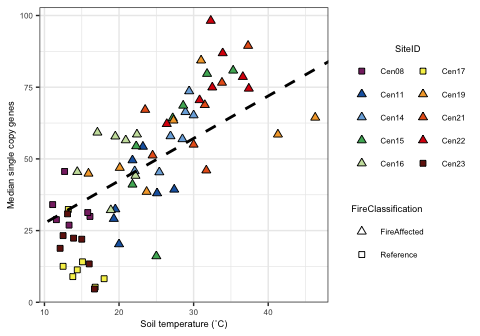<!-- -->

``` r
ggsave(SCG_temp.plot, file="/Users/sambarnett/Documents/Shade_lab/Centralia_project/Metagenomics/Manuscript/Revision_1/Figures/Supplemental/FigS11.tiff",
       device="tiff", width=5, height=3.5, units="in", bg = "white")
```

Call up the nonpareil data and compare the number of single copy genes
to both metagenome coverage and diversity.

``` r
# Read in the the nonpareil data. These are separate files.
nonpareil.full = Nonpareil.set(sample.meta$nonpareil_file)
```

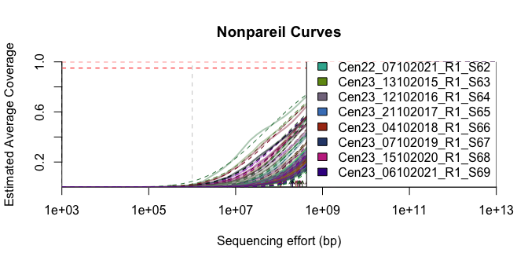<!-- -->

``` r
nonpareil.sum = data.frame(summary(nonpareil.full)) %>%
  tibble::rownames_to_column(var="SequenceID") %>%
  left_join(KEGG_SCG.sum, by = "SequenceID") %>%
  left_join(sample.meta, by = "SequenceID")

# Linear relationship to coverage
SCG_coverage.model = lm(mean_RP_genes ~ C, data=nonpareil.sum)
SCG_coverage.model.sum = summary(SCG_coverage.model)
SCG_coverage.model.sum
```

    ## 
    ## Call:
    ## lm(formula = mean_RP_genes ~ C, data = nonpareil.sum)
    ## 
    ## Residuals:
    ##      Min       1Q   Median       3Q      Max 
    ## -22.3519  -7.9366  -0.7976   7.1141  23.4875 
    ## 
    ## Coefficients:
    ##             Estimate Std. Error t value Pr(>|t|)    
    ## (Intercept)  -279.22      19.98  -13.97   <2e-16 ***
    ## C             377.79      23.08   16.37   <2e-16 ***
    ## ---
    ## Signif. codes:  0 '***' 0.001 '**' 0.01 '*' 0.05 '.' 0.1 ' ' 1
    ## 
    ## Residual standard error: 10.49 on 67 degrees of freedom
    ## Multiple R-squared:    0.8,  Adjusted R-squared:  0.797 
    ## F-statistic:   268 on 1 and 67 DF,  p-value: < 2.2e-16

``` r
SCG_coverage.plot = ggplot(data=nonpareil.sum, aes(x=C, y=mean_RP_genes)) +
  geom_point(aes(shape=FireClassification, fill=SiteID), size=2) +
  geom_abline(intercept = SCG_coverage.model.sum$coefficients[1],
              slope = SCG_coverage.model.sum$coefficients[2],
              linetype = 2, linewidth=1, color="black") +
  scale_shape_manual(values=FC.shape) +
  scale_fill_manual(values=site.col) +
  labs(x="Metagenome coverage", y="Median single copy genes") +
  publication_theme +
  guides(fill=guide_legend(override.aes=list(shape=site.shape), ncol = 2))
SCG_coverage.plot
```

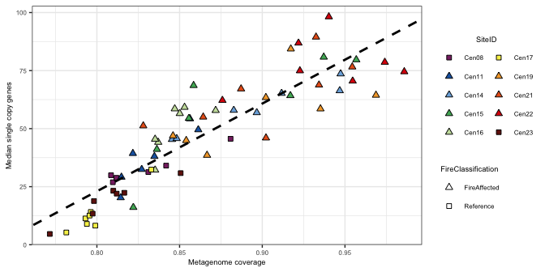<!-- -->

``` r
# Linear relationship to diversity
SCG_diversity.model = lm(mean_RP_genes ~ diversity, data=nonpareil.sum)
SCG_diversity.model.sum = summary(SCG_diversity.model)
SCG_diversity.model.sum
```

    ## 
    ## Call:
    ## lm(formula = mean_RP_genes ~ diversity, data = nonpareil.sum)
    ## 
    ## Residuals:
    ##     Min      1Q  Median      3Q     Max 
    ## -36.307 -10.705   1.205  10.646  37.317 
    ## 
    ## Coefficients:
    ##             Estimate Std. Error t value Pr(>|t|)    
    ## (Intercept)   437.82      49.78   8.795 8.92e-13 ***
    ## diversity     -18.92       2.41  -7.853 4.43e-11 ***
    ## ---
    ## Signif. codes:  0 '***' 0.001 '**' 0.01 '*' 0.05 '.' 0.1 ' ' 1
    ## 
    ## Residual standard error: 16.92 on 67 degrees of freedom
    ## Multiple R-squared:  0.4793, Adjusted R-squared:  0.4715 
    ## F-statistic: 61.67 on 1 and 67 DF,  p-value: 4.435e-11

``` r
SCG_diversity.plot = ggplot(data=nonpareil.sum, aes(x=diversity, y=mean_RP_genes)) +
  geom_point(aes(shape=FireClassification, fill=SiteID), size=2) +
  geom_abline(intercept = SCG_diversity.model.sum$coefficients[1],
              slope = SCG_diversity.model.sum$coefficients[2],
              linetype = 2, linewidth=1, color="black") +
  scale_shape_manual(values=FC.shape) +
  scale_fill_manual(values=site.col) +
  labs(x="Metagenome diversity", y="Median single copy genes") +
  publication_theme +
  guides(fill=guide_legend(override.aes=list(shape=site.shape), ncol = 2))
SCG_diversity.plot
```

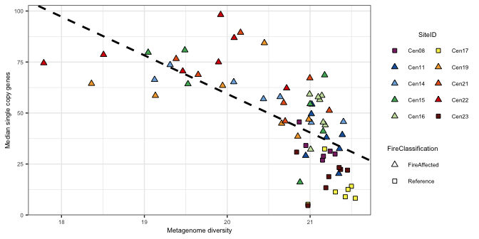<!-- -->

As you can see there is a strong correlation to coverage which makes
perfect sense. Less coverage means less single copy genes recovered.
Therefore single copy genes should be a good normalization for gene
counts.

# Nitrogen cycling

For the first pathway to look at, lets consider nitrogen cycling. For
this analysis lets look at genes for different nitrogen cycling pathways
as defined by KEGG modules.

## Find the genes in each pathway

First lets find the nitrogen cycling genes for each pathway and count
them.

``` r
# Define these pathways with the member KEGG orthologues
N_Cycling.def = rbind(data.frame(KEGG_ortho_kofamscan = module("M00175")@definitions[[1]]$definition_kos,
                                 N_path = "Nitrogen Fixation"),
                      data.frame(KEGG_ortho_kofamscan = module("M00531")@definitions[[1]]$definition_kos,
                                 N_path = "Assimilatory nitrate reduction"),
                      data.frame(KEGG_ortho_kofamscan = module("M00530")@definitions[[1]]$definition_kos,
                                 N_path = "Dissimilatory nitrate reduction"),
                      data.frame(KEGG_ortho_kofamscan = module("M00529")@definitions[[1]]$definition_kos,
                                 N_path = "Denitrification"),
                      data.frame(KEGG_ortho_kofamscan = module("M00528")@definitions[[1]]$definition_kos,
                                 N_path = "Nitrification"),
                      data.frame(KEGG_ortho_kofamscan = module("M00804")@definitions[[1]]$definition_kos,
                                 N_path = "comammox"),
                      data.frame(KEGG_ortho_kofamscan = module("M00973")@definitions[[1]]$definition_kos,
                                 N_path = "Anammox"))

# Now pull out genes for the pathways from our annotations and summarize
KEGG_N_Cycling.sum = KEGG_long.df %>%
  inner_join(N_Cycling.def) %>%
  group_by(SequenceID, N_path) %>%
  summarize(n_genes = n()) %>%
  ungroup %>%
  tidyr::spread(key="N_path", value="n_genes") %>%
  tidyr::gather(key="N_path", value="n_genes", -SequenceID) %>%
  mutate(n_genes = ifelse(is.na(n_genes), 0, n_genes)) %>%
  left_join(KEGG_SCG.sum) %>%
  mutate(pop_invest = n_genes/mean_RP_genes) %>%
  left_join(sample.meta)
```

## Nitrogen cycling investment over soil temperature

Now lets quantify the per-genome investment in these nitrogen cycling
pathways. First lets see how nitrogen cycling genes change over
temperature.

``` r
# Linear mixed effects over temperature
Ncyc_temp.model.sum = data.frame()
for(N_p in unique(N_Cycling.def$N_path)){
  sub.Ncyc_temp.model.old = lme(pop_invest ~ CoreTemp_C, random = ~1|SiteID, data=filter(KEGG_N_Cycling.sum, N_path == N_p))
  sub.Ncyc_temp.model = lmer(pop_invest ~ CoreTemp_C + (1|SiteID) + (1|Year), data=filter(KEGG_N_Cycling.sum, N_path == N_p))
  Ncyc_temp.model.sum = rbind(Ncyc_temp.model.sum,
                              data.frame(intercept = summary(sub.Ncyc_temp.model)$coefficients[1],
                                         slope = summary(sub.Ncyc_temp.model)$coefficients[2],
                                         SE = summary(sub.Ncyc_temp.model)$coefficients[4],
                                         p_value = summary(sub.Ncyc_temp.model)$coefficients[10],
                                         N_path = N_p))
}


Ncyc_temp.model.sum = Ncyc_temp.model.sum %>%
  mutate(padj = p.adjust(p_value, method = "BH")) %>%
  mutate(sig = ifelse(padj < 0.05, "p < 0.05", "p ≥ 0.05"))
Ncyc_temp.model.sum
```

    ##      intercept        slope           SE      p_value
    ## 1 -0.005022539 0.0007040271 0.0003793988 7.672012e-02
    ## 2  0.067501009 0.0140917626 0.0024827605 5.533622e-07
    ## 3  0.075146680 0.0214528532 0.0034103263 4.303045e-08
    ## 4  0.038181796 0.0407065953 0.0059531833 1.383806e-08
    ## 5  0.033384895 0.0052272329 0.0012673088 1.090422e-04
    ## 6 -0.212970053 0.0266863003 0.0027268676 9.429609e-11
    ## 7  0.128752679 0.0063787648 0.0026688847 1.987477e-02
    ##                            N_path         padj      sig
    ## 1               Nitrogen Fixation 7.672012e-02 p ≥ 0.05
    ## 2  Assimilatory nitrate reduction 9.683838e-07 p < 0.05
    ## 3 Dissimilatory nitrate reduction 1.004044e-07 p < 0.05
    ## 4                 Denitrification 4.843320e-08 p < 0.05
    ## 5                   Nitrification 1.526590e-04 p < 0.05
    ## 6                        comammox 6.600726e-10 p < 0.05
    ## 7                         Anammox 2.318723e-02 p < 0.05

``` r
Ncyc_temp.plot = ggplot(data=KEGG_N_Cycling.sum, aes(x=CoreTemp_C, y=pop_invest)) +
  geom_point(aes(shape=FireClassification, fill=SiteID), size=2) +
  geom_abline(data = filter(Ncyc_temp.model.sum, p_value < 0.05),
              aes(intercept = intercept, slope = slope),
              linetype = 2, linewidth=1, color="black") +
  scale_shape_manual(values=FC.shape) +
  scale_fill_manual(values=site.col) +
  labs(x="Soil temperature (˚C)", y="Genes per genome") +
  publication_theme +
  facet_wrap(~N_path, scales = "free_y", nrow=2) +
  #theme(legend.position = "bottom",
  #     legend.direction = "vertical") +
  theme(legend.position = c(0.88,0.2)) +
  guides(fill=guide_legend(override.aes=list(shape=site.shape), ncol = 2),
         shape=guide_legend(ncol = 2))

Ncyc_temp.plot
```

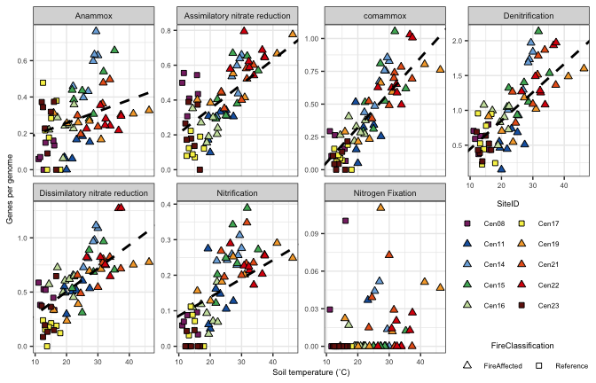<!-- -->

``` r
# Save plot for publication
ggsave(Ncyc_temp.plot, file="/Users/sambarnett/Documents/Shade_lab/Centralia_project/Metagenomics/Manuscript/Revision_1/Figures/Fig3.tiff",
       device="tiff", width=7, height=4.5, units="in", bg = "white")
```

## Nitrogen cycling investment over soil nitrate and ammonium concentrations

Next lets see how nitrogen cycling genes change over concentrations of
nitrate and ammonium in the soils.

``` r
# Linear mixed effects over nitrate levels
Ncyc_nitrate.model.sum = data.frame()
for(N_p in unique(N_Cycling.def$N_path)){
  sub.Ncyc_nitrate.model.old = lme(pop_invest ~ NO3N_ppm, random = ~1|SiteID, data=filter(KEGG_N_Cycling.sum, N_path == N_p))
  sub.Ncyc_nitrate.model = lmer(pop_invest ~ NO3N_ppm + (1|SiteID) + (1|Year), data=filter(KEGG_N_Cycling.sum, N_path == N_p))
  Ncyc_nitrate.model.sum = rbind(Ncyc_nitrate.model.sum,
                              data.frame(intercept = summary(sub.Ncyc_nitrate.model)$coefficients[1],
                                         slope = summary(sub.Ncyc_nitrate.model)$coefficients[2],
                                         SE = summary(sub.Ncyc_nitrate.model)$coefficients[4],
                                         p_value = summary(sub.Ncyc_nitrate.model)$coefficients[10],
                                         N_path = N_p))
}
  
Ncyc_nitrate.model.sum = Ncyc_nitrate.model.sum %>%
  mutate(padj = p.adjust(p_value, method = "BH")) %>%
  mutate(sig = ifelse(padj < 0.05, "p < 0.05", "p ≥ 0.05"))
  
Ncyc_nitrate.plot = ggplot(data=KEGG_N_Cycling.sum, aes(x=NO3N_ppm, y=pop_invest)) +
  geom_point(aes(shape=FireClassification, fill=SiteID), size=2) +
  geom_abline(data = filter(Ncyc_nitrate.model.sum, padj < 0.05),
              aes(intercept = intercept, slope = slope),
              linetype = 2, linewidth=1, color="black") +
  scale_shape_manual(values=FC.shape) +
  scale_fill_manual(values=site.col) +
  labs(x="Nitrate nitrogen (ppm)", y="Genes per genome") +
  publication_theme +
  facet_wrap(~N_path, scales = "free_y", nrow=1) +
  theme(legend.position = "bottom",
        legend.direction = "vertical") +
  guides(fill=guide_legend(override.aes=list(shape=site.shape), nrow = 2))

# Linear mixed effects over ammonium levels
Ncyc_ammonium.model.sum = data.frame()
for(N_p in unique(N_Cycling.def$N_path)){
  sub.Ncyc_ammonium.model = lme(pop_invest ~ NH4N_ppm, random = ~1|SiteID, data=filter(KEGG_N_Cycling.sum, N_path == N_p))
  Ncyc_ammonium.model.sum = rbind(Ncyc_ammonium.model.sum,
                              data.frame(intercept = summary(sub.Ncyc_ammonium.model)$tTable[1],
                                         slope = summary(sub.Ncyc_ammonium.model)$tTable[2],
                                         p_value = summary(sub.Ncyc_ammonium.model)$tTable[10],
                                         N_path = N_p))
}
  
Ncyc_ammonium.model.sum = Ncyc_ammonium.model.sum %>%
  mutate(padj = p.adjust(p_value, method = "BH")) %>%
  mutate(sig = ifelse(padj < 0.05, "p < 0.05", "p ≥ 0.05"))
  
Ncyc_ammonium.plot = ggplot(data=KEGG_N_Cycling.sum, aes(x=NH4N_ppm, y=pop_invest)) +
  geom_point(aes(shape=FireClassification, fill=SiteID), size=2) +
  geom_abline(data = filter(Ncyc_ammonium.model.sum, padj < 0.05),
              aes(intercept = intercept, slope = slope),
              linetype = 2, linewidth=1, color="black") +
  scale_shape_manual(values=FC.shape) +
  scale_fill_manual(values=site.col) +
  labs(x="Ammonium nitrogen (ppm)", y="Genes per genome") +
  publication_theme +
  facet_wrap(~N_path, scales = "free_y", nrow=1) +
  theme(legend.position = "bottom",
        legend.direction = "vertical") +
  guides(fill=guide_legend(override.aes=list(shape=site.shape), nrow = 2))


# Plot together

cowplot::plot_grid(Ncyc_nitrate.plot + theme(legend.position = "none"), 
                   Ncyc_ammonium.plot + theme(legend.position = "none"), 
                   g_legend(Ncyc_nitrate.plot), rel_heights = c(1,1,0.3),
                   ncol=1, labels=c("A", "B"), label_size = 8)
```

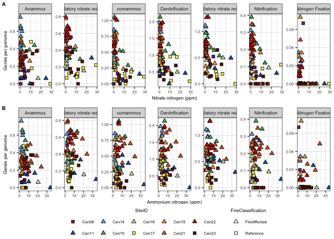<!-- -->

# Carbon cycling

Next lets take a look at carbon cycling. Specifically, lets look at
carbohydrate metabolism. For this analysis, lets look at level C
pathways under level B metabolism 09101 “Carbohydrate metabolism”.

## Find the genes in each pathway

First lets find the carbohydrate metabolism genes. To do this we need to
find all ko within each classification level.

``` r
# Get main metabolism dataset from KEGG.
ko00001.json = fromJSON("/Users/sambarnett/Documents/Shade_lab/Centralia_project/Metagenomics/Data/Annotations/ko00001.json", flatten = TRUE)

# Get the different levels of classification from the JSON file for each ko
ko00001_children = ko00001.json$children

ko00001.df = data.frame()
for (c1 in 1:nrow(ko00001_children)){
  LevelA_name = ko00001_children$name[[c1]]
  LevelA_children = ko00001_children$children[[c1]]
  for (c2 in 1:nrow(LevelA_children)){
    LevelB_name = LevelA_children$name[[c2]]
    LevelB_children = LevelA_children$children[[c2]]
    for (c3 in 1:nrow(LevelB_children)){
      LevelC_name = LevelB_children$name[[c3]]
      sub_BRITE.df = LevelB_children$children[[c3]]
      if (!is.null(sub_BRITE.df)){
        sub_BRITE.df = sub_BRITE.df %>%
          dplyr::rename(LevelD = name) %>%
          mutate(LevelC = LevelC_name,
                 LevelB = LevelB_name,
                 LevelA = LevelA_name) %>%
          select(LevelA, LevelB, LevelC, LevelD)
        ko00001.df = rbind(ko00001.df, sub_BRITE.df)
      }
    }
  }
}

ko00001.df = ko00001.df %>%
  mutate(KEGG_ortho_kofamscan = gsub(" .*", "", LevelD))
```

Pull out the carbohydrate metabolism genes from the dataset.

``` r
# Get the ko for carbohydrate metabolism and rename some of the levelC names so they fit better in figures.
Carbo_kegg.df = ko00001.df %>%
  filter(LevelB == "09101 Carbohydrate metabolism") %>%
  mutate(C_path = gsub(" \\[.*", "", LevelC)) %>%
  select(KEGG_ortho_kofamscan, C_path) %>%
  unique %>%
  mutate(C_path = gsub("metabolism", "met.", C_path)) %>%
  mutate(C_path = gsub("and", "&", C_path)) %>%
  mutate(C_path = gsub("interconversions", "interconv.", C_path))

# Get carbohydrate metabolism genes from the metagenomes and summarize across samples
KEGG_Carbo.sum = KEGG_long.df %>%
  inner_join(Carbo_kegg.df) %>%
  group_by(SequenceID, C_path) %>%
  summarize(n_genes = n()) %>%
  ungroup %>%
  tidyr::spread(key="C_path", value="n_genes") %>%
  tidyr::gather(key="C_path", value="n_genes", -SequenceID) %>%
  mutate(n_genes = ifelse(is.na(n_genes), 0, n_genes)) %>%
  left_join(KEGG_SCG.sum) %>%
  mutate(pop_invest = n_genes/mean_RP_genes) %>%
  #mutate(pop_invest = n_genes) %>%
  left_join(sample.meta)
```

## Carbohydrate metabolism investment over soil temperature

Now lets quantify the per-genome investment in these carbon cycling
pathways.

``` r
# Linear mixed effects over temperature
Ccyc_temp.model.sum = data.frame()
for(N_p in unique(Carbo_kegg.df$C_path)){
  sub.Ccyc_temp.model.old = lme(pop_invest ~ CoreTemp_C, random = ~1|SiteID, data=filter(KEGG_Carbo.sum, C_path == N_p))
  sub.Ccyc_temp.model = lmer(pop_invest ~ CoreTemp_C + (1|SiteID) + (1|Year), data=filter(KEGG_Carbo.sum, C_path == N_p))
  Ccyc_temp.model.sum = rbind(Ccyc_temp.model.sum,
                              data.frame(intercept = summary(sub.Ccyc_temp.model)$coefficients[1],
                                         slope = summary(sub.Ccyc_temp.model)$coefficients[2],
                                         SE = summary(sub.Ccyc_temp.model)$coefficients[4],
                                         p_value = summary(sub.Ccyc_temp.model)$coefficients[10],
                                         C_path = N_p))
}
  
Ccyc_temp.model.sum = Ccyc_temp.model.sum %>%
  mutate(padj = p.adjust(p_value, method = "BH")) %>%
  mutate(sig = ifelse(padj < 0.05, "p < 0.05", "p ≥ 0.05"))
Ccyc_temp.model.sum
```

    ##    intercept      slope         SE      p_value
    ## 1  19.678558 0.15964906 0.04113115 3.595842e-04
    ## 2  12.100569 0.16425036 0.03323831 5.586352e-06
    ## 3  18.885485 0.05983698 0.03991267 1.390027e-01
    ## 4   6.015803 0.06904539 0.02509097 7.617206e-03
    ## 5  11.020475 0.05361805 0.02091354 1.265688e-02
    ## 6   7.445185 0.06175202 0.02805921 3.210307e-02
    ## 7   4.490486 0.04697169 0.01582930 5.016712e-03
    ## 8  11.792398 0.14000071 0.04207695 1.788476e-03
    ## 9  21.539513 0.21707725 0.05516696 2.975624e-04
    ## 10 25.498948 0.28680957 0.06030406 1.153301e-05
    ## 11 14.988739 0.22289821 0.04592100 1.528788e-05
    ## 12 21.100392 0.26644232 0.06175296 6.829374e-05
    ## 13  6.078345 0.10330179 0.01679635 3.606615e-07
    ## 14  7.744829 0.04009326 0.02438389 1.048110e-01
    ##                                    C_path         padj      sig
    ## 1      00010 Glycolysis / Gluconeogenesis 7.191685e-04 p < 0.05
    ## 2         00020 Citrate cycle (TCA cycle) 3.910446e-05 p < 0.05
    ## 3         00030 Pentose phosphate pathway 1.390027e-01 p ≥ 0.05
    ## 4  00040 Pentose & glucuronate interconv. 1.066409e-02 p < 0.05
    ## 5           00051 Fructose & mannose met. 1.610876e-02 p < 0.05
    ## 6                    00052 Galactose met. 3.745358e-02 p < 0.05
    ## 7         00053 Ascorbate & aldarate met. 7.803775e-03 p < 0.05
    ## 8             00500 Starch & sucrose met. 3.129834e-03 p < 0.05
    ## 9                     00620 Pyruvate met. 6.943123e-04 p < 0.05
    ## 10  00630 Glyoxylate & dicarboxylate met. 5.350757e-05 p < 0.05
    ## 11                  00640 Propanoate met. 5.350757e-05 p < 0.05
    ## 12                   00650 Butanoate met. 1.912225e-04 p < 0.05
    ## 13    00660 C5-Branched dibasic acid met. 5.049261e-06 p < 0.05
    ## 14          00562 Inositol phosphate met. 1.128733e-01 p ≥ 0.05

``` r
Ccyc_temp.plot = ggplot(data=KEGG_Carbo.sum, aes(x=CoreTemp_C, y=pop_invest)) +
  geom_point(aes(shape=FireClassification, fill=SiteID), size=2) +
  geom_abline(data = filter(Ccyc_temp.model.sum, p_value < 0.05),
              aes(intercept = intercept, slope = slope),
              linetype = 2, linewidth=1, color="black") +
  scale_shape_manual(values=FC.shape) +
  scale_fill_manual(values=site.col) +
  labs(x="Soil temperature (˚C)", y="Genes per genome") +
  publication_theme +
  facet_wrap(~C_path, scales = "free_y", ncol=3) +
  theme(legend.position = "bottom",
        legend.direction = "vertical") +
  guides(fill=guide_legend(override.aes=list(shape=site.shape), nrow = 2),
         shape=guide_legend(nrow = 2))

Ccyc_temp.plot
```

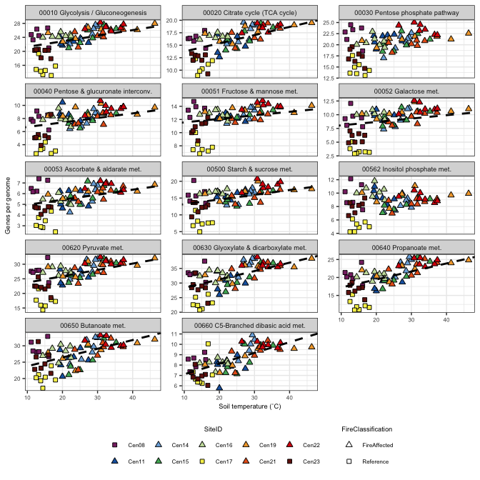<!-- -->

``` r
# Save plot for publications
ggsave(Ccyc_temp.plot, file="/Users/sambarnett/Documents/Shade_lab/Centralia_project/Metagenomics/Manuscript/Revision_1/Figures/Fig4.tiff",
       device="tiff", width=7, height=7, units="in", bg = "white")
```

## CAZyme investment over soil temperature

Lets double check these findings by looking specifically at CAZymes
(carbohydrate active enzymes). Rather than using KEGG orthologues, we
will use genes annotated using the CAZy database. First call up the
CAZyme data

``` r
# Import CAZymes
CAZyme.df = read.table("/Users/sambarnett/Documents/Shade_lab/Centralia_project/Metagenomics/Data/Annotations/Specific_enzyme_annotations.txt", 
                       header=TRUE, sep="\t", comment.char = "", quote = "") %>%
  filter(Enzyme_type == "CAZyme")

# Filter to genes we are more confident are CAZymes.
CAZyme_filt.df = CAZyme.df %>%
  filter(alignment_probability > 0.8) %>%
  mutate(Target = gsub(".hmm", "", Target)) %>%
  group_by(SequenceID, locus_tag) %>%
  summarize(n_modules = n(),
            CAZy_modules = paste(Target, collapse = ";")) %>%
  ungroup

# Summarize per-genome investment in total CAZymes
CAZyme.sum = CAZyme_filt.df %>%
  group_by(SequenceID) %>%
  summarize(n_genes = n()) %>%
  ungroup %>%
  left_join(KEGG_SCG.sum) %>%
  mutate(pop_invest = n_genes/mean_RP_genes) %>%
  left_join(sample.meta, by = "SequenceID")

# Summarize per-genome investment in glycoside hydrolases
GH.sum = CAZyme_filt.df %>%
  filter(grepl("GH", CAZy_modules)) %>%
  group_by(SequenceID) %>%
  summarize(n_genes = n()) %>%
  ungroup %>%
  left_join(KEGG_SCG.sum) %>%
  mutate(pop_invest = n_genes/mean_RP_genes) %>%
  left_join(sample.meta, by = "SequenceID")
```

First lets take a look at all CAZymes over temperature.

``` r
# Wilcoxon test over fire classification
CAZyme_FC.wilcox = wilcox.test(x=filter(CAZyme.sum, FireClassification=="Reference")$pop_invest,
                               y=filter(CAZyme.sum, FireClassification=="FireAffected")$pop_invest,
                               conf.int=TRUE, conf.level=0.95)
CAZyme_FC.wilcox
```

    ## 
    ##  Wilcoxon rank sum exact test
    ## 
    ## data:  filter(CAZyme.sum, FireClassification == "Reference")$pop_invest and filter(CAZyme.sum, FireClassification == "FireAffected")$pop_invest
    ## W = 111, p-value = 5.109e-08
    ## alternative hypothesis: true location shift is not equal to 0
    ## 95 percent confidence interval:
    ##  -37.64438 -21.16768
    ## sample estimates:
    ## difference in location 
    ##              -28.79937

``` r
CAZyme_FC.plot = ggplot(data=CAZyme.sum, aes(x=FireClassification, y=pop_invest)) +
  geom_boxplot(outlier.shape=NA) +
  geom_jitter(aes(fill=SiteID, shape=FireClassification), size=2, width=0.25) +
  annotate("text", label="< 0.001", fontface="bold", x=1.5, y=max(CAZyme.sum$pop_invest), size=6*5/14) +
  #lims(y=c(NA, 22)) +
  scale_fill_manual(values=site.col) +
  scale_shape_manual(values=FC.shape) +
  labs(x="FireClassification", y="CAZyme genes per genome") +
  publication_theme +
  guides(fill=guide_legend(override.aes=list(shape=site.shape), ncol=2))
CAZyme_FC.plot
```

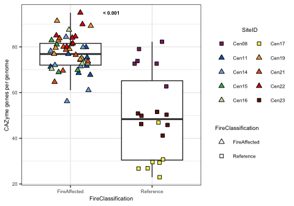<!-- -->

``` r
# Linear mixed effects over temperature
CAZyme_temp.model.old = lme(pop_invest ~ CoreTemp_C, random = ~1|SiteID, data=CAZyme.sum)
CAZyme_temp.model = lmer(pop_invest ~ CoreTemp_C + (1|SiteID) + (1|Year), data=CAZyme.sum)
summary(CAZyme_temp.model)
```

    ## Linear mixed model fit by REML. t-tests use Satterthwaite's method [
    ## lmerModLmerTest]
    ## Formula: pop_invest ~ CoreTemp_C + (1 | SiteID) + (1 | Year)
    ##    Data: CAZyme.sum
    ## 
    ## REML criterion at convergence: 482.7
    ## 
    ## Scaled residuals: 
    ##      Min       1Q   Median       3Q      Max 
    ## -2.17833 -0.51382 -0.08505  0.51362  2.48516 
    ## 
    ## Random effects:
    ##  Groups   Name        Variance Std.Dev.
    ##  SiteID   (Intercept) 236.220  15.369  
    ##  Year     (Intercept)   1.593   1.262  
    ##  Residual              38.909   6.238  
    ## Number of obs: 69, groups:  SiteID, 10; Year, 7
    ## 
    ## Fixed effects:
    ##             Estimate Std. Error      df t value Pr(>|t|)    
    ## (Intercept)  62.6511     6.3976 19.4144   9.793 5.99e-09 ***
    ## CoreTemp_C    0.2807     0.1756 42.4484   1.598    0.117    
    ## ---
    ## Signif. codes:  0 '***' 0.001 '**' 0.01 '*' 0.05 '.' 0.1 ' ' 1
    ## 
    ## Correlation of Fixed Effects:
    ##            (Intr)
    ## CoreTemp_C -0.635

``` r
CAZyme_temp.model.sum = data.frame(intercept = summary(CAZyme_temp.model)$coefficients[1],
                                   slope = summary(CAZyme_temp.model)$coefficients[2],
                                   p_value = summary(CAZyme_temp.model)$coefficients[10])

CAZyme_temp.plot = ggplot(data=CAZyme.sum, aes(x=CoreTemp_C, y=pop_invest)) +
  geom_point(aes(shape=FireClassification, fill=SiteID), size=2) +
  geom_abline(data = filter(CAZyme_temp.model.sum, p_value < 0.05),
              aes(intercept = intercept, slope = slope),
              linetype = 2, linewidth=1, color="black") +
  scale_shape_manual(values=FC.shape) +
  scale_fill_manual(values=site.col) +
  labs(x="Soil temperature (˚C)", y="Genes per genome") +
  publication_theme +
  guides(fill=guide_legend(override.aes=list(shape=site.shape), ncol = 2))

CAZyme_temp.plot
```

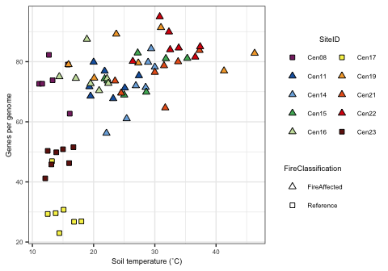<!-- -->

Next lets take a look at glycoside hydrolases over temperature.

``` r
# Wilcoxon test over fire classification
GH_FC.wilcox = wilcox.test(x=filter(GH.sum, FireClassification=="Reference")$pop_invest,
                               y=filter(GH.sum, FireClassification=="FireAffected")$pop_invest,
                               conf.int=TRUE, conf.level=0.95)
GH_FC.wilcox
```

    ## 
    ##  Wilcoxon rank sum exact test
    ## 
    ## data:  filter(GH.sum, FireClassification == "Reference")$pop_invest and filter(GH.sum, FireClassification == "FireAffected")$pop_invest
    ## W = 192, p-value = 4.102e-05
    ## alternative hypothesis: true location shift is not equal to 0
    ## 95 percent confidence interval:
    ##  -12.466814  -5.044215
    ## sample estimates:
    ## difference in location 
    ##              -9.439772

``` r
GH_FC.plot = ggplot(data=GH.sum, aes(x=FireClassification, y=pop_invest)) +
  geom_boxplot(outlier.shape=NA) +
  geom_jitter(aes(fill=SiteID, shape=FireClassification), size=2, width=0.25) +
  annotate("text", label="< 0.001", fontface="bold", x=1.5, y=max(GH.sum$pop_invest), size=6*5/14) +
  #lims(y=c(NA, 22)) +
  scale_fill_manual(values=site.col) +
  scale_shape_manual(values=FC.shape) +
  labs(x="FireClassification", y="GH genes per genome") +
  publication_theme +
  guides(fill=guide_legend(override.aes=list(shape=site.shape), ncol=2))
GH_FC.plot
```

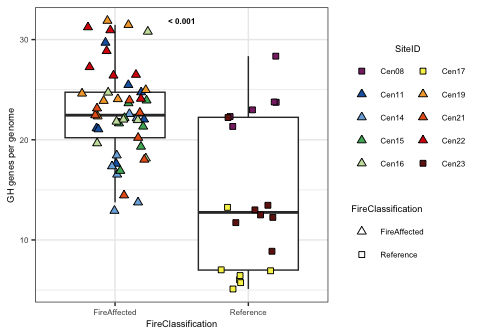<!-- -->

``` r
# Linear mixed effects over temperature
GH_temp.model.old = lme(pop_invest ~ CoreTemp_C, random = ~1|SiteID, data=GH.sum)
GH_temp.model = lmer(pop_invest ~ CoreTemp_C + (1|SiteID) + (1|Year), data=GH.sum)
summary(GH_temp.model)
```

    ## Linear mixed model fit by REML. t-tests use Satterthwaite's method [
    ## lmerModLmerTest]
    ## Formula: pop_invest ~ CoreTemp_C + (1 | SiteID) + (1 | Year)
    ##    Data: GH.sum
    ## 
    ## REML criterion at convergence: 394.5
    ## 
    ## Scaled residuals: 
    ##     Min      1Q  Median      3Q     Max 
    ## -1.8542 -0.5942 -0.1686  0.5117  2.3908 
    ## 
    ## Random effects:
    ##  Groups   Name        Variance Std.Dev.
    ##  SiteID   (Intercept) 32.61    5.711   
    ##  Year     (Intercept)  0.00    0.000   
    ##  Residual             11.89    3.448   
    ## Number of obs: 69, groups:  SiteID, 10; Year, 7
    ## 
    ## Fixed effects:
    ##             Estimate Std. Error       df t value Pr(>|t|)    
    ## (Intercept) 18.22631    2.77580 29.40628   6.566 3.19e-07 ***
    ## CoreTemp_C   0.09369    0.08928 66.71433   1.049    0.298    
    ## ---
    ## Signif. codes:  0 '***' 0.001 '**' 0.01 '*' 0.05 '.' 0.1 ' ' 1
    ## 
    ## Correlation of Fixed Effects:
    ##            (Intr)
    ## CoreTemp_C -0.745
    ## optimizer (nloptwrap) convergence code: 0 (OK)
    ## boundary (singular) fit: see help('isSingular')

``` r
GH_temp.model.sum = data.frame(intercept = summary(GH_temp.model)$coefficients[1],
                                   slope = summary(GH_temp.model)$coefficients[2],
                                   p_value = summary(GH_temp.model)$coefficients[10])

GH_temp.plot = ggplot(data=GH.sum, aes(x=CoreTemp_C, y=pop_invest)) +
  geom_point(aes(shape=FireClassification, fill=SiteID), size=2) +
  geom_abline(data = filter(GH_temp.model.sum, p_value < 0.05),
              aes(intercept = intercept, slope = slope),
              linetype = 2, linewidth=1, color="black") +
  scale_shape_manual(values=FC.shape) +
  scale_fill_manual(values=site.col) +
  labs(x="Soil temperature (˚C)", y="Genes per genome") +
  publication_theme +
  guides(fill=guide_legend(override.aes=list(shape=site.shape), ncol = 2))

GH_temp.plot
```

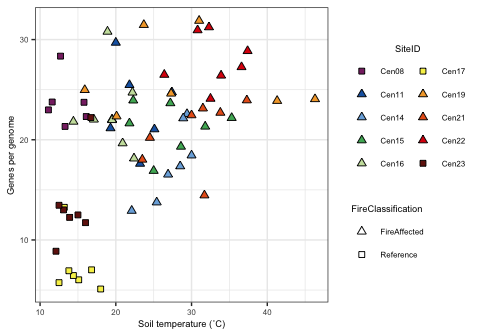<!-- -->

Plot boxplot together for publication

``` r
CAZyme_GH_FC.plot = cowplot::plot_grid(cowplot::plot_grid(CAZyme_FC.plot + theme(legend.position = "none"), 
                                                          CAZyme_temp.plot + theme(legend.position = "none"),
                                                          nrow=1, rel_widths = c(0.5,1)),
                                       cowplot::plot_grid(GH_FC.plot + theme(legend.position = "none"), 
                                                          GH_temp.plot + theme(legend.position = "none"),
                                                          nrow=1, rel_widths = c(0.5,1)),
                                       g_legend(CAZyme_FC.plot + theme(legend.position = "bottom", legend.direction = "vertical") +
                                                  guides(fill=guide_legend(override.aes=list(shape=site.shape), nrow = 2))),
                                       nrow=3, rel_heights = c(1,1,0.3))
CAZyme_GH_FC.plot
```

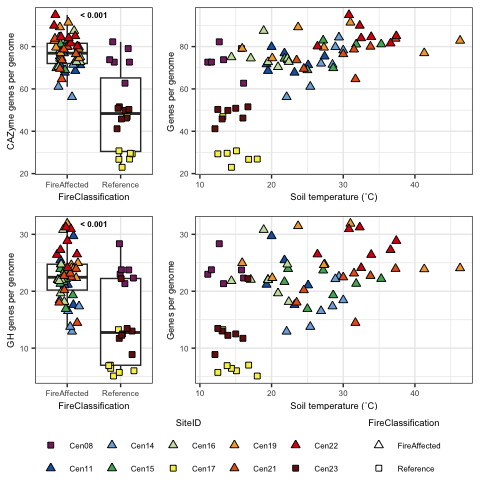<!-- -->

``` r
# Save plot for publications
ggsave(CAZyme_GH_FC.plot, file="/Users/sambarnett/Documents/Shade_lab/Centralia_project/Metagenomics/Manuscript/Revision_1/Figures/Supplemental/FigS12.tiff",
       device="tiff", width=5, height=5, units="in", bg = "white")
```

# Environmental response genes

Finally, lets take a look at genes related to environmental response.
Specifically, lets look at transcription factors. We will do this
similarly to above. The list of transcriptions factors used here are
taken from KEGG. We will be looking at transcription factors in
individual families.

## Find transcription factor genes

First we need to find the transcription factor genes and count them.

``` r
# Get the list of transcription factor ko
TFac.def = read_xlsx("/Users/sambarnett/Documents/Shade_lab/Centralia_project/Metagenomics/Data/Transcription_factor_kos.xlsx") %>%
  rename(KEGG_ortho_kofamscan = ko, ER_path = family) %>%
  select(KEGG_ortho_kofamscan, ER_path) %>%
  mutate(ER_path = gsub(" transcriptional regulator", "", ER_path))

# Now find the transcription factor genes in our samples and summarize them within the families
KEGG_TFac.sum = KEGG_long.df %>%
  inner_join(TFac.def) %>%
  dplyr::group_by(SequenceID, ER_path) %>%
  dplyr::summarize(n_genes = n()) %>%
  ungroup %>%
  tidyr::spread(key="ER_path", value="n_genes") %>%
  tidyr::gather(key="ER_path", value="n_genes", -SequenceID) %>%
  mutate(n_genes = ifelse(is.na(n_genes), 0, n_genes)) %>%
  left_join(KEGG_SCG.sum) %>%
  mutate(pop_invest = n_genes/mean_RP_genes) %>%
  left_join(sample.meta)
```

## Transcription factor investment over soil temperature

Now lets see if the number of transcription factor genes-per-genome
varies across temperature for each of the different transcription factor
families

``` r
# Linear mixed effects over temperature
TFac_temp.model.sum = data.frame()
for(N_p in unique(TFac.def$ER_path)){
  if (nrow(filter(KEGG_TFac.sum, ER_path == N_p)) > 0){
    sub.TFac_temp.model.old = lme(pop_invest ~ CoreTemp_C, random = ~1|SiteID, data=filter(KEGG_TFac.sum, ER_path == N_p))
    sub.TFac_temp.model = lmer(pop_invest ~ CoreTemp_C + (1|SiteID) + (1|Year), data=filter(KEGG_TFac.sum, ER_path == N_p))
    TFac_temp.model.sum = rbind(TFac_temp.model.sum,
                                data.frame(intercept = summary(sub.TFac_temp.model)$coefficients[1],
                                           slope = summary(sub.TFac_temp.model)$coefficients[2],
                                           SE = summary(sub.TFac_temp.model)$coefficients[4],
                                           p_value = summary(sub.TFac_temp.model)$coefficients[10],
                                           ER_path = N_p))
  } else{
    print(paste("No", N_p, "found"))
  }
}
```

    ## [1] "No SgrR family found"
    ## [1] "No HTH-type / antitoxin PezA found"
    ## [1] "No MucR family found"

``` r
TFac_temp.model.sum = TFac_temp.model.sum %>%
  mutate(padj = p.adjust(p_value, method = "BH")) %>%
  mutate(sig = ifelse(padj < 0.05, "p < 0.05", "p ≥ 0.05"))
TFac_temp.model.sum %>%
  filter(padj < 0.05)
```

    ##     intercept        slope           SE      p_value            ER_path
    ## 1  4.01152560 -0.051821379 0.0128240738 1.841148e-04        AraC family
    ## 2  1.23232172  0.020215642 0.0066254020 3.618953e-03        ArsR family
    ## 3  2.93749564  0.056277001 0.0210049365 9.630012e-03        GntR family
    ## 4  0.55264049  0.015352222 0.0052060400 5.303682e-03        IclR family
    ## 5  0.72420643  0.060208123 0.0169543652 9.936007e-04        LacI family
    ## 6  2.37733458 -0.029502915 0.0082432906 6.581315e-04    Lrp/AsnC family
    ## 7  0.46746784  0.029016467 0.0117276902 1.709295e-02        LuxR family
    ## 8  1.06969629  0.024128375 0.0076164527 2.635204e-03        MerR family
    ## 9  9.92559187 -0.170132331 0.0380229331 3.095039e-05        PadR family
    ## 10 0.12110310  0.009388746 0.0017774034 4.934385e-05        Rrf2 family
    ## 11 0.52848954  0.013622110 0.0038424166 1.263831e-03        DtxR family
    ## 12 2.64578034 -0.051136673 0.0120564878 7.593737e-05        BlaI family
    ## 13 0.56773013  0.008133018 0.0021072490 8.233189e-04        BirA family
    ## 14 0.24400375  0.011109473 0.0035861780 3.280993e-03           HTH-type
    ## 15 0.01279862  0.002469557 0.0008730074 7.158727e-03 sigma-54 dependent
    ## 16 0.37385096 -0.005160210 0.0013794947 1.261010e-03        BolA family
    ## 17 1.18298860  0.024687215 0.0057143653 6.975447e-05        ParB family
    ## 18 1.02069789 -0.010627633 0.0027575299 2.191351e-03        CarD family
    ##            padj      sig
    ## 1  0.0016202106 p < 0.05
    ## 2  0.0113738530 p < 0.05
    ## 3  0.0249247365 p < 0.05
    ## 4  0.0155574659 p < 0.05
    ## 5  0.0054648038 p < 0.05
    ## 6  0.0048262976 p < 0.05
    ## 7  0.0417827552 p < 0.05
    ## 8  0.0096624131 p < 0.05
    ## 9  0.0008353111 p < 0.05
    ## 10 0.0008353111 p < 0.05
    ## 11 0.0055608567 p < 0.05
    ## 12 0.0008353111 p < 0.05
    ## 13 0.0051751473 p < 0.05
    ## 14 0.0111048978 p < 0.05
    ## 15 0.0196864997 p < 0.05
    ## 16 0.0055608567 p < 0.05
    ## 17 0.0008353111 p < 0.05
    ## 18 0.0087654048 p < 0.05

``` r
sig_TFac_temp = filter(TFac_temp.model.sum, padj < 0.05)$ER_path
  

TFac_temp.plot = ggplot(data=filter(KEGG_TFac.sum, ER_path %in% sig_TFac_temp), aes(x=CoreTemp_C, y=pop_invest)) +
  geom_point(aes(shape=FireClassification, fill=SiteID), size=2) +
  geom_abline(data = filter(TFac_temp.model.sum, padj < 0.05),
              aes(intercept = intercept, slope = slope),
              linetype = 2, linewidth=1, color="black") +
  scale_shape_manual(values=FC.shape) +
  scale_fill_manual(values=site.col) +
  labs(x="Soil temperature (˚C)", y="Genes per Genome") +
  publication_theme +
  facet_wrap(~ER_path, scales = "free_y", nrow=4) +
  theme(legend.position = "bottom",
        legend.direction = "vertical") +
  guides(fill=guide_legend(override.aes=list(shape=site.shape), nrow = 2))

TFac_temp.plot
```

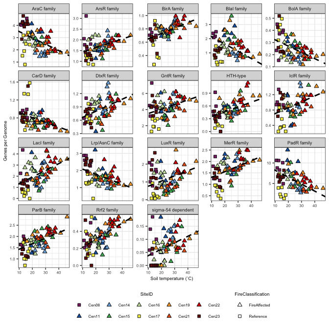<!-- -->

``` r
ggsave(TFac_temp.plot, file="/Users/sambarnett/Documents/Shade_lab/Centralia_project/Metagenomics/Manuscript/Revision_1/Figures/Supplemental/FigS13.tiff",
       device="tiff", width=7, height=7, units="in", bg = "white")
```

## Transcription factor diversity

Now lets take a look at the diversity of the transcription factors found
across samples. Diversity may have something to do with the variety and
stability of the environments that these microbes live in.

First lets look at all transcription factors regardless of family.

``` r
# Get abundances of KEGG orthologues that are transcription factors. Abundance will be summed RPKM.
TFac.df = KEGG_long.df %>%
  inner_join(TFac.def) %>%
  group_by(SequenceID, ER_path, KEGG_ortho_kofamscan) %>%
  summarize(sum_RPKM = sum(RPKM)) %>%
  ungroup

# Calculate alpha diversity (evenness especially) and see if there is a relationship to temperature.
TFac.mat = TFac.df %>%
    select(SequenceID, KEGG_ortho_kofamscan, sum_RPKM) %>%
    tidyr::spread(key=KEGG_ortho_kofamscan, value=sum_RPKM) %>%
    tibble::column_to_rownames(var="SequenceID") %>%
    as.matrix
TFac.mat[is.na(TFac.mat)] = 0
  
TFac.diversity = data.frame(richness = specnumber(TFac.mat),
                            shannon = vegan::diversity(TFac.mat)) %>%
  tibble::rownames_to_column(var="SequenceID") %>%
  mutate(evenness = shannon/log(richness)) %>%
  left_join(sample.meta)
 
# Compare evenness across fire classification
TFac_diversity_FC.model = wilcox.test(filter(TFac.diversity, FireClassification == "FireAffected")$evenness,
                                      filter(TFac.diversity, FireClassification == "Reference")$evenness)
TFac_diversity_FC.model
```

    ## 
    ##  Wilcoxon rank sum exact test
    ## 
    ## data:  filter(TFac.diversity, FireClassification == "FireAffected")$evenness and filter(TFac.diversity, FireClassification == "Reference")$evenness
    ## W = 114, p-value = 6.925e-08
    ## alternative hypothesis: true location shift is not equal to 0

``` r
# Compare evenness across soil temperature
TFac_diversity_temp.model.old = lme(evenness ~ CoreTemp_C, random = ~1|SiteID, data=TFac.diversity)
TFac_diversity_temp.model = lmer(evenness ~ CoreTemp_C + (1|SiteID) + (1|Year), data=TFac.diversity)
TFac_diversity_temp.model.sum = data.frame(intercept = summary(TFac_diversity_temp.model)$coefficients[1],
                                           slope = summary(TFac_diversity_temp.model)$coefficients[2],
                                           SE = summary(TFac_diversity_temp.model)$coefficients[4],
                                           p_value = summary(TFac_diversity_temp.model)$coefficients[10])
TFac_diversity_temp.model.sum
```

    ##   intercept         slope           SE   p_value
    ## 1 0.8482627 -0.0003973455 0.0004503116 0.3819802

``` r
# Plot results
TFac_diversity_FC.plot = ggplot(data=TFac.diversity, aes(x=FireClassification, y=evenness)) +
  geom_boxplot(outlier.shape = NA) +
  geom_jitter(height=0, width=0.25, size=2, aes(shape=FireClassification, fill=SiteID)) +
  scale_shape_manual(values=c("FireAffected" = 24, "Recovered" = 21, "Reference" = 22)) +
  scale_fill_manual(values=site.col) +
  labs(x = "Fire Classification", y = "Transcription factor gene evenness") +
  publication_theme +
  theme(legend.position = "none")

TFac_diversity_temp.plot = ggplot(data=TFac.diversity, aes(x=CoreTemp_C, y=evenness)) +
  geom_point(aes(shape=FireClassification, fill=SiteID), size=2) +
  scale_shape_manual(values=FC.shape) +
  scale_fill_manual(values=site.col) +
  labs(x="Soil temperature (˚C)", y="Evenness") +
  publication_theme +
  theme(legend.position = "bottom",
        legend.direction = "vertical") +
  guides(fill=guide_legend(override.aes=list(shape=site.shape), nrow = 2))

cowplot::plot_grid(cowplot::plot_grid(TFac_diversity_FC.plot, TFac_diversity_temp.plot + theme(axis.title.y = element_blank(), legend.position = "none"),
                                      nrow=1, rel_widths = c(0.5,1)),
                   g_legend(TFac_diversity_temp.plot), ncol=1, rel_heights = c(1,0.3))
```

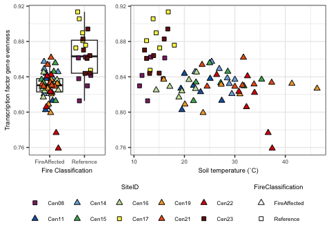<!-- -->

Next lets look within families.

``` r
# Get abundances of KEGG orthologues that are transcription factors. Abundance will be summed RPKM.
TFac.df = KEGG_long.df %>%
  inner_join(TFac.def) %>%
  group_by(SequenceID, ER_path, KEGG_ortho_kofamscan) %>%
  summarize(sum_RPKM = sum(RPKM)) %>%
  ungroup

# For each family of transcription factors, calculate alpha diversity (evenness especially) and see if there is a relationship to temperature.
TFac_diversity.df = data.frame()
TFac_evenness_temp.model.sum = data.frame()
for (family in unique(TFac.df$ER_path)){
  TFac.mat = TFac.df %>%
    filter(ER_path == family) %>%
    select(SequenceID, KEGG_ortho_kofamscan, sum_RPKM) %>%
    tidyr::spread(key=KEGG_ortho_kofamscan, value=sum_RPKM) %>%
    tibble::column_to_rownames(var="SequenceID") %>%
    as.matrix
  TFac.mat[is.na(TFac.mat)] = 0
  
  TFac.diversity = data.frame(richness = specnumber(TFac.mat),
                              shannon = vegan::diversity(TFac.mat)) %>%
    tibble::rownames_to_column(var="SequenceID") %>%
    mutate(ER_path = family,
           evenness = shannon/log(richness)) %>%
    left_join(sample.meta)
  
  if(max(TFac.diversity$richness >= 5)){
    sub.TFac_temp.model.old = lme(evenness ~ CoreTemp_C, random = ~1|SiteID, data=filter(TFac.diversity, !is.na(evenness) & !is.infinite(evenness)))
    sub.TFac_temp.model = lmer(evenness ~ CoreTemp_C + (1|SiteID) + (1|Year), data=filter(TFac.diversity, !is.na(evenness) & !is.infinite(evenness)))
    TFac_evenness_temp.model.sum = rbind(TFac_evenness_temp.model.sum,
                                         data.frame(intercept = summary(sub.TFac_temp.model)$coefficients[1],
                                                    slope = summary(sub.TFac_temp.model)$coefficients[2],
                                                    SE = summary(sub.TFac_temp.model)$coefficients[4],
                                                    p_value = summary(sub.TFac_temp.model)$coefficients[10],
                                                    ER_path = family))
  }
  TFac_diversity.df = rbind(TFac_diversity.df, 
                            select(TFac.diversity, SequenceID, ER_path, richness, shannon, evenness))
}

# Add in metadata and adjust p-values for multiple comparisons.
TFac_diversity.df = TFac_diversity.df %>%
  left_join(sample.meta)
TFac_evenness_temp.model.sum = TFac_evenness_temp.model.sum %>%
  mutate(padj = p.adjust(p_value, method = "BH"))

TFac_evenness_temp.model.sum %>%
  filter(padj < 0.05)
```

    ##   intercept        slope           SE      p_value     ER_path         padj
    ## 1 0.9476888 -0.006908672 0.0010610529 2.083992e-07 AraC family 3.542787e-06
    ## 2 0.9007640 -0.005847096 0.0017926867 2.261473e-03  Fur family 7.689010e-03
    ## 3 0.8006914 -0.003902124 0.0009593398 2.120763e-04 GntR family 9.013244e-04
    ## 4 1.0166778 -0.010180001 0.0017723529 1.265609e-05    HTH-type 1.075768e-04
    ## 5 0.8931138 -0.001713247 0.0003709576 7.721242e-05       Other 4.375370e-04

``` r
# Get significant families
sig_TFac_evenness_temp = TFac_evenness_temp.model.sum %>%
  filter(padj < 0.05,
         ER_path != "Other")

# Plot
TF_evenness.plot = ggplot(data=filter(TFac_diversity.df, ER_path %in% sig_TFac_evenness_temp$ER_path,
                                      !is.na(evenness), !is.infinite(evenness)), 
                          aes(x=CoreTemp_C, y=evenness)) +
  geom_point(aes(shape=FireClassification, fill=SiteID), size=2) +
  geom_abline(data = sig_TFac_evenness_temp,
              aes(intercept = intercept, slope = slope),
              linetype = 2, linewidth=1, color="black") +
  scale_shape_manual(values=FC.shape) +
  scale_fill_manual(values=site.col) +
  labs(x="Soil temperature (˚C)", y="Evenness") +
  publication_theme +
  facet_wrap(~ER_path, scales = "free_y", nrow=2) +
  theme(legend.position = "bottom",
        legend.direction = "vertical") +
  guides(fill=guide_legend(override.aes=list(shape=site.shape), nrow = 2))

TF_evenness.plot
```

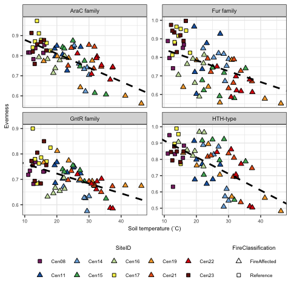<!-- -->

``` r
ggsave(TF_evenness.plot, file="/Users/sambarnett/Documents/Shade_lab/Centralia_project/Metagenomics/Manuscript/Revision_1/Figures/Fig5.tiff",
       device="tiff", width=5, height=5, units="in", bg = "white")
```

# Session info

``` r
sessionInfo()
```

    ## R version 4.4.1 (2024-06-14)
    ## Platform: aarch64-apple-darwin20
    ## Running under: macOS 26.3.1
    ## 
    ## Matrix products: default
    ## BLAS:   /Library/Frameworks/R.framework/Versions/4.4-arm64/Resources/lib/libRblas.0.dylib 
    ## LAPACK: /Library/Frameworks/R.framework/Versions/4.4-arm64/Resources/lib/libRlapack.dylib;  LAPACK version 3.12.0
    ## 
    ## locale:
    ## [1] en_US.UTF-8/en_US.UTF-8/en_US.UTF-8/C/en_US.UTF-8/en_US.UTF-8
    ## 
    ## time zone: America/Detroit
    ## tzcode source: internal
    ## 
    ## attached base packages:
    ## [1] stats     graphics  grDevices utils     datasets  methods   base     
    ## 
    ## other attached packages:
    ##  [1] ggkegg_1.3.4    tidygraph_1.3.1 igraph_2.0.3    XML_3.99-0.17  
    ##  [5] ggraph_2.2.1    ggplot2_4.0.1   ecotraj_1.1.0   Rcpp_1.1.0     
    ##  [9] lmerTest_3.2-0  lme4_1.1-37     Matrix_1.7-0    Nonpareil_3.5.3
    ## [13] picante_1.8.2   nlme_3.1-166    vegan_2.7-1     permute_0.9-7  
    ## [17] jsonlite_1.8.8  readxl_1.4.3    ape_5.8         phyloseq_1.48.0
    ## [21] dplyr_1.1.4    
    ## 
    ## loaded via a namespace (and not attached):
    ##   [1] RColorBrewer_1.1-3      rstudioapi_0.16.0       magrittr_2.0.3         
    ##   [4] magick_2.8.4            farver_2.1.2            nloptr_2.2.1           
    ##   [7] rmarkdown_2.29          ragg_1.3.2              GlobalOptions_0.1.2    
    ##  [10] zlibbioc_1.50.0         vctrs_0.6.5             multtest_2.60.0        
    ##  [13] memoise_2.0.1           minqa_1.2.8             htmltools_0.5.8.1      
    ##  [16] curl_5.2.2              cellranger_1.1.0        Rhdf5lib_1.26.0        
    ##  [19] rhdf5_2.48.0            plyr_1.8.9              cachem_1.1.0           
    ##  [22] lifecycle_1.0.4         iterators_1.0.14        pkgconfig_2.0.3        
    ##  [25] R6_2.5.1                fastmap_1.2.0           GenomeInfoDbData_1.2.12
    ##  [28] rbibutils_2.3           digest_0.6.37           numDeriv_2016.8-1.1    
    ##  [31] colorspace_2.1-1        patchwork_1.2.0         AnnotationDbi_1.66.0   
    ##  [34] S4Vectors_0.42.1        textshaping_0.4.0       RSQLite_2.3.7          
    ##  [37] org.Hs.eg.db_3.19.1     labeling_0.4.3          filelock_1.0.3         
    ##  [40] fansi_1.0.6             httr_1.4.7              polyclip_1.10-7        
    ##  [43] mgcv_1.9-1              compiler_4.4.1          bit64_4.0.5            
    ##  [46] withr_3.0.1             S7_0.2.1                viridis_0.6.5          
    ##  [49] DBI_1.2.3               highr_0.11              ggforce_0.4.2          
    ##  [52] MASS_7.3-61             rjson_0.2.22            biomformat_1.32.0      
    ##  [55] tools_4.4.1             glue_1.7.0              rhdf5filters_1.16.0    
    ##  [58] shadowtext_0.1.4        grid_4.4.1              cluster_2.1.6          
    ##  [61] reshape2_1.4.4          ade4_1.7-22             generics_0.1.3         
    ##  [64] gtable_0.3.6            tidyr_1.3.1             data.table_1.16.0      
    ##  [67] utf8_1.2.4              XVector_0.44.0          BiocGenerics_0.50.0    
    ##  [70] ggrepel_0.9.5           foreach_1.5.2           pillar_1.9.0           
    ##  [73] stringr_1.5.1           splines_4.4.1           Kendall_2.2.1          
    ##  [76] tweenr_2.0.3            BiocFileCache_2.12.0    lattice_0.22-6         
    ##  [79] survival_3.7-0          bit_4.0.5               tidyselect_1.2.1       
    ##  [82] Biostrings_2.72.1       knitr_1.48              reformulas_0.4.0       
    ##  [85] gridExtra_2.3           IRanges_2.38.1          stats4_4.4.1           
    ##  [88] xfun_0.52               graphlayouts_1.1.1      Biobase_2.64.0         
    ##  [91] stringi_1.8.4           UCSC.utils_1.0.0        yaml_2.3.10            
    ##  [94] boot_1.3-31             evaluate_0.24.0         codetools_0.2-20       
    ##  [97] tibble_3.2.1            cli_3.6.3               systemfonts_1.3.1      
    ## [100] Rdpack_2.6.4            GenomeInfoDb_1.40.1     dbplyr_2.5.0           
    ## [103] png_0.1-8               parallel_4.4.1          blob_1.2.4             
    ## [106] viridisLite_0.4.2       scales_1.4.0            purrr_1.0.2            
    ## [109] crayon_1.5.3            GetoptLong_1.0.5        rlang_1.1.4            
    ## [112] cowplot_1.1.3           KEGGREST_1.44.1
